<!-- Este .md fue generado a partir del .Rmd homónimo. Edítese el .Rmd -->

# Autocorrelación espacial: supuestos, medidas

## Supuestos

Es recomendable comprender los supuestos de la autocorrelación espacial,
antes de saltar a pruebas estadísticas o gráficos avanzados. Las pruebas
y gráficos requieren interpretación y, al realizarlas, varios supuestos
se dan por satisfechos. Por tal razón, evaluar autocorrelación requiere
conocer tanto los datos como los supuestos.

Los supuestos básicos que deben cumplir las observaciones son normalidad
y homocedasticidad. La evaluación de normalidad es un requisito estricto
al evaluar autocorrelación espacial e, igualmente, al realizar
modelización espacial. Esta comprobación determina qué tanto se acerca
la distribución de los datos al modelo de la distribución normal. La
mayoría de modelos estocásticos asume que las observaciones se aproximan
a una media, y que se sitúan en torno a ella de forma aleatoria,
siguiendo dicha distribución. Si este supuesto no se cumple, las
técnicas de modelización pierden potencia o podrían arrojar relaciones
espurias.

Por otra parte, la homocedasticidad aplicada al análisis espacial, asume
que la media y la varianza son constantes en el espacio; es decir, se
asume que no existe tendencia en los datos, y que la dispersión es
invariable en las distintas localidades del conjunto de datos. No es un
requisito estricto al evaluar autocorrelación, pero sí debe considerarse
o atenuarse al realizar modelizaciones.

La normalidad se evalúa comúnmente con la gráfica cuantilar normal, así
como con pruebas estadísticas. El desvío de la normalidad normalmente se
corrige con transformaciones (e.g. logarítmicas, Box-Cox). El desvío de
la homocedasticidad, la heterocedasticidad, puede corregirse igualmente
con las referidas transformaciones, pero no siempre se tiene éxito.

Evaluemos con datos reales tanto el supuesto de normalidad como la
homocedasticidad. Carguemos paquetes y utilicemos los datos de la sesión
sobre vecindad.

``` r
load('export/objetos_de_vecindad.RData')
library(spdep)
library(tidyverse)
library(sf)
library(lmtest)#Necesario para la función bptest, que evalúa homocedasticidad
library(tmap)
library(RColorBrewer)
```

Utilicemos, como variable el porcentaje de personas que decía residir
fuera del país en relación al total de población del municipio.
Necesitaremos generar una columna de porcentaje (`Pct vive fuera pais`),
lo cual haremos con `tidyverse`. Igualmente, generaremos una columna que
contenga la transformación logarítmica de la anterior (`Pct vive fuera
pais log`). El resultado lo asignaremos al objeto `vivefuera_sf`.

``` r
coordsxy <- mun.sf.pop %>%
  st_centroid() %>% 
  mutate("Pct vive fuera pais"=`En otro país`/(Hombres+Mujeres)*100,
         "Pct vive fuera pais log"= log(`Pct vive fuera pais`),
         x=unlist(map(geom,1)),
         y=unlist(map(geom,2))) %>%
  st_drop_geometry()
## Warning in st_centroid.sf(.): st_centroid assumes attributes are constant
## over geometries of x
vivefuera_sf <- mun.sf.pop %>%
  inner_join(coordsxy, by = 'TOPONIMIA') %>% 
  dplyr::select(contains('Pct'), x, y, TOPONIMIA)
```

Generamos ahora un mapa que muestre las variables la variable, tanto en
su versión original como transformada.

``` r
p1 <- tm_shape(vivefuera_sf) +
  tm_fill(col = "Pct vive fuera pais", style = 'jenks', palette = brewer.pal(9, name = 'Reds')) +
  tm_borders(lwd = 0.5)
p2 <- tm_shape(vivefuera_sf) +
  tm_fill(col = "Pct vive fuera pais log", style = 'jenks',
          palette = brewer.pal(9, name = 'Reds'), midpoint = NA) +
  tm_borders(lwd = 0.5)
tmap_arrange(p1, p2)
```

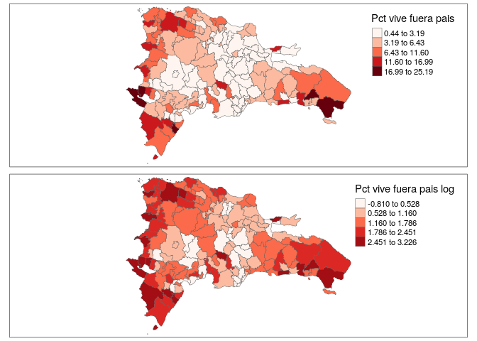

Una forma de comprobar el supuesto de normalidad es la gráfica cuantilar
normal, que consiste en una representación de las áreas acumuladas y
puntuaciones *z* correspondientes a la distribución normal. El supuesto
de normalidad se cumple si las observaciones siguen una línea recta.

``` r
vivefuera_sf %>% st_drop_geometry() %>%
  gather(variable, valor, -(x:TOPONIMIA)) %>%
  ggplot() + aes(sample=valor) +
  stat_qq() + stat_qq_line() + theme_bw() +
  theme(text = element_text(size = 14)) +
  facet_wrap(~variable, scales = 'free')
```

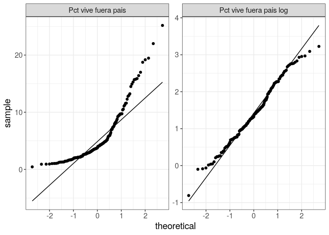

Como vemos, la columna de datos transformados se aproxima más a una
línea recta. Ahora probemos el supuesto de normalidad con la prueba
*Shapiro-Wilk*:

``` r
vivefuera_sf %>% st_drop_geometry() %>%
  gather(variable, valor, -(x:TOPONIMIA)) %>% group_by(variable) %>%
  summarise(prueba_normalidad=shapiro.test(valor)$p.value)
## # A tibble: 2 x 2
##   variable                prueba_normalidad
##   <chr>                               <dbl>
## 1 Pct vive fuera pais     0.000000000000969
## 2 Pct vive fuera pais log 0.256
```

La hipótesis nula en esta prueba es “los datos provienen de una
población con distribución normal”. Como vemos, para los datos
originales, y si asumimos un nivel de significancia de 0.05, debemos
rechazar la hipótesis nula, mientras que, para los datos transformados
no podemos rechazarla. Tenemos evidencia de que, al menos los datos
transformados, sí cumplen *en principio* con el supuesto de normalidad.

Ahora comprobemos el supuesto de homocedasticidad. Existen varias
alternativas en este caso. En primer lugar, usaremos los gráficos
“escala-localización”, que representan, en abscisa los valores
ajustados de la variable con relación a la coordenada *x*, y lo mismo
con relación a la coordenada *y*, inicialmente para los datos originales
y, posteriormente, con los datos transformados.

``` r
#Variable original
vivefuera_sf %>% lm(`Pct vive fuera pais`~ x, .) %>% plot(3)
```

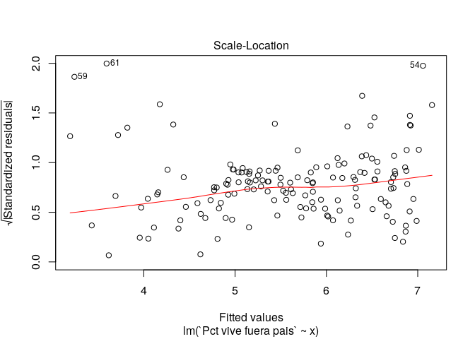

``` r
vivefuera_sf %>% lm(`Pct vive fuera pais`~ y, .) %>% plot(3)
```

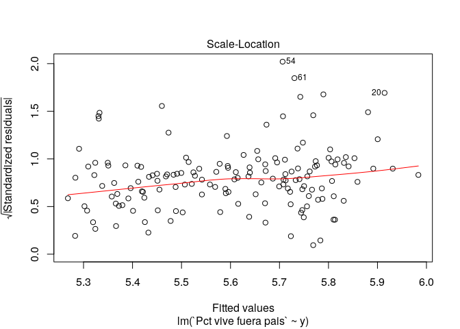

``` r

#Variable transformada
vivefuera_sf %>% lm(`Pct vive fuera pais log`~ x, .) %>% plot(3)
```

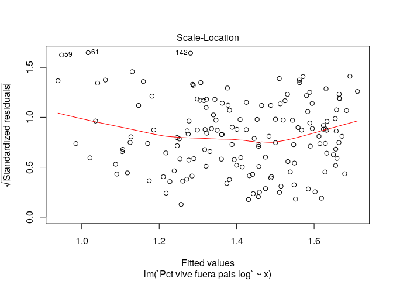

``` r
vivefuera_sf %>% lm(`Pct vive fuera pais log`~ y, .) %>% plot(3)
```

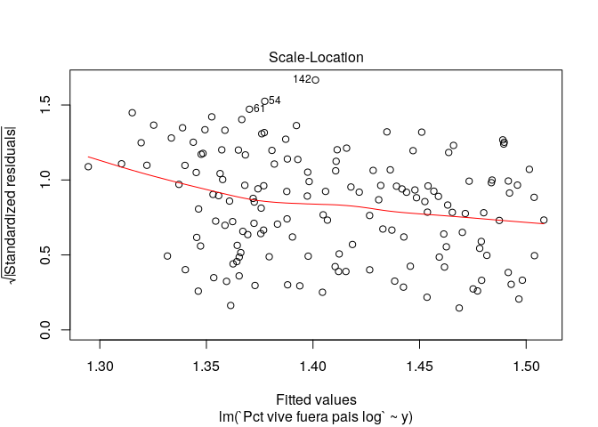

En ambos casos, la línea se muestra algo curvada y la dispersión de los
datos varía, sobre todo cuando la variable (original y transformada) se
pone en relación con *y*. Otra forma de probar homocedasticidad, es a
través de la prueba *Breusch-Pagan*, la cual *evalúa como hipótesis nula
que la varianza de los residuos es homogénea o constante*:

``` r
#Datos originales
vivefuera_sf %>% lm(`Pct vive fuera pais`~ x, .) %>% bptest()
## 
##  studentized Breusch-Pagan test
## 
## data:  .
## BP = 0.31244, df = 1, p-value = 0.5762
vivefuera_sf %>% lm(`Pct vive fuera pais`~ y, .) %>% bptest()
## 
##  studentized Breusch-Pagan test
## 
## data:  .
## BP = 3.4402, df = 1, p-value = 0.06363

#Datos transformados
vivefuera_sf %>% lm(`Pct vive fuera pais log`~ x, .) %>% bptest()
## 
##  studentized Breusch-Pagan test
## 
## data:  .
## BP = 4.1195, df = 1, p-value = 0.04239
vivefuera_sf %>% lm(`Pct vive fuera pais log`~ y, .) %>% bptest()
## 
##  studentized Breusch-Pagan test
## 
## data:  .
## BP = 9.1053, df = 1, p-value = 0.002549
```

Según la prueba, los datos transformados no siguen el supuesto de
homocedasticidad en ninguno de los dos ejes. Sin embargo, parecería que
los datos originales si son homocedásticos, al menos respecto del eje
*x*. Aunque satisfacer el supuesto de homocedasticidad es deseable, si
los datos son ligeramente heterocedásticos (como es el caso) es posible
realizar pruebas de autocorrelación. Ahora bien, un modelo espacial
autorregresivo útil sí exige que este supuesto se cumpla, o que se
atenúen rasgos heterocedásticas extremos en los datos. Continuaremos el
análisis de autocorrelación utilizando los datos transformados, dado que
al menos el supuesto de normalidad sí se cumple.

## Medidas de autocorrelación espacial

### *I* de Moran global

Vistos los supuestos y antes de continuar, a modo de representación
generalizada de la autocorrelación espacial, sirva la siguiente imagen
divulgativa tomada de Olaya (2014):

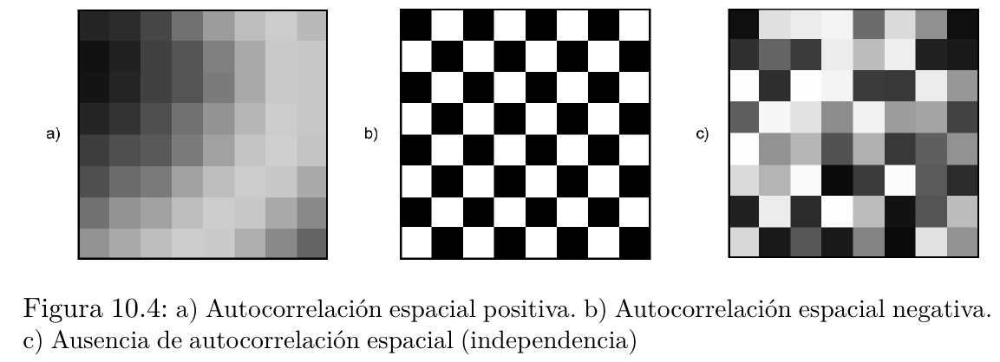

En el primer caso, a), donde se representa autocorrelación espacial
positiva, la variable se concentra en determinadas áreas de la imagen:
los valores representados como oscuros se concentran en la mitad
izquierda y en el borde inferior derecho; los valores contrarios se
organizan a lo largo de una banda diagonal entre las áreas anteriores.
Existen “grumos”, es decir, cada píxel se parece mucho a sus vecinos. La
autocorrelación espacial negativa, representada por b), es el caso
contrario: cada píxel tiene un valor opuesto al de sus vecinos (al menos
en modo torre). Esto significa que existe autocorrelación, pero en
sentido contrario. Finalmente, en c), se representa ausencia de
autocorrelación espacial: la variable no presenta estructura alguna y
luce que sus valores siguen una distribución aleatoria.

Verifiquemos, mediante la función `match` y haciendo una evaluación
lógica contra un vector secuencial, que el orden de los pesos coincide
con el orden de los municipios en el objeto espacial, que en este caso
es
`vivefuera_sf`.

``` r
match(attr(mun.w.W$neighbours, "region.id"),vivefuera_sf$TOPONIMIA)==1:155
##   [1] TRUE TRUE TRUE TRUE TRUE TRUE TRUE TRUE TRUE TRUE TRUE TRUE TRUE TRUE
##  [15] TRUE TRUE TRUE TRUE TRUE TRUE TRUE TRUE TRUE TRUE TRUE TRUE TRUE TRUE
##  [29] TRUE TRUE TRUE TRUE TRUE TRUE TRUE TRUE TRUE TRUE TRUE TRUE TRUE TRUE
##  [43] TRUE TRUE TRUE TRUE TRUE TRUE TRUE TRUE TRUE TRUE TRUE TRUE TRUE TRUE
##  [57] TRUE TRUE TRUE TRUE TRUE TRUE TRUE TRUE TRUE TRUE TRUE TRUE TRUE TRUE
##  [71] TRUE TRUE TRUE TRUE TRUE TRUE TRUE TRUE TRUE TRUE TRUE TRUE TRUE TRUE
##  [85] TRUE TRUE TRUE TRUE TRUE TRUE TRUE TRUE TRUE TRUE TRUE TRUE TRUE TRUE
##  [99] TRUE TRUE TRUE TRUE TRUE TRUE TRUE TRUE TRUE TRUE TRUE TRUE TRUE TRUE
## [113] TRUE TRUE TRUE TRUE TRUE TRUE TRUE TRUE TRUE TRUE TRUE TRUE TRUE TRUE
## [127] TRUE TRUE TRUE TRUE TRUE TRUE TRUE TRUE TRUE TRUE TRUE TRUE TRUE TRUE
## [141] TRUE TRUE TRUE TRUE TRUE TRUE TRUE TRUE TRUE TRUE TRUE TRUE TRUE TRUE
## [155] TRUE
```

Dado que la secuencia numérica incrementa en 1 en cada observación,
ambos vectores están ordenados de manera idéntica.

Evaluemos primero la autocorrelación espacial global. Para ello,
utilizaremos el *I* de Moran (Moran’s *I*) como primera medida para
evaluar la autocorrelación. Partiendo de la fórmula para calcular el *I*
de Moran (Bivand, Pebesma, & Gomez-Rubio, 2008):


donde *y<sub>i</sub>* es la observación *i*-ésima,
*<span style="text-decoration: overline">y</span>* es la media de la
variable de interés, y *w<sub>ij</sub>* es el peso espacial entre los
objetos *i* y *j*.

Si la variable tuviese un patrón aleatorio, el valor del *I* de Moran
tiene un valor esperado conocido. Dicho valor se estimaría con la
fórmula anterior usando valores distribuidos normalmente y, por lo
tanto, aleatoriamente. Si el valor obtenido del *I* de Moran con los
datos observados se aleja significativamente del valor esperado, se dice
que existe autocorrelación espacial global.

Nótese que, en la medida en que los datos estén distribuidos
aleatoriamente, la sumatoria de los productos del numerador se
cancelarían mutuamente, dando lugar a un valor bajo de *I*, es decir,
una autocorrelación inexistente.

La función `moran.test` calcula el valor del *I* de Moran y, a la vez,
evalúa dicho resultado contra el valor esperado, o lo que es lo mismo,
evalúa la hipótesis nula “no hay autocorrelación espacial global”. Si la
prueba resulta significativa (e.g. p\<α, donde comúnmente α=0.05, je je,
me río, porque la significancia está en crisis, pero nada, que siga el
entierro), se rechaza la hipótesis nula, es decir, se rechaza “no hay
autocorrelación”, con lo que se asume que, al menos *a priori*, existe
autocorrelación espacial global (no es habitual decir que “se acepta”
una hipótesis nula, sino más bien se dice que “no se rechaza”, y me sigo
riendo, que siga el entierro).

Evaluemos la autocorrelación espacial global usando los datos
transformados, considerando dos estilos de pesos
diferentes.

``` r
(gmoranw <- moran.test(x = vivefuera_sf$`Pct vive fuera pais log`, listw = mun.w.W))
## 
##  Moran I test under randomisation
## 
## data:  vivefuera_sf$`Pct vive fuera pais log`  
## weights: mun.w.W    
## 
## Moran I statistic standard deviate = 8.6411, p-value < 2.2e-16
## alternative hypothesis: greater
## sample estimates:
## Moran I statistic       Expectation          Variance 
##       0.439234922      -0.006493506       0.002660737
(gmoranb <- moran.test(x = vivefuera_sf$`Pct vive fuera pais log`, listw = mun.w.B))
## 
##  Moran I test under randomisation
## 
## data:  vivefuera_sf$`Pct vive fuera pais log`  
## weights: mun.w.B    
## 
## Moran I statistic standard deviate = 8.33, p-value < 2.2e-16
## alternative hypothesis: greater
## sample estimates:
## Moran I statistic       Expectation          Variance 
##       0.400094905      -0.006493506       0.002382453
```

Como vemos, la prueba sugiere que existe autocorrelación espacial global
positiva en la variable “logaritmo del porcentaje de personas que
respondió ‘Vivo fuera del país’ respecto del total municipal”. Esto
significa que, de entrada, existen áreas donde se concentra el valor de
dicha variable, es decir, existe al menos un *cluster*. Y en este caso,
*cluster* no significa que existe un municipio aislado con un valor
extremo diferenciado de su vecindad, sino que existe al menos un
conjunto de municipios en los que el valor de la variable analizada es
muy parecido entre ellos. Observa el mapa superior y notarás que dicho
patrón realmente existe.

Comparemos el resultado anterior contra una variable aleatoria.

``` r
set.seed(10)
(gmoranwale <- moran.test(x = rnorm(155), listw = mun.w.W))
## 
##  Moran I test under randomisation
## 
## data:  rnorm(155)  
## weights: mun.w.W    
## 
## Moran I statistic standard deviate = 0.42208, p-value = 0.3365
## alternative hypothesis: greater
## sample estimates:
## Moran I statistic       Expectation          Variance 
##       0.015296757      -0.006493506       0.002665173
```

En este caso, la prueba es no significativa, por lo que no podemos
rechaza la hipótesis nula “no hay autocorrelación espacial global”, y
concluimos que ésta no
existe.

### *I* de Moran local

``` r
moran.plot(x = vivefuera_sf$`Pct vive fuera pais log`, listw = mun.w.W)
```

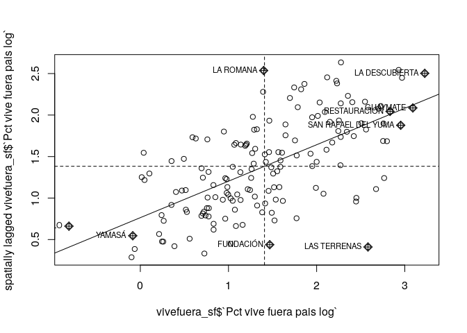

``` r
vivefueralomo <- localmoran(vivefuera_sf$`Pct vive fuera pais log`, listw = mun.w.W)
summary(vivefueralomo)
##        Ii                E.Ii               Var.Ii       
##  Min.   :-1.85213   Min.   :-0.006494   Min.   :0.06477  
##  1st Qu.:-0.01731   1st Qu.:-0.006494   1st Qu.:0.15968  
##  Median : 0.23452   Median :-0.006494   Median :0.19289  
##  Mean   : 0.43923   Mean   :-0.006494   Mean   :0.22368  
##  3rd Qu.: 0.68650   3rd Qu.:-0.006494   3rd Qu.:0.24272  
##  Max.   : 3.14474   Max.   :-0.006494   Max.   :0.99009  
##       Z.Ii            Pr(z > 0)      
##  Min.   :-2.63169   Min.   :0.00000  
##  1st Qu.:-0.02224   1st Qu.:0.06083  
##  Median : 0.59970   Median :0.27435  
##  Mean   : 0.96370   Mean   :0.30807  
##  3rd Qu.: 1.54934   3rd Qu.:0.50887  
##  Max.   : 5.94820   Max.   :0.99575
```

``` r
# Puntuaciones z
vivefuera_sf$svivefueralog <- scale(vivefuera_sf$`Pct vive fuera pais log`)  %>% as.vector()

# Crear variable con rezago
vivefuera_sf$lagsvivefueralog <- lag.listw(mun.w.W, vivefuera_sf$svivefueralog)

# Resúmenes
summary(vivefuera_sf$svivefueralog)
##    Min. 1st Qu.  Median    Mean 3rd Qu.    Max. 
## -2.7804 -0.7250 -0.1047  0.0000  0.7498  2.2782
summary(vivefuera_sf$lagsvivefueralog)
##     Min.  1st Qu.   Median     Mean  3rd Qu.     Max. 
## -1.40619 -0.55423 -0.06197 -0.03214  0.49090  1.53642

# moran scatterplot, in basic graphics (with identification of influential observations)
puntz <- vivefuera_sf$svivefueralog
rezag <- vivefuera_sf$lagsvivefueralog
df <- data.frame(puntz, rezag)

moran.plot(puntz, mun.w.W)
```

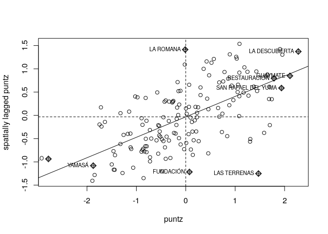

``` r

# Diagrama de dispersión de Moran en ggplot
ggplot(df, aes(puntz, rezag)) +
  geom_point() + geom_smooth(method = 'lm', se = F) +
  geom_hline(yintercept = 0, linetype = 'dashed') +
  geom_vline(xintercept = 0, linetype = 'dashed') 
```

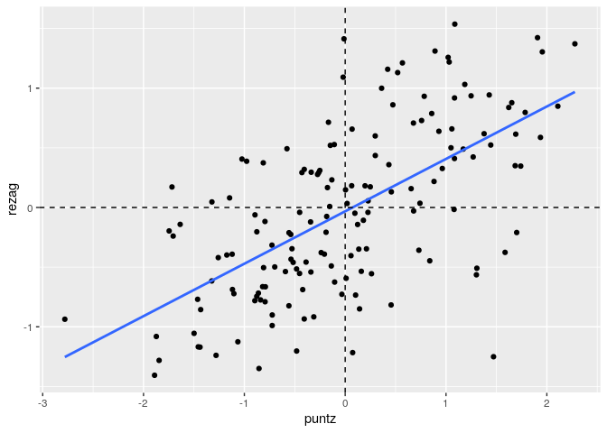

``` r

# Variable nueva sobre significancia de la correlación local, rellena con NAs
vivefuera_sf$quad_sig <- NA

# Cuadrante high-high quadrant
vivefuera_sf[(vivefuera_sf$svivefueralog >= 0 & 
                vivefuera_sf$lagsvivefueralog >= 0) & 
               (vivefueralomo[, 5] <= 0.05), "quad_sig"] <- "high-high"
# Cuadrante low-low
vivefuera_sf[(vivefuera_sf$svivefueralog <= 0 & 
                vivefuera_sf$lagsvivefueralog <= 0) & 
               (vivefueralomo[, 5] <= 0.05), "quad_sig"] <- "low-low"
# Cuadrante high-low
vivefuera_sf[(vivefuera_sf$svivefueralog >= 0 & 
                vivefuera_sf$lagsvivefueralog <= 0) & 
               (vivefueralomo[, 5] <= 0.05), "quad_sig"] <- "high-low"
# Cuadrante low-high
vivefuera_sf[(vivefuera_sf$svivefueralog <= 0 
                   & vivefuera_sf$lagsvivefueralog >= 0) & 
                    (vivefueralomo[, 5] <= 0.05), "quad_sig"] <- "low-high"
# No significativas
vivefuera_sf[(vivefueralomo[, 5] > 0.05), "quad_sig"] <- "not signif."  

#Convertir a factorial
vivefuera_sf$quad_sig <- as.factor(vivefuera_sf$quad_sig)

# Mapa
vivefuera_sf %>% 
  ggplot() +
  aes(fill = quad_sig) + 
  geom_sf(color = "white", size = .05)  +
  theme_void() + scale_fill_brewer(palette = "Set1")
```

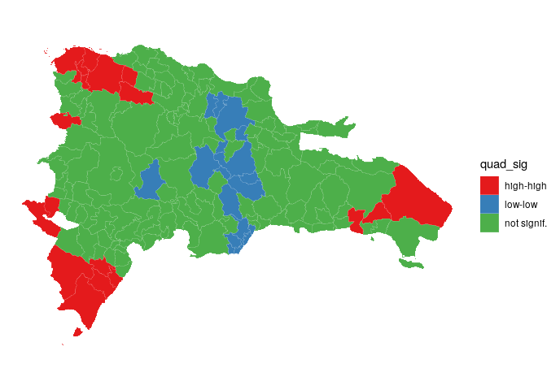

## Referencias

<div id="refs" class="references">

<div id="ref-bivand2008applied">

Bivand, R. S., Pebesma, E. J., & Gomez-Rubio, V. (2008). *Applied
spatial data analysis with R* (Vol. 747248717). Springer.

</div>

<div id="ref-olaya2014sistemas">

Olaya, V. (2014). *Sistemas de informacion geográfica*. Retrieved from
<https://volaya.github.io/libro-sig/>

</div>

</div>
