<!-- Este .md fue generado a partir del .Rmd homónimo. Edítese el .Rmd -->

# Datos puntuales, geoestadística.

## Geoestadística

### Definición

La geoestadística se ocupa en modelar, predecir y simular fenómenos
espacialmente continuos. En realidad, lo que aborda es la obtención de
valores en lugares no muestreados. Dado que es imposible tomar muestras
en todas partes, la geoestadística asiste en la predicción espacialmente
continua del valor de una variable.

### Kriging

Considera un fenómeno *Z(s)*, muestreado en *s<sub>i</sub>*, con
*i=1,2,3,…,n*, pero nos interesa su valor en todas las localidades,
*s<sub>0</sub>*; debemos predecir *s<sub>0</sub>*, lo cual realizaremos
de manera habitual con el método del krigeaje (krigeado o **kriging**),
que consiste en una predicción Gaussiana.

Existen varias modalidades de krigeaje según los distintos supuestos
(todas asumen que la variación espacial es modelizable mediante el
variograma), siendo las más comunes las siguientes:

  - **Kriging ordinario**. Asume **media constante y desconocida** en el
    entorno próximo de la observación *s<sub>i</sub>*. **No se asume que
    la media local tenga el mismo valor que la media poblacional**, es
    decir, no hay requisito de estacionariedad de primer momento. Dada
    las pocas asunciones que requiere en su implementación, y por su
    aproximación más conservadora, es muy empleado en varias
    disciplinas.

  - **Kriging simple**. **Asume estacionariedad de primer momento**
    (media constante) en el dominio analizado, pero la media poblacional
    es conocida.

  - **Kriging universal**. Asume una **tendencia general modelizada por
    polinomio**, como por ejemplo, un modelo lineal.

### Semivarianza y variograma

El kriging utiliza un modelo para ponderar las observaciones cercanas a
*s<sub>0</sub>* denominado variograma o semivariograma. El variograma es
el gráfico de representación de estimaciones de la semivarianza γ; esta
última mide el grado de dependencia espacial entre muestras. En la
medida en que aumenta la distancia entre pares de observaciones, se
asume que la semivarianza aumenta igualmente. Observaciones cercanas
obtendrán semivarianzas pequeñas, puesto que si existe autocorrelación
espacial, observaciones cercanas serán muy parecidas.

Las estimaciones de la semivarianza se obtienen a partir de la fórmula:

<figure>

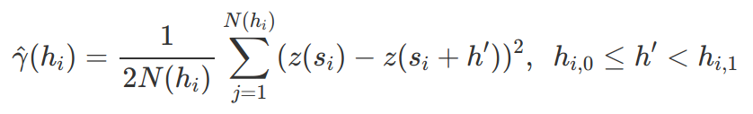

</figure>

*Tomado de Pebesma & Bivand (2019)*

Donde *h<sub>i</sub>=\[h<sub>i,0</sub>,h<sub>i,1</sub>\]* es el
intervalo de distancia para *i* y *N(h<sub>i</sub>)* es el número de
pares de muestras disponibles para *i* en el intervalo *h<sub>i</sub>*,
*z(s<sub>i</sub>)* es el valor de la variable en *i*, y
*z(s<sub>i</sub>)+h’* el valor de la variable a la distancia *h’* desde
*i*.

En realidad, los programas de computo de la semivarianza utilizan un
diseño geométrico de búsqueda basado en *lags* que se fijan de
incrementalmente de acuerdo al tamaño de intervalo. Aunque la anchura de
búsqueda es fija, los *lags* pueden ser múltiples, lo que complica
significativamente los cálculos.

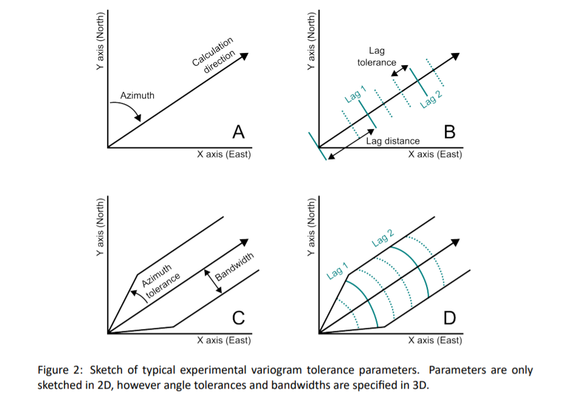

*Tomado de
<http://geostatisticslessons.com/pdfs/variogramparameters.pdf>*

Como podrás sospechar, en la medida en la que aumenta el número de
observaciones, el número de posibles pares se incrementa
exponencialmente, más aun si se aumenta la distancia máxima de búsqueda
y la anchura de intervalo. Calcular la semivarianza es muy tedioso si se
realiza para muestras grandes. Dado que la capacidad de cómputo no es
una limitante hoy en día, se puede calcular la semivarianza para muchos
pares de muestras, y representar cómo ésta cambia con la distancia, lo
cual se denomina semivariagrama muestral. Para realizar una predicción
razonable, necesitamos un modelo para ponderar las observaciones.
Utilizando el variograma muestral, ajustamos un variograma modelo que
utilizaremos como función para establecer los pesos.

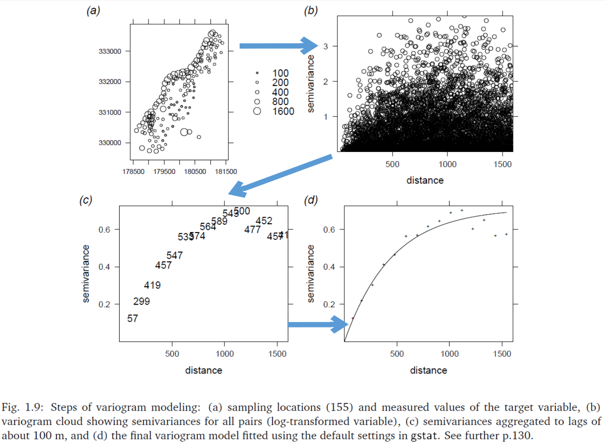 *Tomado de Hengl (2009)*

Se utilizan distintos variogramas modelo, siendo los más comunes el
exponencial y el esférico.

<figure>

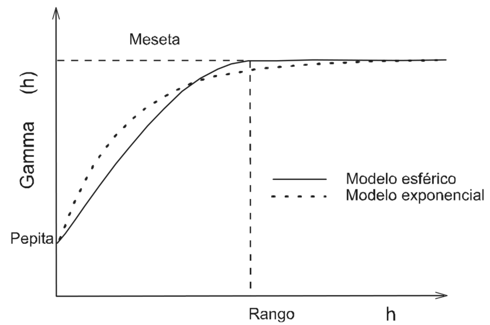

</figure>

  
*Tomado de Alperín, Borges, & Sarandón (2002)*

Además de los anteriores, R dispone de los modelos comunes de
variograma:

``` r
library(gstat)
show.vgms()
```

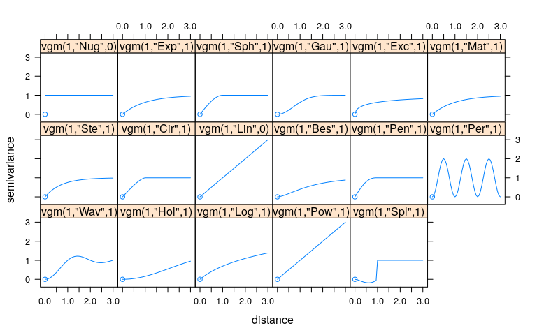

``` r
vgm()
##    short                                      long
## 1    Nug                              Nug (nugget)
## 2    Exp                         Exp (exponential)
## 3    Sph                           Sph (spherical)
## 4    Gau                            Gau (gaussian)
## 5    Exc        Exclass (Exponential class/stable)
## 6    Mat                              Mat (Matern)
## 7    Ste Mat (Matern, M. Stein's parameterization)
## 8    Cir                            Cir (circular)
## 9    Lin                              Lin (linear)
## 10   Bes                              Bes (bessel)
## 11   Pen                      Pen (pentaspherical)
## 12   Per                            Per (periodic)
## 13   Wav                                Wav (wave)
## 14   Hol                                Hol (hole)
## 15   Log                         Log (logarithmic)
## 16   Pow                               Pow (power)
## 17   Spl                              Spl (spline)
## 18   Leg                            Leg (Legendre)
## 19   Err                   Err (Measurement error)
## 20   Int                           Int (Intercept)
```

Los elementos de un variograma son los siguientes (según Alperín et al.
(2002)):

  - Efecto “pepita” (*nugget*): corresponde a la variabilidad aleatoria
    inherente \[variabilidad inframuestra, imposible de detectarse con
    la espaciación elegida en el diseño muestral\].

  - Rango (*range*), rango de influencia, alcance: corresponde a la
    distancia a la cual las muestras se tornan independientes, es la
    distancia donde se alcanza la meseta.

  - Meseta (*psill*): correspondiente a la varianza estructural.

### ¿Cómo interpretar un variograma?

La principal tarea al generar un variograma consiste en detectar
autocorrelación espacial, es decir, relación entre observaciones debido
a la estructrura espacial. Si existe autocorrelación, ésta podrá
modelizarse adecuadamente mediante un variograma modelo.

El variograma de una variable autocorrelacionada espacialmente muestra
un incremento gradual de la semivarianza hasta que se alcanza la meseta
en el rango (concretamente, al alcanzar el 95% de la semivarianza
total). Esto implica que la semivarianza inicia en cero o cercana a éste
para el intervalo de distancia cero.

En el caso de una variable no autocorrelacionada, ya sea porque tiene un
comportamiento aleatorio o porque la distribución espacial de las
observaciones es demasiado gruesa como para detectar la autocorrelación
de escalas más detalladas (variabilidad inframuestra), en la distancia
cero el variograma intercepta el eje de la semivarianza en valores
significativamente elevados.

<figure>

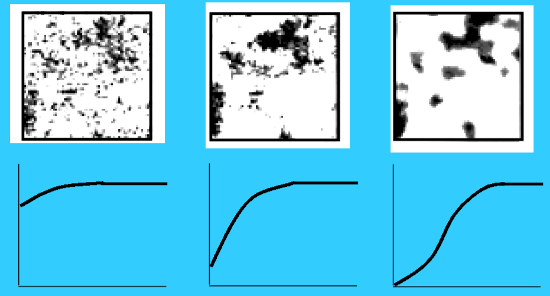

</figure>

  
*Tomado de <http://www.statios.com/Resources/04-variogram.pdf>*

A continuación, ejemplos de variogramas modelo aplicados a datos de
abundancia de especie de plantas leñosas en la cuenca del río Ocoa.

<figure>

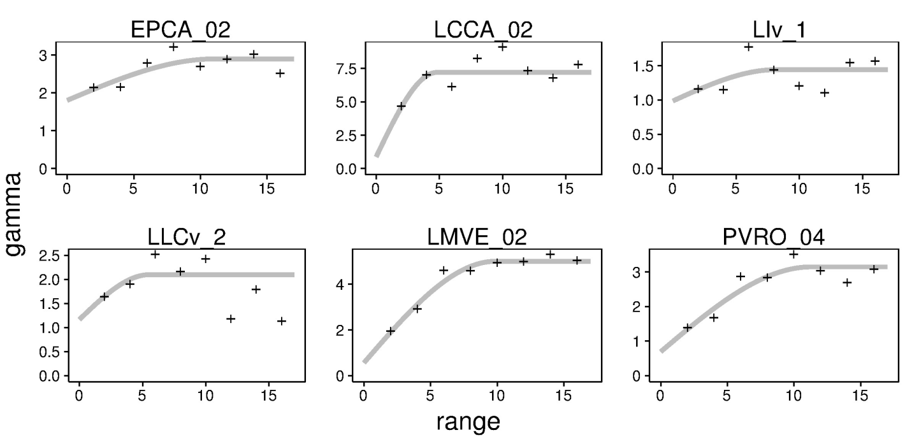

</figure>

  

Nótese por ejemplo el caso del variograma LMVE\_02, donde la
semivarianza aumenta gradualmente hasta alcanzar el rango, que ocurre
entre 5 y 10 m. Por el contrario, EPCA\_02 y LIv\_1 no presentan un
patrón autocorrelacionado, puesto que la semivarianza no aumenta
gradualmente.

## Estudio de caso: precipitación de República Dominicana mediante kriging ordinario

En esta introducción realizaremos un **kriging ordinario** y un
**kriging universal** utilizando los observatorios de precipitación de
República Dominicana colectados por ONAMET.

### Datos fuente

Tomaremos como ejemplo la precipitación del año 1979. Primero carguemos
los observatorios y las provincias:

``` r
library(sf)
rutapre <- 'data/onamet_prec_anual_sf.gpkg'
rutadiv <- 'data/divisionRD.gpkg'
st_layers(rutapre)
## Driver: GPKG 
## Available layers:
##             layer_name geometry_type features fields
## 1 onamet_prec_anual_sf         Point       25     37
pre <- st_read(rutapre)
## Reading layer `onamet_prec_anual_sf' from data source `/home/jr/Documentos/clases_UASD/201902/maestria-geotel-analisis-espacial/material-de-apoyo/data/onamet_prec_anual_sf.gpkg' using driver `GPKG'
## Simple feature collection with 25 features and 37 fields
## geometry type:  POINT
## dimension:      XY
## bbox:           xmin: -71.7 ymin: 18.067 xmax: -68.367 ymax: 19.85
## epsg (SRID):    4326
## proj4string:    +proj=longlat +datum=WGS84 +no_defs
pre
## Simple feature collection with 25 features and 37 fields
## geometry type:  POINT
## dimension:      XY
## bbox:           xmin: -71.7 ymin: 18.067 xmax: -68.367 ymax: 19.85
## epsg (SRID):    4326
## proj4string:    +proj=longlat +datum=WGS84 +no_defs
## First 10 features:
##            Estación  a1979  a1980  a1981  a1982  a1983  a1984  a1985
## 1          Barahona 1740.0 1053.6 1435.3  815.3 1183.0  584.1  997.8
## 2         Bayaguana 2794.3 1761.5 2412.4 1758.6 1857.1 1645.6 1928.3
## 3           Cabrera 2035.0 1276.8     NA 2136.9 1703.8 1888.7 1557.1
## 4         Constanza 1652.1 1166.9 1343.3  921.2  828.4     NA  892.8
## 5  Gaspar Hernández     NA 1443.8 2174.9 1844.1 1688.8 2208.8 1895.5
## 6       Hondo Valle 1823.6 1778.2 2203.7 1709.9 1841.3 1796.6 1309.5
## 7            Jimaní 1060.7  639.1  960.2  507.5  610.7  641.5  689.6
## 8          La Unión 1781.5 1630.6 2304.4 1413.1 1288.4 1499.4 1157.1
## 9           La Vega 1833.5 1304.3 1993.7 1483.2 1353.9 1550.1 1084.9
## 10     Las Américas 1958.4  958.7 1513.4  787.4  975.5  954.9 1398.2
##     a1986  a1987  a1988  a1989   a1990  a1991  a1992  a1993  a1994   a1995
## 1  1080.0 1423.9  704.7 1011.6 1075.20  983.1 1112.5  968.5 1622.4  956.00
## 2  2182.2 2273.5 1813.2 1730.6 1823.40 1850.3 1765.7 1606.2 1892.8 1360.10
## 3  1597.0 2059.7     NA 1176.9 1183.40  957.6     NA     NA     NA      NA
## 4   715.8  786.9  837.7  671.5  875.35     NA  858.6  858.6  900.7  839.40
## 5  2874.7 2360.8 1426.3 1214.2 1530.70     NA 1257.5 1345.3 1824.9 1665.45
## 6  1589.7 1778.8 1766.5 1722.8 1596.10 1088.4 1731.0 1887.0 1772.0 1288.30
## 7   802.4  648.9  521.0  680.7  880.00  311.6  809.2  472.9  840.2  909.00
## 8  1313.1 1786.5 1888.8 1222.8 1808.00 1250.4 1555.2 1484.8 1035.9  877.70
## 9  1767.1 1663.2 1934.9 1192.4 1664.40 1146.4 1565.6 1855.4 1455.7 1175.40
## 10 1419.0 1866.4 1620.5 1151.7      NA  997.0     NA     NA     NA 1017.50
##      a1996   a1997  a1998  a1999  a2000  a2001  a2002   a2003  a2004
## 1   965.65  662.60  684.6  662.7  600.0  600.0  997.6  942.60  972.6
## 2  1867.70 1618.60 2156.6 1712.5 1868.5 1796.1 1658.0 2117.30 1554.2
## 3       NA      NA     NA     NA 1538.6 1852.9  946.9 1810.95 2053.3
## 4  1167.30  525.10 1492.7 1077.8  951.3  787.1  959.2 1084.10  985.9
## 5  2656.80  984.80 2147.9 1791.9 1716.9 2178.8 1093.4 2058.50 1906.8
## 6  1447.90  912.65 1813.9 1762.2 2285.9 1604.3 1477.4 1628.10 1617.7
## 7   816.20  358.20  824.1 1037.0  833.9  488.4  510.1  656.70  866.9
## 8  1980.50  554.20 1744.1 1314.3 1148.5 1360.5  972.1 1802.00 2550.1
## 9  1772.50 1018.80 1549.6 1817.9 1368.6 1522.0 1200.7 2290.60 1825.7
## 10 1019.60  651.20 1218.6 1125.9  809.7  747.6  933.4 1083.60 1338.9
##      a2005   a2006   a2007   a2008  a2009  a2010  a2011  a2012  a2013
## 1  1274.60 1118.40 1531.30 1136.80  583.3 1036.3 1280.2 1726.3  576.2
## 2  2102.80 2097.10 2137.60 1831.20 1607.9 1881.6 1849.9 2350.8 2108.0
## 3  1451.10 1957.90      NA      NA     NA 2411.4 1920.1 2821.3     NA
## 4  1245.20 1162.20 1661.40 1072.90  902.8 1024.5 1008.2 1188.1 1016.3
## 5  2001.85 1992.00 3282.65 1866.30 2386.1 2639.2 1727.2 2524.0 1448.2
## 6  1554.65 1487.15 1487.15 1399.15 1461.9 2005.6 1309.0 1736.8 1390.2
## 7   929.30  963.90 1084.00  751.10  694.9  807.1  879.5 1037.3  292.9
## 8  2034.30 2106.60 2764.80 1536.30 1605.8 2255.6 1719.2 2484.3 1299.2
## 9  1245.20 1162.20 1661.40 1072.90 2867.4 1486.4 1434.1 2204.7 1227.0
## 10 1744.60 1141.70 1457.50 1718.40 1369.1 2422.4 1885.5 1658.7 1039.6
##     a2014                    geom
## 1   845.9      POINT (-71.1 18.2)
## 2  1505.6 POINT (-69.63333 18.75)
## 3  1975.6    POINT (-69.9 19.633)
## 4   764.1      POINT (-70.7 18.9)
## 5  1928.7    POINT (-70.3 19.617)
## 6   908.9    POINT (-71.7 18.717)
## 7   502.0  POINT (-71.633 18.483)
## 8  1741.5    POINT (-70.55 19.75)
## 9  1812.5  POINT (-70.533 19.217)
## 10  909.4  POINT (-69.667 18.433)
st_layers(rutadiv)
## Driver: GPKG 
## Available layers:
##      layer_name geometry_type features fields
## 1 PROVCenso2010       Polygon       32      4
## 2  MUNCenso2010       Polygon      155      5
## 3  REGCenso2010       Polygon       10      2
prov <- st_read(rutadiv, layer = 'PROVCenso2010')
## Reading layer `PROVCenso2010' from data source `/home/jr/Documentos/clases_UASD/201902/maestria-geotel-analisis-espacial/material-de-apoyo/data/divisionRD.gpkg' using driver `GPKG'
## Simple feature collection with 32 features and 4 fields
## geometry type:  MULTIPOLYGON
## dimension:      XY
## bbox:           xmin: 182215.8 ymin: 1933532 xmax: 571365.3 ymax: 2205216
## epsg (SRID):    32619
## proj4string:    +proj=utm +zone=19 +datum=WGS84 +units=m +no_defs
prov
## Simple feature collection with 32 features and 4 fields
## geometry type:  MULTIPOLYGON
## dimension:      XY
## bbox:           xmin: 182215.8 ymin: 1933532 xmax: 571365.3 ymax: 2205216
## epsg (SRID):    32619
## proj4string:    +proj=utm +zone=19 +datum=WGS84 +units=m +no_defs
## First 10 features:
##    PROV REG         TOPONIMIA ENLACE                           geom
## 1    01  10 DISTRITO NACIONAL   1001 MULTIPOLYGON (((406845.9 20...
## 2    02  05              AZUA   0502 MULTIPOLYGON (((322129.5 20...
## 3    03  06           BAORUCO   0603 MULTIPOLYGON (((271940 2060...
## 4    04  06          BARAHONA   0604 MULTIPOLYGON (((291856.5 20...
## 5    05  04           DAJABÓN   0405 MULTIPOLYGON (((245433.3 21...
## 6    06  03            DUARTE   0306 MULTIPOLYGON (((374434.8 21...
## 7    07  07        ELÍAS PIÑA   0707 MULTIPOLYGON (((235630.8 21...
## 8    08  08          EL SEIBO   0808 MULTIPOLYGON (((523436.4 20...
## 9    09  01         ESPAILLAT   0109 MULTIPOLYGON (((385993.5 21...
## 10   10  06     INDEPENDENCIA   0610 MULTIPOLYGON (((205698.2 20...
```

Exploremos el CRS del objeto `obs`.

``` r
st_crs(pre)
## Coordinate Reference System:
##   EPSG: 4326 
##   proj4string: "+proj=longlat +datum=WGS84 +no_defs"
```

Transformemos a 32619:

``` r
crsdestino <- 32619
preutm <- pre %>% st_transform(crs = crsdestino)
preutm
## Simple feature collection with 25 features and 37 fields
## geometry type:  POINT
## dimension:      XY
## bbox:           xmin: 215264.1 ymin: 1999092 xmax: 566794.7 ymax: 2197035
## epsg (SRID):    32619
## proj4string:    +proj=utm +zone=19 +datum=WGS84 +units=m +no_defs
## First 10 features:
##            Estación  a1979  a1980  a1981  a1982  a1983  a1984  a1985
## 1          Barahona 1740.0 1053.6 1435.3  815.3 1183.0  584.1  997.8
## 2         Bayaguana 2794.3 1761.5 2412.4 1758.6 1857.1 1645.6 1928.3
## 3           Cabrera 2035.0 1276.8     NA 2136.9 1703.8 1888.7 1557.1
## 4         Constanza 1652.1 1166.9 1343.3  921.2  828.4     NA  892.8
## 5  Gaspar Hernández     NA 1443.8 2174.9 1844.1 1688.8 2208.8 1895.5
## 6       Hondo Valle 1823.6 1778.2 2203.7 1709.9 1841.3 1796.6 1309.5
## 7            Jimaní 1060.7  639.1  960.2  507.5  610.7  641.5  689.6
## 8          La Unión 1781.5 1630.6 2304.4 1413.1 1288.4 1499.4 1157.1
## 9           La Vega 1833.5 1304.3 1993.7 1483.2 1353.9 1550.1 1084.9
## 10     Las Américas 1958.4  958.7 1513.4  787.4  975.5  954.9 1398.2
##     a1986  a1987  a1988  a1989   a1990  a1991  a1992  a1993  a1994   a1995
## 1  1080.0 1423.9  704.7 1011.6 1075.20  983.1 1112.5  968.5 1622.4  956.00
## 2  2182.2 2273.5 1813.2 1730.6 1823.40 1850.3 1765.7 1606.2 1892.8 1360.10
## 3  1597.0 2059.7     NA 1176.9 1183.40  957.6     NA     NA     NA      NA
## 4   715.8  786.9  837.7  671.5  875.35     NA  858.6  858.6  900.7  839.40
## 5  2874.7 2360.8 1426.3 1214.2 1530.70     NA 1257.5 1345.3 1824.9 1665.45
## 6  1589.7 1778.8 1766.5 1722.8 1596.10 1088.4 1731.0 1887.0 1772.0 1288.30
## 7   802.4  648.9  521.0  680.7  880.00  311.6  809.2  472.9  840.2  909.00
## 8  1313.1 1786.5 1888.8 1222.8 1808.00 1250.4 1555.2 1484.8 1035.9  877.70
## 9  1767.1 1663.2 1934.9 1192.4 1664.40 1146.4 1565.6 1855.4 1455.7 1175.40
## 10 1419.0 1866.4 1620.5 1151.7      NA  997.0     NA     NA     NA 1017.50
##      a1996   a1997  a1998  a1999  a2000  a2001  a2002   a2003  a2004
## 1   965.65  662.60  684.6  662.7  600.0  600.0  997.6  942.60  972.6
## 2  1867.70 1618.60 2156.6 1712.5 1868.5 1796.1 1658.0 2117.30 1554.2
## 3       NA      NA     NA     NA 1538.6 1852.9  946.9 1810.95 2053.3
## 4  1167.30  525.10 1492.7 1077.8  951.3  787.1  959.2 1084.10  985.9
## 5  2656.80  984.80 2147.9 1791.9 1716.9 2178.8 1093.4 2058.50 1906.8
## 6  1447.90  912.65 1813.9 1762.2 2285.9 1604.3 1477.4 1628.10 1617.7
## 7   816.20  358.20  824.1 1037.0  833.9  488.4  510.1  656.70  866.9
## 8  1980.50  554.20 1744.1 1314.3 1148.5 1360.5  972.1 1802.00 2550.1
## 9  1772.50 1018.80 1549.6 1817.9 1368.6 1522.0 1200.7 2290.60 1825.7
## 10 1019.60  651.20 1218.6 1125.9  809.7  747.6  933.4 1083.60 1338.9
##      a2005   a2006   a2007   a2008  a2009  a2010  a2011  a2012  a2013
## 1  1274.60 1118.40 1531.30 1136.80  583.3 1036.3 1280.2 1726.3  576.2
## 2  2102.80 2097.10 2137.60 1831.20 1607.9 1881.6 1849.9 2350.8 2108.0
## 3  1451.10 1957.90      NA      NA     NA 2411.4 1920.1 2821.3     NA
## 4  1245.20 1162.20 1661.40 1072.90  902.8 1024.5 1008.2 1188.1 1016.3
## 5  2001.85 1992.00 3282.65 1866.30 2386.1 2639.2 1727.2 2524.0 1448.2
## 6  1554.65 1487.15 1487.15 1399.15 1461.9 2005.6 1309.0 1736.8 1390.2
## 7   929.30  963.90 1084.00  751.10  694.9  807.1  879.5 1037.3  292.9
## 8  2034.30 2106.60 2764.80 1536.30 1605.8 2255.6 1719.2 2484.3 1299.2
## 9  1245.20 1162.20 1661.40 1072.90 2867.4 1486.4 1434.1 2204.7 1227.0
## 10 1744.60 1141.70 1457.50 1718.40 1369.1 2422.4 1885.5 1658.7 1039.6
##     a2014                     geom
## 1   845.9 POINT (277900.2 2013585)
## 2  1505.6 POINT (433242.1 2073284)
## 3  1975.6   POINT (405636 2171119)
## 4   764.1 POINT (320947.7 2090623)
## 5  1928.7 POINT (363678.2 2169619)
## 6   908.9 POINT (215264.1 2071669)
## 7   502.0 POINT (221953.7 2045651)
## 8  1741.5 POINT (337592.1 2184559)
## 9  1812.5 POINT (338847.1 2125548)
## 10  909.4 POINT (429562.7 2038222)
```

### EDA básico

Obtengamos los estadísticos básicos para el año 1979:

``` r
nrow(preutm)
## [1] 25
summary(preutm$a1979)
##    Min. 1st Qu.  Median    Mean 3rd Qu.    Max.    NA's 
##     835    1551    1824    2067    2794    3621       4
hist(preutm$a1979)
```

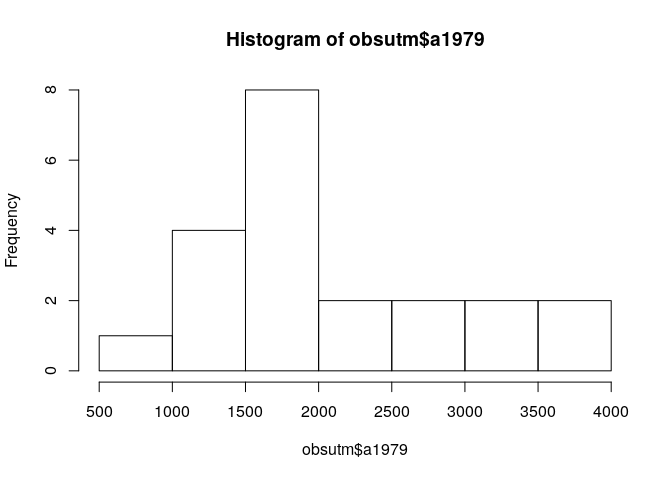

``` r
hist(log(preutm$a1979))
```

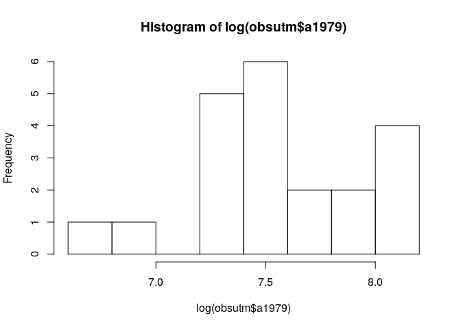

``` r
shapiro.test(preutm$a1979)
## 
##  Shapiro-Wilk normality test
## 
## data:  preutm$a1979
## W = 0.91614, p-value = 0.07268
shapiro.test(log(pre$a1979))
## 
##  Shapiro-Wilk normality test
## 
## data:  log(pre$a1979)
## W = 0.96103, p-value = 0.537
```

Como vemos, los datos siguen distribución normal, pero hay algo de sesgo
hacia la derecha en la distribución. Igualmente, de los 25 observatorios
que hay en todo el país, para 1979 en al menos 4 hay datos perdidos
(`NA`). Eliminemos dichos observatorios, generemos un objeto que incluya
solamente a 1979 y que contenga igualmente una columna con datos
transformados:

``` r
pre1979 <- na.omit(preutm[,c('Estación', 'a1979')])
pre1979$a1979log <- log(pre1979$a1979)
pre1979
## Simple feature collection with 21 features and 3 fields
## geometry type:  POINT
## dimension:      XY
## bbox:           xmin: 215264.1 ymin: 1999092 xmax: 566794.7 ymax: 2197035
## epsg (SRID):    32619
## proj4string:    +proj=utm +zone=19 +datum=WGS84 +units=m +no_defs
## First 10 features:
##        Estación  a1979                     geom a1979log
## 1      Barahona 1740.0 POINT (277900.2 2013585) 7.461640
## 2     Bayaguana 2794.3 POINT (433242.1 2073284) 7.935337
## 3       Cabrera 2035.0   POINT (405636 2171119) 7.618251
## 4     Constanza 1652.1 POINT (320947.7 2090623) 7.409802
## 6   Hondo Valle 1823.6 POINT (215264.1 2071669) 7.508568
## 7        Jimaní 1060.7 POINT (221953.7 2045651) 6.966684
## 8      La Unión 1781.5 POINT (337592.1 2184559) 7.485211
## 9       La Vega 1833.5 POINT (338847.1 2125548) 7.513982
## 10 Las Américas 1958.4 POINT (429562.7 2038222) 7.579883
## 11         Moca 1571.2 POINT (342475.8 2143891) 7.359595
```

Representemos los observatorios, estilizando por tono según la
precipitación del año 1979:

``` r
library(ggplot2)
ggplot() +
  geom_sf(data = prov, fill = 'white') +
  geom_sf(data = pre1979, aes(col = a1979log), size = 6) +
  scale_colour_gradient(low="#deebf7", high="#3182bd") +
  geom_sf_text(data = prov, aes(label=TOPONIMIA), check_overlap = T, size = 2) +
  geom_sf_text(data = pre1979, aes(label=Estación), check_overlap = T, size = 1.5) +
  theme_bw()
```

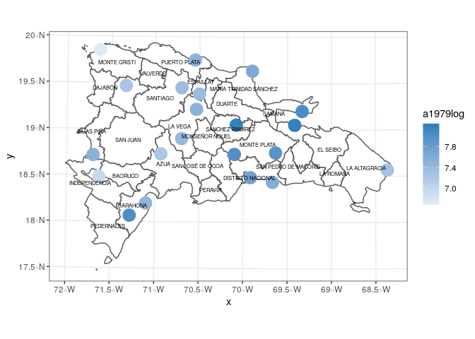

### Variograma muestral

Generemos el variograma muestral para el logaritmo de la precipitación.
Para ello empleamos la función `variogram`.

``` r
v79 <- variogram(a1979log~1, pre1979)
v79
##    np      dist      gamma dir.hor dir.ver   id
## 1   5  22194.50 0.06577156       0       0 var1
## 2   6  32173.82 0.02770140       0       0 var1
## 3   5  39853.47 0.01633966       0       0 var1
## 4   3  51054.25 0.12291414       0       0 var1
## 5   9  58733.21 0.11826353       0       0 var1
## 6  11  67537.43 0.09826248       0       0 var1
## 7   6  77939.63 0.11675252       0       0 var1
## 8  17  84561.60 0.09521950       0       0 var1
## 9   9  93413.46 0.10509438       0       0 var1
## 10  7 103432.81 0.08401457       0       0 var1
## 11  8 111794.75 0.14187529       0       0 var1
## 12 11 120568.26 0.17431061       0       0 var1
## 13  8 127997.00 0.08698657       0       0 var1
plot(v79, plot.numbers = T)
```

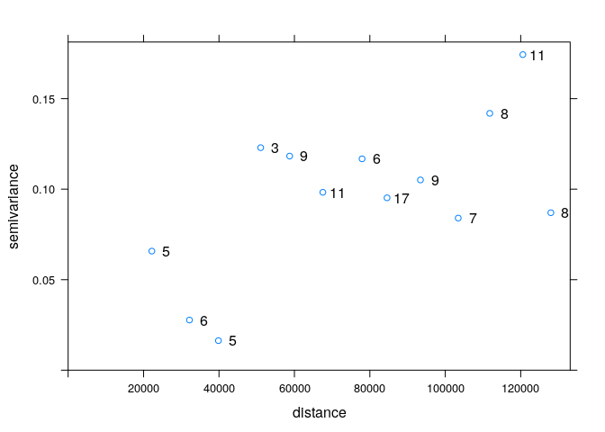

Nótese la fórmula `a1979log~1`, la cual indica que la precipitación de
1979 es la variable sobre la cual se generará el variograma contra un
modelo de media, que en este caso es simplemente un intercepto (media
desconocida y constante). Típicamente, este variograma servirá para
realizar un kriging ordinario.

La función `variogram` fija una distancia máxima de búsqueda (`cutoff`),
que equivale a un tercio de la diagonal del recuadro delimitador
(*bounding box*), y fija intervalos de anchura constante (`width`, que
es la distancia de los intervalos *h<sub>i</sub>*, referida
anteriormente) equivalentes a `cutoff/15`. Dichos parámetros, `cutoff` y
`width` pueden modificarse por argumentos dentro de la función
`variogram`.

### Variograma modelo

A partir del variograma muestral, generamos un variograma modelo que
será el que utlizará la función `krige` para realizar la interpolación.
Probamos varias opciones en función de lo visto en el variograma
muestral.

``` r
v79_m <- fit.variogram(v79, vgm(model = "Sph", range = 50000))
v79_m
##   model     psill    range
## 1   Sph 0.1177765 102296.2
plot(v79, v79_m, plot.numbers = T)
```

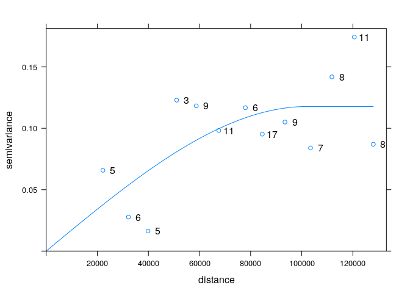

``` r
v79_m2 <- fit.variogram(v79, vgm(model = "Exp", range = 50000))
v79_m2
##   model     psill    range
## 1   Exp 0.1553417 71374.34
plot(v79, v79_m2, plot.numbers = T)
```

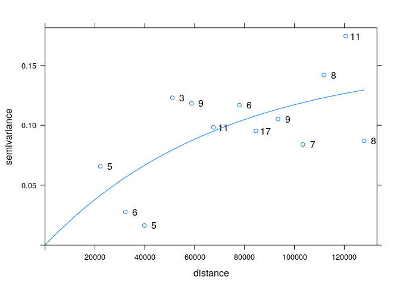

``` r
v79_m3 <- fit.variogram(v79, vgm(model = "Gau", range = 50000))
v79_m3
##   model     psill    range
## 1   Gau 0.0976919 31073.96
plot(v79, v79_m3, plot.numbers = T)
```

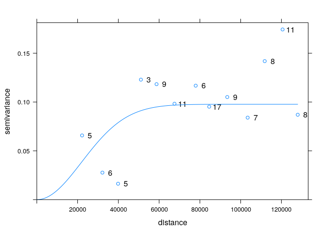

``` r
attr(v79_m, 'SSErr')
## [1] 2.848504e-11
attr(v79_m2, 'SSErr') #Elegimos este
## [1] 2.763794e-11
attr(v79_m3, 'SSErr')
## [1] 3.618551e-11
```

### Interpolación por kriging ordinario

Antes de realizar la interpolación, necesitamos una cuadrícula que
“llenaremos” con las predcciones. Creemos una cuadrícula para RD, en
este caso, de baja resolución, 10x10km:

``` r
library(stars)
## Loading required package: abind
grd <- st_bbox(prov) %>%
  st_as_stars(dx = 10000) %>% #10000 metros=10km de resolución espacial
  st_set_crs(crsdestino) %>%
  st_crop(prov)
grd
## stars object with 2 dimensions and 1 attribute
## attribute(s):
##     values    
##  Min.   :0    
##  1st Qu.:0    
##  Median :0    
##  Mean   :0    
##  3rd Qu.:0    
##  Max.   :0    
##  NA's   :605  
## dimension(s):
##   from to  offset  delta                       refsys point values    
## x    1 39  182216  10000 +proj=utm +zone=19 +datum...    NA   NULL [x]
## y    1 28 2205216 -10000 +proj=utm +zone=19 +datum...    NA   NULL [y]
plot(grd)
```

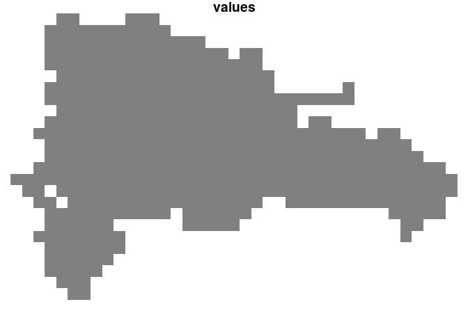

Sobre ella, ejecutamos la interpolación por kriging ordinario. La
función `krige` asume que se trata de kriging ordinario, dado que no se
especifica un valor para el argumento `beta`, o
media.

``` r
k <- krige(formula = a1979log~1, locations = pre1979, newdata = grd, model = v79_m2)
## [using ordinary kriging]
k
## stars object with 2 dimensions and 2 attributes
## attribute(s):
##    var1.pred       var1.var      
##  Min.   :6.776   Min.   :0.0067  
##  1st Qu.:7.303   1st Qu.:0.0448  
##  Median :7.469   Median :0.0619  
##  Mean   :7.532   Mean   :0.0620  
##  3rd Qu.:7.734   3rd Qu.:0.0783  
##  Max.   :8.161   Max.   :0.1242  
##  NA's   :605     NA's   :605     
## dimension(s):
##   from to  offset  delta                       refsys point values    
## x    1 39  182216  10000 +proj=utm +zone=19 +datum...    NA   NULL [x]
## y    1 28 2205216 -10000 +proj=utm +zone=19 +datum...    NA   NULL [y]
```

El objeto `k` es un ráster `stars` con dos variables, `var1.pred` y
`var1.var`, que son, respectivamente, la predicción y la varianza de la
predicción. La función `plot` contiene un método para imprimir el objeto
`k`.

``` r
plot(k)
```


Utilicemos `ggplot` para representar el objeto `stars`.

``` r
ggplot() +
  geom_stars(data = k, aes(fill = var1.pred, x = x, y = y)) + 
  scale_fill_gradient(low="#deebf7", high="#3182bd") +
  geom_sf(data = st_cast(prov, "MULTILINESTRING")) +
  geom_sf(data = pre1979) +
  geom_sf_text(data = prov, aes(label=TOPONIMIA), check_overlap = T, size = 2) +
  theme_bw()
```

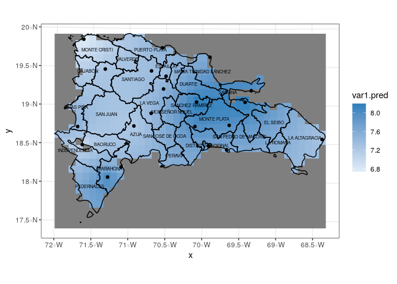

Nótese en la leyenda que el objeto `k`, variable `var1.pred` contiene
las predicciones del logaritmo de la precipitación para la cuadrícula de
10x10km (de ahí que el rango de la leyenda sea `6.8-8.0`). Si calculamos
*e<sup>6.8</sup>* obtendremos el valor de precipitación del límite
inferior, y si calculamos *e<sup>8</sup>* obtendremos el límite
superior.

Si queremos representar los valores de precipitación, debemos realizar
la operación inversa, que sería elevar al `e` el valor predicho en `k`,
lo cual se realiza mediante la función `exp()`.

``` r
ggplot() +
  geom_stars(data = exp(k), aes(fill = var1.pred, x = x, y = y)) + 
  scale_fill_gradient(low="#deebf7", high="#3182bd", trans = 'log10') +
  geom_sf(data = st_cast(prov, "MULTILINESTRING")) +
  geom_sf(data = pre1979) +
  geom_sf_text(data = prov, aes(label=TOPONIMIA), check_overlap = T, size = 2) +
  theme_bw()
```


## Estudio de caso: temperatura de República Dominicana mediante kriging universal

Hasta este punto, logramos ejecutar un kriging ordinario para predecir
el valor de la precipitación de 1979 para todo el país a partir de 21
observatorios. Notemos que se trataba de un kriging ordinario, porque a
la función `krige` no le introducimos una media (argumento `beta`), e
igualmente porque con la función `variogram` generamos un variograma
contra un intercepto (fórmula `a1979log~1`).

El kriging universal predice el valor de la variable de interés en
función del modelo espacial aportado por el variograma Y, al mismo
tiempo, considerando covariables mediante polinomios. En este ejemplo,
tomaremos la temperatura registrada en observatorios de ONAMET.

### Datos fuente

``` r
rutatemp <- 'data/onamet_temp_anual.gpkg'
st_layers(rutatemp)
## Driver: GPKG 
## Available layers:
##          layer_name geometry_type features fields
## 1 onamet_temp_anual         Point       72     14
temp <- st_read(rutatemp)
## Reading layer `onamet_temp_anual' from data source `/home/jr/Documentos/clases_UASD/201902/maestria-geotel-analisis-espacial/material-de-apoyo/data/onamet_temp_anual.gpkg' using driver `GPKG'
## Simple feature collection with 72 features and 14 fields
## geometry type:  POINT
## dimension:      XY
## bbox:           xmin: 199028.4 ymin: 1967717 xmax: 566825.1 ymax: 2199684
## epsg (SRID):    32619
## proj4string:    +proj=utm +zone=19 +datum=WGS84 +units=m +no_defs
temp
## Simple feature collection with 72 features and 14 fields
## geometry type:  POINT
## dimension:      XY
## bbox:           xmin: 199028.4 ymin: 1967717 xmax: 566825.1 ymax: 2199684
## epsg (SRID):    32619
## proj4string:    +proj=utm +zone=19 +datum=WGS84 +units=m +no_defs
## First 10 features:
##           nombre  ene  feb  mar  abr  may  jun  jul  ago  sep  oct  nov
## 1        HERRERA 24.6 24.4 24.8 25.8 26.4 27.1 27.4 27.4 27.1 26.9 26.1
## 2       LA UNION 23.3 23.3 23.8 24.7 25.7 27.0 27.0 27.1 26.9 26.3 25.0
## 3  ARROYO BARRIL 24.6 24.9 25.6 26.1 26.4 27.1 27.1 26.8 26.8 26.6 25.7
## 4           AZUA 25.2 25.5 26.2 26.8 27.3 27.7 28.4 28.5 28.1 27.4 26.6
## 5           BANI 25.9 26.0 26.7 27.4 27.6 27.9 28.6 28.5 28.1 27.6 27.0
## 6       BARAHONA 24.6 24.8 25.4 26.2 26.7 27.3 27.9 27.9 27.5 26.7 26.2
## 7      BAYAGUANA 24.6 24.9 25.6 26.3 27.0 27.6 27.7 27.6 27.5 27.2 26.3
## 8          BONAO 23.4 23.8 24.6 25.4 25.9 26.8 26.9 27.0 26.8 26.4 25.2
## 9        CABRERA 24.7 24.8 25.2 25.6 26.0 26.6 26.8 26.8 26.7 26.5 25.7
## 10       CEVICOS 23.0 23.4 24.3 25.2 26.0 26.6 26.6 26.6 26.6 26.1 24.7
##     dic tanual                     geom
## 1  25.1   26.1 POINT (397885.6 2042020)
## 2  23.7   25.3 POINT (337547.6 2184493)
## 3  25.0   26.1 POINT (452651.8 2124797)
## 4  25.5   26.9 POINT (316911.7 2040776)
## 5  25.9   27.3 POINT (359011.1 2020133)
## 6  25.2   26.4 POINT (277856.2 2013510)
## 7  25.0   26.4 POINT (433198.1 2073212)
## 8  23.8   25.5 POINT (352534.2 2093960)
## 9  24.9   25.9 POINT (405589.5 2171085)
## 10 23.3   25.2 POINT (398204.6 2101037)
```

Exploremos el CRS del objeto `obs`.

``` r
st_crs(temp)
## Coordinate Reference System:
##   EPSG: 32619 
##   proj4string: "+proj=utm +zone=19 +datum=WGS84 +units=m +no_defs"
```

Dado que es EPSG:32619 no necesitamos realizar transformación alguna.

### EDA básico

Obtengamos los estadísticos básicos del objeto `temp` y de su variable
`tanual`:

``` r
nrow(temp)
## [1] 72
summary(temp$tanual)
##    Min. 1st Qu.  Median    Mean 3rd Qu.    Max. 
##   18.20   25.20   25.90   25.50   26.43   28.40
hist(temp$tanual)
```

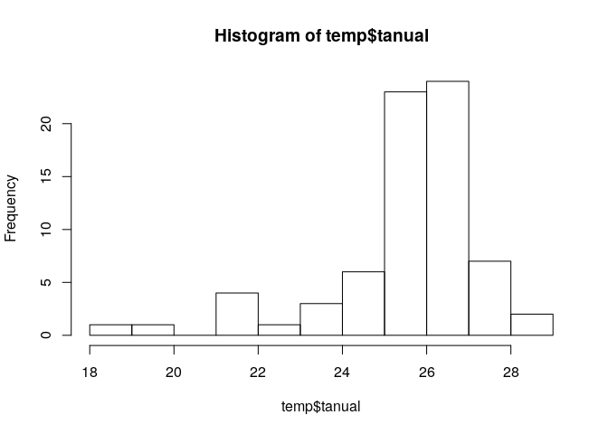

``` r
qqnorm(temp$tanual)
```

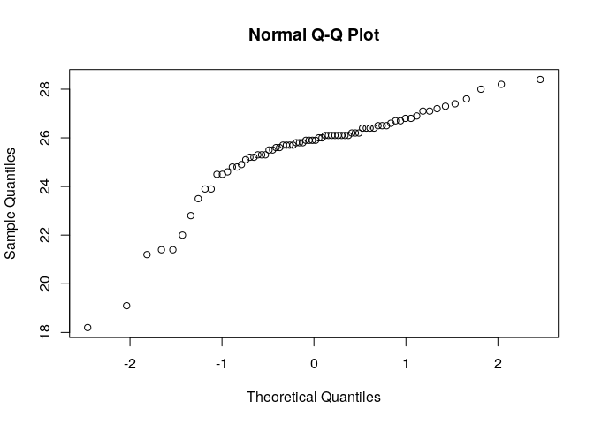

``` r
hist(log(temp$tanual))
```

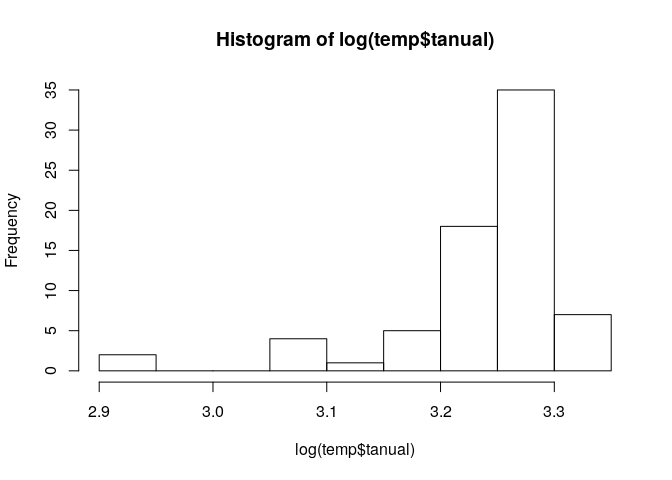

``` r
qqnorm(log(temp$tanual))
```

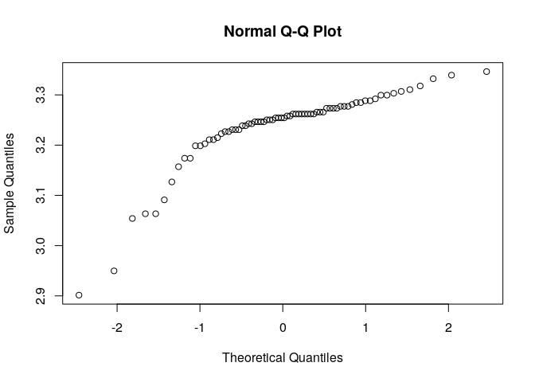

``` r
shapiro.test(temp$tanual)
## 
##  Shapiro-Wilk normality test
## 
## data:  temp$tanual
## W = 0.81613, p-value = 4.783e-08
shapiro.test(log(temp$tanual))
## 
##  Shapiro-Wilk normality test
## 
## data:  log(temp$tanual)
## W = 0.77059, p-value = 3e-09
```

Dado que en este caso existe una fuerte desviación de una distribución
normal, debemos tenerlo en cuenta al modelizar la temperatura respecto
de la elevación. Al menos los residuos deberían tener distribución
normal. Exploraremos el modelo oportunamente. Visualicemos los datos en
un mapa

``` r
library(RColorBrewer)
ggplot() +
  geom_sf(data = prov, fill = 'white') +
  geom_sf(data = temp, aes(col = tanual), size = 6) + 
  scale_colour_gradientn(colours = rev(brewer.pal(9, name = 'RdBu'))) +
  geom_sf_text(data = temp, aes(label=nombre), check_overlap = T, size = 1.5) +
  theme_bw()
```

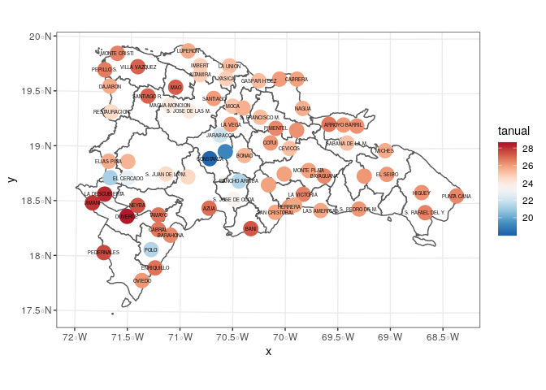

### Importar DEM

Ahora necesitamos traer el DEM, que en este caso será uno resumido a
partir del SRTM-90m.

``` r
dem <- read_stars('data/dem_srtm_remuestreado.tif')
names(dem) <- 'ele'
plot(dem)
```

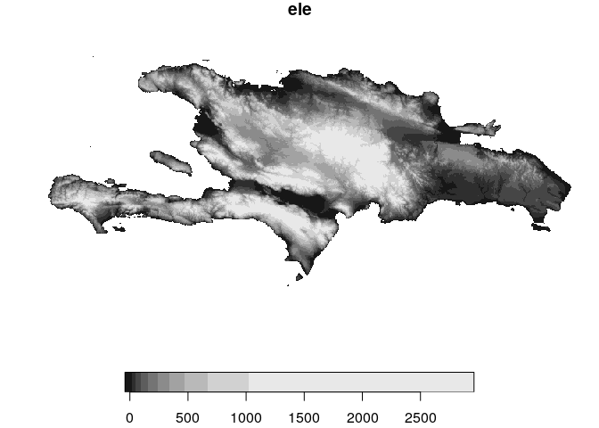

Ahora remuestreamos el DEM para que se alinee con la cuadrícula fuente,
`grd`. El DEM remuestreado será la cuadrícula del covariable (variable
independiente) que utilizaremos para predecir el valor de temperatura.

``` r
grdcovars <- aggregate(dem, grd, mean, na.rm=T)
plot(grdcovars)
```

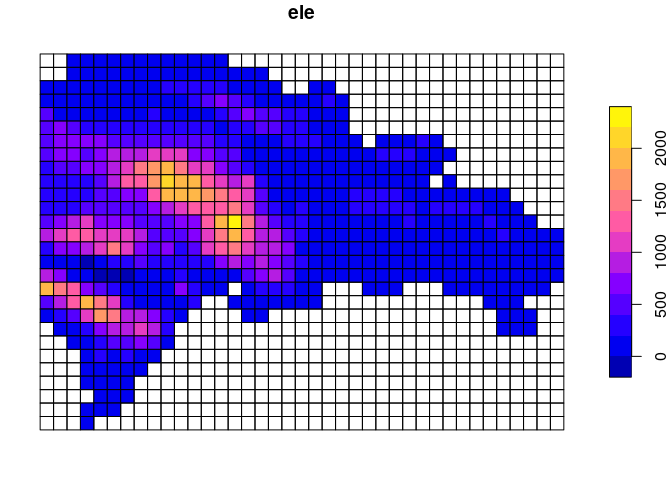

### Extraer datos de elevación y generar modelo

Necesitamos que los datos de elevación pasen al objeto `temp`, de manera
que podamos probar un modelo lineal que ponga en relación a la elevación
con la temperatura.

``` r
temp$ele <- st_as_sf(aggregate(grdcovars, temp, mean))[[1]]
temp$ele
##  [1]   37.04137  111.19428   96.23608   89.05470   53.63334  360.12991
##  [7]   49.84021  235.65909   83.14058  155.80394 1373.07323   57.56667
## [13]   82.44868  218.63500 1042.68780  122.73364  419.19694  151.41004
## [19]   94.38337   79.46646  115.23488 1355.50136  945.64083   66.49686
## [25] 1152.72653   29.14500  165.08992   24.01264   21.70497  443.20785
## [31]   41.29578  108.17977  167.63144   25.13954   66.00372   56.24511
## [37]   -4.08697   50.94419   10.78244  140.73771   41.89802 1010.59454
## [43]   11.03355  879.47538  617.60780   84.08008   14.71723  157.90341
## [49]   99.80911   58.09217  489.49667  647.02488   61.22240  212.92748
## [55]  191.10207   29.83365   24.18545  181.29521   79.46121  241.98926
## [61]  498.26058  529.88060   11.89785   53.39107   22.52430   26.70314
## [67]  237.12488   44.10347   72.15647  271.38220         NA  690.64947
temp <- temp[!is.na(temp$ele),] #Quitar observación con NA
plot(temp$tanual, temp$ele)
```

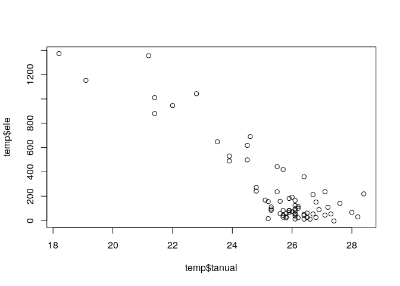

``` r
temp_lm <- lm(tanual ~ ele, temp)
summary(temp_lm)
## 
## Call:
## lm(formula = tanual ~ ele, data = temp)
## 
## Residuals:
##     Min      1Q  Median      3Q     Max 
## -1.9474 -0.5766 -0.1059  0.6037  2.7525 
## 
## Coefficients:
##              Estimate Std. Error t value Pr(>|t|)    
## (Intercept) 26.724159   0.129657  206.11   <2e-16 ***
## ele         -0.004925   0.000314  -15.68   <2e-16 ***
## ---
## Signif. codes:  0 '***' 0.001 '**' 0.01 '*' 0.05 '.' 0.1 ' ' 1
## 
## Residual standard error: 0.8768 on 69 degrees of freedom
## Multiple R-squared:  0.7809, Adjusted R-squared:  0.7777 
## F-statistic: 245.9 on 1 and 69 DF,  p-value: < 2.2e-16
plot(temp_lm)
```

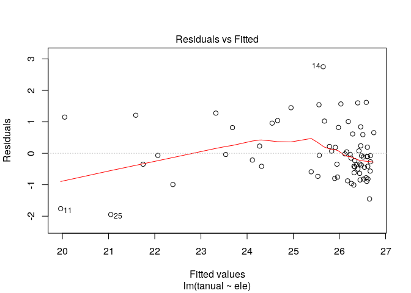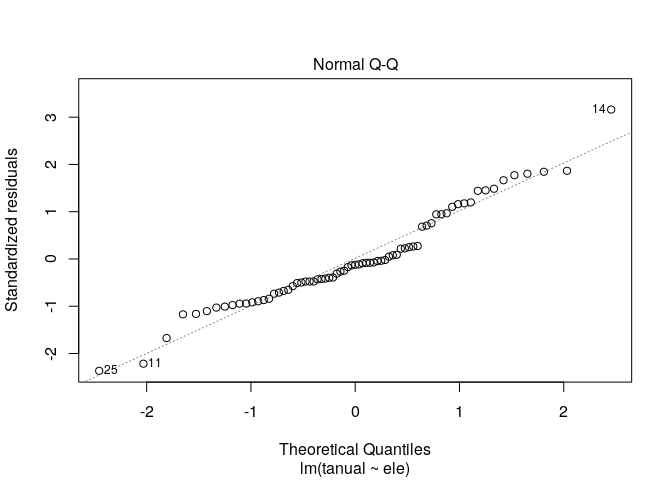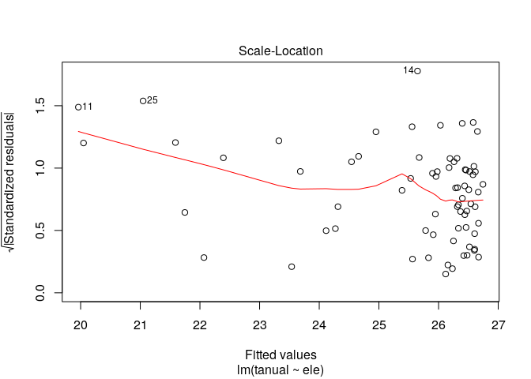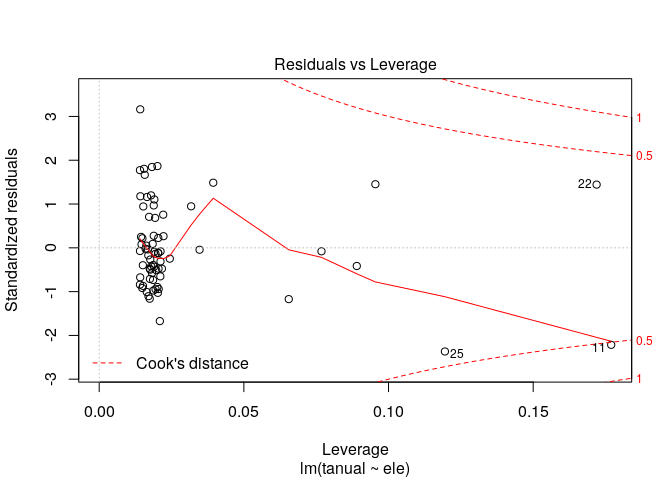

El modelo sugiere que existe asociación entre temperatura y elevación,
lo cual es esperable. En este caso, el gradiente resultante es de unos
-0.5°C por cada 100 metros de elevación. El gradiente comúnmente es de
-0.7°C/100m, pero en este caso, al utilizar un DEM resumido, el
gradiente igualmente se atenúa. Generemos variograma muestral con este
modelo.

### Variograma muestral

``` r
vt <- variogram(tanual ~ ele, temp)
vt
##     np       dist      gamma dir.hor dir.ver   id
## 1    1   5700.529 0.05627847       0       0 var1
## 2   32  16704.469 0.33635604       0       0 var1
## 3   48  24262.705 0.54374141       0       0 var1
## 4   71  33650.837 0.35356827       0       0 var1
## 5   95  43808.242 0.50038750       0       0 var1
## 6   96  53318.232 0.47861452       0       0 var1
## 7  119  63032.130 0.55137087       0       0 var1
## 8  114  72385.146 0.38117872       0       0 var1
## 9  117  82661.116 0.64274923       0       0 var1
## 10 132  91995.843 0.62593645       0       0 var1
## 11 121 101582.482 0.67431891       0       0 var1
## 12 133 111087.873 0.66429574       0       0 var1
## 13 127 120784.573 0.93949779       0       0 var1
## 14 137 130797.186 0.74052779       0       0 var1
## 15 119 140308.927 0.76607643       0       0 var1
plot(vt)
```

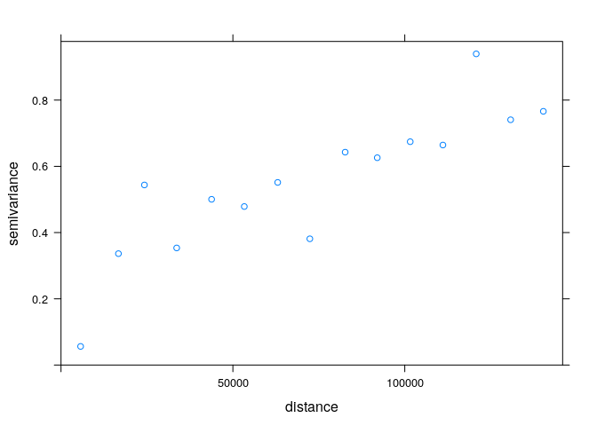

### Variograma modelo

Parecería razonable utilizar un variograma modelo exponencial con rango
corto, por ejemplo, 20 o 30 km. Probemos.

``` r
vt_m <- fit.variogram(vt, vgm(model = "Exp", range = 30000))
vt_m
##   model     psill   range
## 1   Exp 0.6121034 22069.9
plot(vt, vt_m, plot.numbers = T)
```

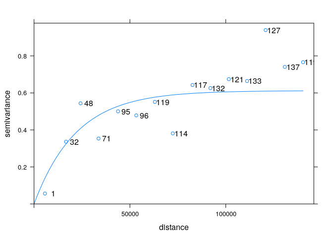

### Kriging universal

Finalmnente, ejecutamos el
kriging.

``` r
k_u <- krige(tanual ~ ele, temp, st_rasterize(st_as_sf(grdcovars)), vt_m)
## [using universal kriging]
```

Finalmente, lo representamos.

``` r
ggplot() +
  geom_stars(data = k_u, aes(fill = var1.pred, x = x, y = y)) + 
  scale_fill_gradientn(colours = rev(brewer.pal(9, name = 'RdBu'))) +
  geom_sf(data = st_cast(prov, "MULTILINESTRING")) +
  geom_sf(data = pre1979) +
  geom_sf_text(data = prov, aes(label=TOPONIMIA), check_overlap = T, size = 2) +
  theme_bw()
```

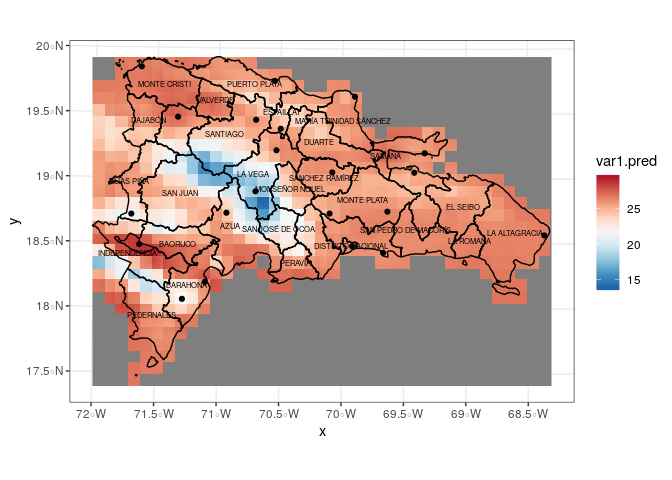

### Nota final

Dado que en este caso existe una fuerte desviación de los datos respecto
a una distribución normal, aun usando transformación logarítmica, se
recomienda aplicar otro tipo de transformación. En este caso, luce mejor
emplear *Tukey Ladder of Powers* (escalera de potencias de Tukey).
Usaremos la función `transformTukey` del paquete `rcompanion`, que
cargaremos a continuación.

``` r
library(rcompanion)
temp$tanualtrans <- transformTukey(temp$tanual, plotit = F)
hist(temp$tanualtrans)
qqnorm(temp$tanualtrans)
shapiro.test(temp$tanualtrans)
```

Nótese que se trata de una transformación de potencia por medio del
exponente `8.1`. Para hacer la transformación inversa, bastaría con
aplicar `temp$tanualtrans^(1/8.1)`. Se podría ensayar con la variable
transformada para generar la superficie continua.

## Referencias

<div id="refs" class="references">

<div id="ref-alperin2002caracterizacion">

Alperín, M. I., Borges, V., & Sarandón, R. (2002). Caracterización
espacial de los tipos de cobertura de suelo usando técnicas
geoestadı'sticas a partir de información satelital. *Revista de La
Facultad de Agronomía*, *105*.

</div>

<div id="ref-hengl2009practical">

Hengl, T. (2009). *A practical guide to geostatistical mapping*.

</div>

<div id="ref-pebesma2019spatial">

Pebesma, E., & Bivand, R. (2019). *Spatial Data Science*. Retrieved from
<https://keen-swartz-3146c4.netlify.com/>

</div>

</div>
