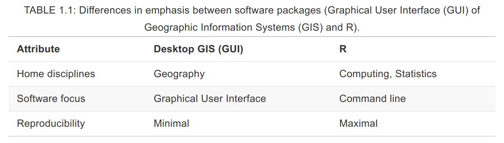
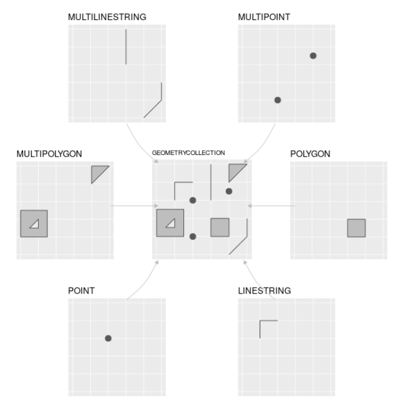
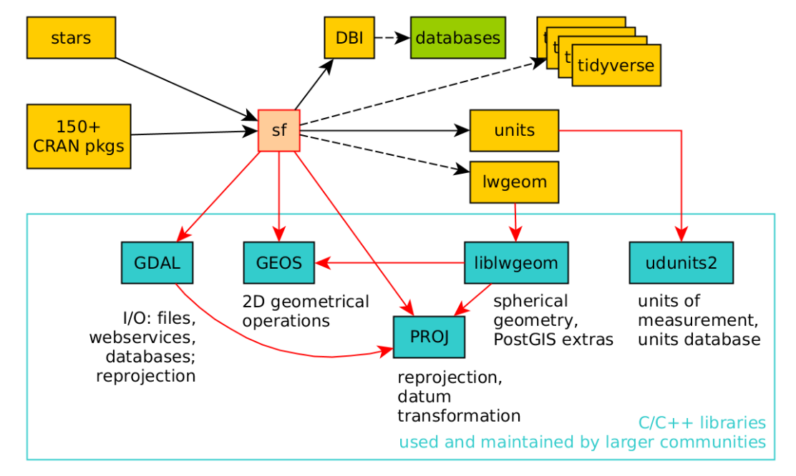

```{r setup, include=FALSE}
knitr::opts_knit$set(root.dir = "..")
knitr::opts_chunk$set(
  echo = TRUE,
  collapse=TRUE,
  fig.path = "../img/",
  out.width='100%'
)
```


<!-- Este .md fue generado a partir del .Rmd homónimo. Edítese el .Rmd -->

# Introducción a R, *simple features* y análisis exploratorio de datos espaciales (ESDA)

## ¿Por qué R?

**En corto**: R cuenta con múltiples herramientas de análisis espacial y geoestadística para crear flujos de trabajo reproducibles.

**En detalle**: Además de sus capacidades para análisis estadísticos avanzados, R cuenta con un "ecosistema" de paquetes para análisis de datos espaciales [muy nutrido](https://cran.r-project.org/web/views/Spatial.html). Igualmente, cuenta con [potentes y versátiles herramientas de representación gráfica](https://www.r-graph-gallery.com/), dispone de un entorno de desarrollo integrado (IDE) orientado a la reproducibilidad y al control de versiones (e.g. [RStudio](https://rstudio.com/)) y, no menos importante, ¡ES LIBRE! Los programas basados en interfaz gráfico difícilmente garantizan reproducibilidad, y no disponen de todas las herramientas de análisis espacial con las que cuenta R.

<figure></figure>
Diferencias en énfasis entre software SIG con interfaz gráfico y R. Fuente: @lovelace2019geocomputation


## Introducción a R

### Recursos

Verás a continuación algunas fuentes de referencia sobre los programas y servicios que manejarás.

* Sobre [R](https://www.r-project.org/)
    * [Vídeo corto sobre la historia de R](https://es.coursera.org/lecture/intro-data-science-programacion-estadistica-r/historia-e-introduccion-a-r-alNk0), donde aprenderás algunas características de este lenguaje y del software libre en general. Verás también ventajas y desventajas de R, así como algunas aplicaciones.
    * [Libro R4DS, R for Data Science](https://r4ds.had.co.nz/), una fuente muy completa realizada principalmente por @Wickham2017R, con apoyo de la comunidad R. [Fue traducido recientemente a español como "R para Ciencia de Datos"](https://es.r4ds.hadley.nz/) por la comunidad R de Latinoamérica, con el objetivo de hacer R más accesible en la región. Es un buen punto de partida. La organización del libro, que prioriza el aparato gráfico sobre la parte programática, ayuda a mantener la motivación en el aprendizaje de R.
    * [Este es un manual de R](https://cran.r-project.org/doc/contrib/rdebuts_es.pdf) con enfoque orientado a la programación, y es todo un clásico [@paradis2003r].
    * [Esta web](https://oscarperpinan.github.io/R/) es bastante completa para un nivel introductorio a R, y es a la vez un buen lugar de referencia [@perpinan2019intro].
    * [Geocomputation with R](https://geocompr.robinlovelace.net/) [@lovelace2019geocomputation], el cual, como aseguran sus autores, trata sobre **hacer cosas con datos espaciales usando R**, enseñando destrezas como lectura y escritura de datos espaciales, elaboración de mapas, modelización de fenómenos geográficos, entre otras.
    * [R-spatial](https://www.r-spatial.org/). Es un sitio web y blog dirigido a personas interesadas en usar R para anlizar datos espaciales y espacio-temporales. Además de publicar entradas periódicas sobre herramientas de análisis espacial con R, el sitio aloja el libro [Spatial Data Science](https://keen-swartz-3146c4.netlify.com/) [@pebesma2019spatial], que explica los conceptos que subyacen a los datos espaciales: puntos, líneas, polígonos, rásters, cubos de datos, entre otros. Aborda también conceptos de mayor nivel, por ejemplo, cómo afectan los atributos y las geometrías en el análisis espacial.
    * La existencia de una diversa y activa comunidad R incentiva a muchos/as usuarios/as a usar este entorno de programación. [A continuación](#twitter) verás algunas cuentas de Twitter, donde podrás observar en vivo una mínima parte de la actividad de la comunidad R. Hay muchas otras cuentas, foros, sitios web e incluso reuniones periódicas donde podrás interactuar con la comunidad. Te animo a descubrirlas.
    * [RStudio](https://www.rstudio.com/). Tanto la página de Wikipedia como [este vídeo](https://www.youtube.com/watch?v=5XeFFoTf2IY) explican muy bien en qué consiste este entorno de desarrollo integrado.
* [Git](https://git-scm.com/). Bueno, esta es una larga historia, que parece estar bien resumida en [Wikipedia](https://es.wikipedia.org/wiki/Git). Busca en YouTube, y verás otros aportes. 
* [GitHub](https://github.com/). Se erige como un servicio público para desarrolladores y desarrolladoras. Luce bien explicado [aquí](https://www.deustoformacion.com/blog/programacion-diseno-web/que-es-para-que-sirve-github). Recomiendo también el libro web ["*Happy Git and GitHub for the useR*"](https://happygitwithr.com/) [@bryan2019happy].
* [GitHub Classroom](https://github.com/education/classroom]). En [esta web](https://www.genbeta.com/desarrollo/classroom-for-github-ayudando-a-los-profesores-a-gestionar-los-ejercicios-de-sus-clases) te explican para qué sirve. Con este servicio estoy asignándote trabajo. También te recomiendo que leas  [ésta afirmación](https://github.com/education/classroom#who-is-github-classroom-for) sobre "Who is GitHub Classroom for?".
* Foros de ayuda y listas de distribución, entre los que destacan [R-help](https://stat.ethz.ch/mailman/listinfo/r-help), [R-devel](https://stat.ethz.ch/mailman/listinfo/r-devel), [Stackoverflow](https://stackoverflow.com/). Las preguntas deben plantearse con un ejemplo reproducible. Si vas a plantear una, lee antes las guías de publicación. Existe una [lista de distribución de R-help en español](https://stat.ethz.ch/mailman/listinfo/r-help-es), así como de [Stackoverflow en español](https://es.stackoverflow.com/).
* <a name="twitter"></a>Twitter:
    * [The R Foundation](https://twitter.com/_r_foundation)
    * [RStudio](https://twitter.com/rstudio)
    * [RLadies](https://twitter.com/RLadiesGlobal)
    * [We Are R-Ladies](https://twitter.com/WeAreRLadies)
    * [Comunidad R Hispano](https://twitter.com/r_hisp?lang=es)
    * [Hadley Wickham](https://twitter.com/hadleywickham)
    * [Gabriela de Queiroz](https://twitter.com/gdequeiroz)
    * [Jenny Bryan](https://twitter.com/JennyBryan)
    * [R Consortium](https://twitter.com/rconsortium)
    * [UseR! 2020](https://twitter.com/useR2020stl)
    * [UseR! 2019](https://twitter.com/UseR2019_Conf)

### Servidor RStudio habilitado por el profesor, o instalación y ejecución de R y RStudio en tu propia PC

* Puedes usar el servidor RStudio habilitado por el profesor. Revisa tu buzón de correo electrónico (también el *spam*), y localiza un mensaje donde te explico los detalles de acceso.

* Si prefieres trabajar en tu propia PC, instala R y RStudio, y los paquetes requeridos en las asignaciones. La guía de instalación varía mucho según el sistema operativo:
    * [R](https://cloud.r-project.org/)
    * [RStudio](https://www.rstudio.com/products/rstudio/download/#download)
    * Igualmente, la forma de ejecutar estas aplicaciones dependerá del sistema operativo.
        * En GNU/Linux puedes ejecutar aplicaciones tanto desde el gestor de ventanas como desde el intérprete de línea de órdenes (CLI) o "terminal" (por ejemplo, para ejecutar R, presiona `CRTL+ALT+T`, escribe `R` y presiona `<enter>`).
        * En Windows y MacOS la ejecución se realiza desde el GUI.

### CRAN (Comprehensive R Archive Network)
* [¿Qué es CRAN?](https://cran.r-project.org/doc/FAQ/R-FAQ.html#What-is-CRAN_003f)
* Instalar paquetes: Ejemplo: `install.packages(pkgs = 'sf', dependencies = T)`. Si realizas tus asignaciones en el servidor RStudio habilitado por el profesor, no necesitarás instalar paquetes.

### Ayuda de R

```{r help-in-r, eval=F}
help(package = 'base') #Ayuda sobre un paquete
library(help = 'base') #Documentación sobre un paquete
help(lm) #Ayuda sobre una función
?lm #Ídem
example(lm) #Ejemplo(s) sobre una función
help.search("matrix") #Busca la palabra clave en las ayudas de los paquetes
??matrix #Ídem
```

¡Usa los foros! Si introduces un mensaje de error (preferiblemente en inglés) de R en el buscador de tu preferencia, encontrarás varios punteros a foros con posibles soluciones.

## *Simple features*

### Paquetes

Carguemos los paquetes que necesitaremos en esta introducción.

```{r, warning=F, message=F}
library(sf)
library(raster)
library(rgdal)
library(tidyverse)
library(readxl)
library(tmap)
library(RColorBrewer)
library(units)
```

Brevemente, con `sf` crearás y manipularás *simple features*, `raster` te ayudará a manipular y analizar imágenes de dicho modelo, con `rgdal` tendrás varias funciones *wrapper* para trabajar con `gdal`desde R, `tidyverse` carga una colección de paquetes para manipular, limpiar y organizar datos de `data.frame`, `readxl` te permitirá cargar archivos Excel, y con `tmap` crearás mapas y los personalizarás. Busca más información sobre estos paquetes, y comprobarás las múltiples capacidades de R para manipular información espacial.

### Mi primer mapa con *simple features*

El siguiente bloque de código carga las regiones de República Dominicana según la división de 2010, a partir de un archivo GeoPackage que contiene 3 capas (regiones propiamente, provincias y municipios^[De la capa municipios, la geometría correspondiente al municipio "Guayubín" resultó ser no válida y fue arreglada]), originalmente *shapefiles* de la @one2015datos.


```{r regiones}
reg.sf <- st_read(dsn = 'data/divisionRD.gpkg', layer = 'REGCenso2010', quiet = T)
plot(reg.sf)
```

La función `st_read` lee la capa correspondiente del GPKG y la convierte a un `simple features` de tipo `MULTIPOLYGON` (este tipo de objetos los analizaremos más adelante).

Notar que la capa `REGCenso2010`, cuenta con dos campos, por lo que la función `plot` representa a los municipios aplicándoles distintos estilos en función del campo representado.  Las regiones fueron coloreadas en función de los campos `REG` y `TOPONIMIA`. Probemos una visualización cuantitativa. Crearemos un campo de área mediante la función `st_area` (en m<sup>2</sup>, que son las unidades del CRS, que es EPSG:32619), representaremos el objeto `reg.sf` usando sólo dicho campo (`reg.sf['area']`) y le aplicaremos estilos al mapa en función de éste.

```{r regiones2, results='asis'}
reg.sf$area <- st_area(reg.sf)
plot(reg.sf['area'])
```

Finalmente, representaremos un panel simbolizando la región de código `REG` igual a `01`, que es la región Cibao Norte, según los campos disponibles (que son 3, `REG`, `TOPONIMIA` y `area`, esta último recién creado).

```{r regiones3, results='asis'}
plot(reg.sf[reg.sf$REG %in% '01', ])
```

>Los mapas anteriores son mejorables en muchos aspectos. En este mismo tutorial, probarás formas de diseñar mapas estilizados.

El bloque de código a continuación carga la capa de municipios desde el GPKG y la representa. Al igual que con la capa regional, dado que tiene múltiples campos (en este caso, 3 adicionales), la función `plot` representa a los municipios aplicándoles distintos estilos en función del campo representado.

```{r municipios}
mun.sf <- st_read(dsn = 'data/divisionRD.gpkg', layer = 'MUNCenso2010', quiet = T)
plot(mun.sf)
mun.sf$area <- st_area(mun.sf)
plot(mun.sf['area'])
```

Puedes mostrar todas las áreas calculadas en forma de una tabla (a fin de cuentas, los objetos `sf` son igualmente `data.frame`), pues el resumen que obtienes al imprimir el objeto `sf` sólo incluye los primeros 10 (depende de la configuración del paquete). Imprimiremos sólo dos columnas, `TOPONIMIA` y `area`, y notarás que la columna de geometría se mantendrá unida al objeto (más adelante se muestra cómo imprimir la tabla de atributos sin dicha columna, deshaciéndonos de la columna geométrica).

```{r}
as.data.frame(mun.sf[,c('TOPONIMIA', 'area')])
```

### ¿Qué son *simple features*?

Veamos lo básico sobre el modelo de datos *simple features*. Se trata de un estándar abierto y jerárquico del Open Geospatial Consortium (organización sin ánimo de lucro que agrupa a entidades públicas y privadas comprometida con este tipo de estándares). Mediante *simple features* se representan al menos 17 tipos de geometrías (sólo admite vectoriales), de las que 7 son ampliamente usadas en análisis espacial (ver figura a continuación).

<figure></figure>
Tipos de *simple features* admitidos por el paquete `sf`. Fuente: @lovelace2019geocomputation

Por ejemplo, exploremos el objeto `mun.sf` en la consola; basta con escribir su nombre para obtener un resumen que muestra el tipo de geometría y otras características espaciales, como el sistema de referencia espacial (CRS). A continuación, mostrará los atributos de los primeros 10 objetos (explicados más adelante).

```{r}
mun.sf
```

Nos informa que se trata de un `Simple feature collection with 155 features and 6 fields` de tipo `MULTIPOLYGON` con dimensiones `XY` y una extensión mostrada en la línea `bbox`. Igualmente, nos indica que el CRS es EPSG:32619, o WGS84 UTM zona 19.

El modelo de datos de los *simple features* se basa en estructuras similares a las que usan bases de datos espaciales, como PostGIS, favoreciendo así la interoperabilidad. Otras ventajas que se señalan en su favor son: mejor rendimiento para lectura, escritura y representación ("ploteado") de datos espaciales, maneja objetos tipo `data.frame` (ver más abajo) y, no menos importante, las operaciones geométricas y de atributos se pueden realizar mediante tuberías (*pipelines*) de la colección `tidyverse`.

Los *simple features* se integran en R mediante el paquete `sf` [@pebesma2018simple]. El paquete `sf` supera significativamente a su predecesor, `sp` en eficiencia y facilidad de uso. Asimismo, `sf` depende de otros paquetes de R muy eficientes, y también de paquetes externos mantenidos por una comunidad muy amplia (como GDAL, GEOS y PROJ). A continuación se muestra un gráfico de las dependencias.

<figure></figure>
El paquete `sf` y sus dependencias. Las flechas sólidas indican dependencia fuerte; las de trazo discontinuo, dependencia débil. Fuente: @pebesma2019spatial

Los *simple features* se almacenan en...tablas. Sí, sí, tablas, denominadas `data.frames` en R, que en el caso concreto serían "tablas espaciales" (*spatial data frames*). Exploremos la estructura del objeto `mun.sf` mediante la función `str`, la cual lo muestra como `Classes 'sf' and data.frame: 10 obs. of 4 variables` (155 observaciones o geometrías, que en este caso son municipios dominicanos, y 4 variables o atributos).

```{r}
str(mun.sf)
```

Al tratarse de un `data.frame`, los análisis estadísticos se ejecutan de manera fluida y sin necesidad de extraer los datos a archivos externos. Así, por ejemplo, la función `summary`, muy empleada en R para obtener estadísticos descriptivos, devuelve estadísticos de todas las columnas de atributos (incluida la de geometría, nombrada como `geom` en este caso):

```{r}
summary(mun.sf)
```

La función `summary` actúa igualmente sobre una columna filtrada desde el objeto `reg.sf`, en este caso `area`.

```{r}
summary(mun.sf['area'])
```

>Nota que la columna `geom` se mantiene en el resumen, puesto que siempre acompaña al objeto a menos que le indiquemos lo contrario (*sticky column*).

### *Simple features*, de abajo a arriba

Normalmente, los datos espaciales se crean en aplicaciones con GUI (e.g. QGIS), o los obtienes de terceros. Sin embargo, para fines didácticos, crearemos algunos objetos conteniendo los tipos de geometrías básicos en la forma de *simple feature geometries* (`sfg`) en el siguiente bloque de código. Las crearemos utilizando **coordenadas geográficas**, aunque no podremos definir un CRS, puesto que la clase `sfg` no admite dicha funcionalidad. Las funciones que utilizaremos para cada geometría serán punto `st_point`, línea `st_linestring` y polígono `st_polygon`.

```{r geoms, out.width=c('33%', '33%', '33%'), fig.show='hold'}
pto.sfg <- st_point(c(-70.3, 19))
pto.sfg
plot(pto.sfg, col = 'red'); box()
matrizlin <- rbind(c(-71.5, 18), c(-71.2, 18),
                   c(-71.2, 18.4), c(-71.5, 18.4))
matrizlin
lin.sfg <- st_linestring(matrizlin)
lin.sfg
plot(lin.sfg, col = 'red'); box()
matrizpol <- list(
  rbind(c(-70.7, 18.6), c(-70.4, 18.6),
        c(-70.4, 18.9), c(-70.7, 18.9),
        c(-70.7, 18.6)))
pol.sfg <- st_polygon(matrizpol)
pol.sfg
plot(pol.sfg, col = 'red'); box()
```

Si combinamos varios puntos generamos un elemento multipunto (*multipoint*). Lo mismo aplica para las líneas (multilínea, *multilinestring*) y los polígonos (multipolígono, *multipolygon*). El siguiente bloque de código muestra cómo crearlos.

```{r geomsm, out.width=c('33%', '33%', '33%'), fig.show='hold'}
mpto.sfg <- st_multipoint(rbind(c(-70.3, 19), c(-70.4, 19), c(-70.4, 19.1), c(-70.3, 19.1)))
mpto.sfg
plot(mpto.sfg, col = 'red'); box()
matrizmlin <- list(rbind(c(-71.5, 18), c(-71.2, 18), c(-71.2, 18.4), c(-71.5, 18.4)),
                  rbind(c(-70.9, 18), c(-70.5, 18), c(-70.7, 18.4)))
matrizmlin
mlin.sfg <- st_multilinestring(matrizmlin)
mlin.sfg
plot(mlin.sfg, col = 'red'); box()
matrizmpol <- list(
  list(rbind(c(-70.7, 18.6), c(-70.4, 18.6), c(-70.4, 18.9), c(-70.7, 18.9), c(-70.7, 18.6))),
  list(rbind(c(-70, 18.6), c(-70.3, 18.6), c(-70.2, 18.9), c(-70, 18.6))))
mpol.sfg <- st_multipolygon(matrizmpol)
mpol.sfg
plot(mpol.sfg, col = 'red'); box()
```

Finalmente, combinaremos varios elementos en una colección, para lo cual usaremos los elementos creados anteriormente.

```{r colec, out.width=c('50%', '50%'), fig.show='hold'}
# colec <- c(pto, lin, pol)
colec1.sfg <- st_geometrycollection(list(pto.sfg, lin.sfg, pol.sfg))
plot(colec1.sfg, col = 'red'); box()
colec2.sfg <- st_geometrycollection(list(mpto.sfg, mlin.sfg, mpol.sfg))
plot(colec2.sfg, col = 'red'); box()
```

Recordemos que, hasta este punto, hemos creado elementos basados en geometrías simples (*simple feature geometries*, `sfg`). Un objeto `sfg` contiene sólo un elemento, que puede ser sencillo, multi\* o una colección. Además, aunque las `sfg` se construyen usando coordenadas, éstas no cuentan con sistema de referencia espacial (CRS). La *simple feature column* (`sfc`), al ser una lista, permite alojar varios elementos y también admite la definición de CRS. La `sfc` es importante porque representa la columna geométrica de un *simple feature* (`sf`), por lo que debemos reconocerla para comprender el modelo de un `sf`. Generaremos una `sfc` a partir de algunos de los `sfg` del objeto `pto.sfg` creado anteriormente (se podrían utilizar los otros igualmente, o combinarlos), y no asignaremos por el momento CRS alguno.

```{r ptosfc}
pto.sfc <- st_sfc(pto.sfg)
pto.sfc
plot(pto.sfc, col = 'red'); box()
```

Aunque la representación gráfica de `pto.sfc` es idéntica a la de su homólogo `pto.sfg`, la diferencia radica en la clase del objeto.

```{r}
class(pto.sfg)
class(pto.sfc)
```

Ahora creemos `sfc` basadas en las geometrías línea (`lin.sfg`), polígono (`pol.sfg`), multipolígono (`mpol.sfg`) y colección (`colec.sfg`).

```{r linpolsfc, out.width=c('50%', '50%'), fig.show='hold'}
lin.sfc <- st_sfc(lin.sfg)
lin.sfc
plot(lin.sfc, col = 'red'); box()
pol.sfc <- st_sfc(pol.sfg)
pol.sfc
plot(pol.sfc, col = 'red'); box()
mpol.sfc <- st_sfc(mpol.sfg)
mpol.sfc
plot(mpol.sfc, col = 'red'); box()
colec1.sfc <- st_sfc(colec1.sfg)
colec1.sfc
plot(colec1.sfc, col = 'red'); box()
```

Los dos gráficos de arriba representan `sfc` de líneas y polígonos, respectivamente. En la franja inferior: izquierda multipolígono, derecha colección.

En el resumen de cada objeto podemos notar que no se ha definido ningún CRS (`epsg (SRID): NA` y `proj4string: NA`. En cualquier caso, para consultar el CRS de cualquier `sfc` utilizamos la función `st_crs`.

```{r}
st_crs(pto.sfc)
```

Todas las geometrías dentro de una `sfc` deben tener el mismo CRS. Podemos definir el CRS de un objeto al crear la `sfc`, o alternativamente lo definimos luego de creado el objeto.

```{r}
#Al crear el objeto, argumento crs de la función st_sfc
pto.sfc <- st_sfc(pto.sfg, crs = 4326)
pto.sfc
#Alternativamente, usando la función st_crs()
st_crs(lin.sfc) <- 4326
lin.sfc
#También admite cadenas de texto proj4string:
st_crs(pol.sfc) <- '+proj=longlat +datum=WGS84 +no_defs'
pol.sfc
```

Finalmente, construyamos un *simple feature* `sf`. Disponemos de una columna geométrica pero necesitamos atributos. Por lo tanto, primero que crearemos atributos y luego `sf`.

```{r}
#Primero el atributo
pto.atr <- data.frame(nombre='pto')
#Luego creamos el sf
pto.sf <- st_sf(pto.atr, geometry = pto.sfc)
```

¿Cuál sería el proceso si lo desarrolláramos desde cero? Primero creemos la geometría para el punto, luego la columna geométrica, luego los atributos y finalmente el *simple feature*.

```{r}
#Geometría simple
pto.sfg <- st_point(c(-70.3, 19))
#Columna de geometría simple
pto.sfc <- st_sfc(pto.sfg, crs = 4326)
#Atributo
pto.atr <- data.frame(nombre='Mi punto')
pto.atr##Sólo un objeto, por lo tanto, sólo un atributo
#Simple feature
pto.sf <- st_sf(pto.atr, geometry = pto.sfc)
pto.sf
#La clase es la misma que para mun.sf
class(pto.sf)
class(mun.sf)
```

Creemos `sf` a partir de la colección `pto.sfc`, `lin.sfc` y `pol.sfc`. Necesitaremos crearles atributos y generar el `sf`.

```{r}
lin.sfc
lin.atr <- data.frame(nombre = 'Mi línea')
lin.sf <- st_sf(lin.atr, lin.sfc)
lin.sf
pol.sfc
pol.atr <- data.frame(nombre = 'Mi polígono')
pol.sf <- st_sf(pol.atr, pol.sfc)
pol.sf
```

Finalmente, representemos `pto.sfc`, `lin.sfc` y `pol.sfc` sobre el mapa de municipios de RD. Para fines de consistencia, transformaremos `mun.sf` al CRS EPSG:4326, generando el objeto `mun.sf.ll`, el cual será el mapa de fondo (se podría realizar la operación contraria, es decir, convertir `pto.sfc`, `lin.sfc` y `pol.sfc` a EPSG:32619, pero sería más trabajoso). Para la representación utilizaremos el paquete `tmap`, el cual requiere, como mínimo, un objeto fuente y, posteriormente, uno o varios elementos o capas de símbolos. Así, mediante la función `tm_shape`, se especifica el objeto que contiene la geometría, y las funciones `tm_dots`, `tm_lines`, `tm_borders` y `tm_fill` (entre otras) definen cómo se representan las geometrías.

```{r tmmunptlinpol}
mun.sf.ll <- st_transform(mun.sf, crs = 4326) #Transformación a EPSG:4326
tmap_options(max.categories = 155) #Aumentando el máx. número de categorías para tmap
tm_shape(mun.sf.ll) + tm_fill('TOPONIMIA', legend.show = F) +  tm_borders('grey') +
  tm_shape(shp = pto.sf) + tm_dots('black', size = 0.5) +
  tm_shape(shp = lin.sf) + tm_lines(col='black') +
  tm_shape(shp = pol.sf) + tm_fill(col='black')
```

## Exportar datos

Puedes exportar los objetos creados anteriormente. Aunque se trata de simples geometrías, en ocasiones querrás exportar objetos creados a partir de análisis y operaciones geométricas o con atributos realizadas en R. El paquete `sf` te ofrece una gama de formatos para exportar. Probemos exportar el objeto `pto.sf` a la carpeta export del repo.

```{r}
st_write(obj = pto.sf, dsn = 'export/pto.sf.gpkg', driver = 'GPKG')
```

Puedes encontrar una lista de drivers ejecutando:

```{r}
st_drivers()
```

## Rásters

La lectura, escritura y manipulación de rásters normalmente exige muchos recursos de memoria. No es la excepción en R, por lo que cuando quieras ejecutar operaciones con rásters, considera las siguientes cuestiones:

* Primero lo primero: recorta tus fuentes de manera que sólo abarque el área de interés. Para esto, no es necesario utilizar R ni software de interfaz de gráfico. Recurre mejor a las herramientas `gdal`, que son altamente eficientes y confiables. Tan pronto cortes el área de interés, elimina el archivo fuente, pero consérvalo (preferiblemente comprimido) en algún repositorio accesible, por si hubiese que realizar operaciones de corte posteriores.

* Considera tratar tus imágenes con código, y sólo recurre al interfaz gráfico para visualizar algún resultado de interés. Serás más eficiente codificando que teniendo que abrir capas completas que pudieran exigir muchos recursos de memoria.

* Intenta la paralelización de operaciones. Si vas a realizar álgebra de mapas o estadística zonal, utiliza herramientas de paralelización (R disponde paquetes para ello) para agilizar los cálculos.

Probemos con un ráster pequeño, en este caso, un modelo digital de elevaciones (MDE) no proyectado (EPSG:4326), de la subcuenca del arroyo Parra, cuenca del río Ocoa.

```{r raster}
r <- raster('data/MDE_SRTM_30m_Naranjal_Parra.tif')
summary(r)
plot(r, col = terrain.colors(n = 255))
```

El `plot` simboliza las elevaciones usando la paleta `terrain.colors`, donde verde es "bajo" y blanco/salmón es "elevado". Realizaremos operaciones más complejas con rásters en la medida que avance la asignatura.

Una de las operaciones más comunes que realizamos con rásters, consiste en obtener información de las celdas que conforman un ráster. Este proceso se conoce como extracción, y comúnmente interactúan un ráster y un vectorial, o dos rásters. Una de las capas es la ráster que contiene las celdas sobre las que queremos indagar, y la segunda es uno o varios polígonos, líneas, puntos o píxeles rásters que tocan las celdas que queremos analizar. Al realizar la extracción, aislamos los píxeles de interés y los sometemos a análisis estadísticos.

Veamos un ejemplo con el ráster anterior, del cual extraeremos las celdas que coinciden con el límite de la subcuencas de los arroyos Naranjal y Hondo, ambas partes de la subcuenca del Parra (las capas están proyectadas, EPSG:32619). Por eficiencia, usaremos un ráster agregado (por promedio) en un factor de 10 con la función `raster::aggregate`, de manera que usaremos una fuente donde una celda representa el promedio de 10 celdas del original:

```{r}
naranjal <- st_read(dsn = 'data/subcuenca_naranjal.gpkg')
hondo <- st_read(dsn = 'data/subcuenca_hondo.gpkg')
r10 <- raster::aggregate(r, 10)
naranjalext <- raster::extract(r10, naranjal)
#Nota que la capa vectorial fue reproyectada al CRS del ráster
summary(naranjalext[[1]])
hondoext <- raster::extract(r10, hondo)
summary(hondoext[[1]])
```

Fíjate en el resumen: la diferencia en cuanto a elevaciones máxima y media entre ambas subcuencas es notoria; Hondo es una subcuenca más alta, al menos en cabecera, que Naranjal.

## Análisis exploratorio de datos espaciales (ESDA)

Cerremos con un ligero análisis exploratorio de datos espaciales (ESDA). Aunque en lecciones posteriores abordaremos el ESDA en profundidad, en este cierre veremos los pasos básicos para hacer que las geometrías "brillen" con atributos reales. Tendremos que unir los datos espaciales con atributos externos (la unión tradicional, o *join*), utilizando un campo común entre ambos. Como suele ocurrir en cualquier flujo de trabajo de análisis de datos, el 80% del esfuerzo lo dedicamos a limpiar y organizar; en este caso no será diferente.

No hace falta abordar el problema de la unidad de área modificable en este punto. Baste decir por el momento que cualquier división que utilicemos es y será arbitraria. Si bien la mayoría de las agencias nacionales de estadística sirven sus datos a nivel de términos municipales, regiones o provincias (u otras unidades), no olvidemos que existe un sesgo inherente, puesto que una división arbitraria no garantiza la independencia de observaciones.

A modo de justificación del análisis exploratorio de datos espaciales, y dado que trabajaremos con mapas, valga esta advertencia tomada de @bivand2013applied:

>Trying to detect pattern in maps of residuals visually is not an acceptable choice, although one sometimes hears comments explaining the lack of formal analysis such as ‘they looked random’, or alternatively ‘I can see the clusters’.

>Tratar de detectar un patrón visualmente en mapas de residuos no es una opción aceptable, aunque algunas veces se escuchan comentarios que explican la falta de análisis formal, tales como 'la variable se veía aleatoria', o, alternativamente, 'veo grupos/conglomerados'.

Tómese también en cuenta el mito de John Snow [@brody2000map]. En definitiva, demos a los mapas su justa valoración, no los mitifiquemos, pero tampoco los ignoremos. Hoy en día "cualquiera puede hacer mapas", pero no cualquiera puede interpretarlos.

Exploraremos los datos de población a nivel municipal del IX Censo Nacional de Población y Vivienda 2010, algo que probablemente has realizado previamente en paquete SIG. La fuente es la [Oficina Nacional de Estadística (ONE)](https://www.one.gob.do/), a través de la [plataforma REDATAM](https://www.one.gob.do/recursos-automatizados/consulta-en-linea-redatam). Descargué una consulta con algunas variables, incluyendo agregados de población totales y por sexo. La plataforma ofrece formatos Excel y PDF. Descargué un archivo Excel y lo convertí a formato "valores separados por coma", que no es propietario. El archivo resultante está alojado en el repo, concretamente en `data/pop_adm3.csv`.

```{r}
pop.mun <- read_csv('data/pop_adm3.csv') #read_csv pertenece al paquete readr, de la colección tidyverse
pop.mun
nrow(pop.mun)
ncol(pop.mun)
```

Recordemos que para hacer la unión necesitamos un campo común entre los objetos que se unirán. Lamentablemente, el campo `Código` en el archivo fuente suprime el `0` a la izquierda en el código del municipio, por lo que no es comparable con su homólogo en el objeto de geometrías. El campo `Código` es de tipo "heredado": cada nivel de la división del país deja su impronta en el campo `Código` del municipio. Así, los dos primeros dígitos corresponden a la región (por ejemplo, `01`, `02`, ..., `10`), los dos siguientes a la provincia y los últimos al municipio. Por lo tanto, para el nivel municipal, cada `Código` debe componerse por 6 dígitos, tal como aparece en el campo homólogo del objeto `mun.sf.ll`, el cual se denomina `ENLACE`. Veamos el caso en detalle.

>Los distritos municipales se analizan como parte del municipio correspondiente.

```{r}
pop.mun$Código #Campo código de pop.mun
mun.sf.ll$ENLACE #Campo ENLACE de mun.sf.ll
match(pop.mun$Código, mun.sf.ll$ENLACE) #Prueba de emparejamiento. Los "NA" son casos sin emparejamiento
```

Notamos que sólo los municipios con seis dígitos de `pop.mun$Código` tienen un "parejo" (hacen `match`) con los de `mun.sf.ll$ENLACE`. Si los campos no son comparables es imposible hacer unión. Por lo tanto, el primer paso consiste en corregir este problema. Aprovecho esta inconsistencia para introducir los flujos de trabajo (tuberías) de `tidyverse`, concretamente de `dplyr`.

El código a continuación toma el objeto `pop.mun`, genera una columna denominada `ENLACE` (como la de `mun.sf.ll`), que evalúa en cada "celda" del campo `Código` si hay 5 caracteres, en cuyo caso le añade un `0` por delante; en caso contrario, lo deja tal cual.

```{r}
pop.mun <- pop.mun %>% mutate(ENLACE = ifelse(nchar(Código)==5, paste0('0', Código),Código))
pop.mun$ENLACE #Muestra la nueva variable creada
match(mun.sf$ENLACE, pop.mun$ENLACE) #Prueba si hay emparejamiento. Todos emparejados, no hay "NA"
```

La tubería `dplyr` se compone de dos tipos de elementos: acción/es y un "empalme/s". La acción en este caso es la función `mutate` y el empalme es el operador `%>%` (*pipe*, pipa), que pertenece al paquete `magrittr`. El *pipe* "entuba" el resultado hacia adelante en una función o una llamada. En otras palabras, la pipa envía como valor del primer argumento de la función a su derecha lo que se encuentre a su derecha. Si lo prefieres, traduce `%>%` a "...entonces...". Así, el valor del primer agrumento de `mutate` es `pop.mun`. La acción `mutate` significa en este ejemplo "añadir una variable".

Si lo leemos en lenguaje humano, le estamos ordenando a R lo siguiente: "Toma `pop.mun` como fuente de datos, y añade la variable `ENLACE` (nos conviene usar el mismo nombre que aparece en el objeto `mun.sf.ll`), que obtendrá su valor de la variable `Código` con una condición: si `Código` tiene 5 caracteres, pon un cero a la izquierda, de lo contrario, toma el valor de la variable `Código`".

Es importante notar que no se añadirá una variable propiamente a `pop.mun`, sino que en RAM se creará una réplica de `pop.mun` que contendrá una nueva variable. Si no lo asignásemos, mediante `<-`, la réplica no quedará disponible en la RAM para ser llamada nuevamente en el futuro. En este caso, se sobreescribe el objeto `pop.mun`.

Ahora usemos una función para unir ambas tablas. Recordemos que `mun.sf.ll` es un `data.frame` con columna de geometría (`sf`). Igualmente, `pop.mun` es un `data.frame`, por lo que estaremos uniendo dos `data.frame`, de tal forma que los datos de población quedarán disponibles en objeto que crearemos a partir de dicha unión al que nombraremos `mun.sf.pop`.

```{r}
mun.sf.pop <- mun.sf.ll %>% #El objeto sf como fuente, al que le uniremos pop.mun
  inner_join(pop.mun, by = 'ENLACE') #Unión con pop.mun a través del campo ENLACE
mun.sf.pop
```

Notemos que el objeto `mun.sf.pop` conserva las columnas que contenía inicialmente `mun.sf.ll` y se añaden todas las columnas `pop.mun`. El resumen del objeto `mun.sf.pop`, en el encabezado indica `Simple feature collection with 155 features and 262 fields`, lo que supone que se han conservado todos los municipios (cada fila un municipio) y se han añadido 256 columnas de las 257 disponibles (`ENLACE` no se añade, por tratarse del campo de unión).

Creemos un objeto nuevo al que llamaremos `mun.sf.sex`, seleccionando de `mun.sf.pop` las columnas de `ENLACE`, `TOPONIMIA`, `Hombres` y `Mujeres` (número de hombres y mujeres, respectivamente). Al mismo tiempo, crearemos la columna `Total`, que contendrá la suma de la población de hombres y mujeres. Finalmente, imprimiremos el objeto `mun.sf.sex` como `data.frame` deshaciéndonos de la columna geométrica (esto sólo tiene efectos sobre la llamada impresa, que no queda alojada en la RAM, mientras que el objeto original `mun.sf.sex` queda intacto), ordenado descendentemente por población total

```{r}
mun.sf.sex <- mun.sf.pop %>%
  dplyr::select(ENLACE, TOPONIMIA, REG, Hombres, Mujeres, area) %>% #Selecciona sólo las columnas de población por sexo y el nombre del municipio 
  mutate(Total=Hombres+Mujeres) #Calcula el total de hombres y mujeres
mun.sf.sex %>% dplyr::select(TOPONIMIA, Total) %>% arrange(desc(Total)) %>% st_drop_geometry()
```

El objeto `mun.sf.sex` tiene los mismo 155 municipios, pero sólo 5 campos. Representemos la población por sexo y total en un panel (la función `plot` representa la misma geometría según cada uno de los campos disponibles)

```{r plotmunsfsex}
plot(mun.sf.sex, breaks = 'jenks') #Panel
```

Hagamos lo propio sólo para la población de mujeres.

```{r plotmunsfmujeres}
plot(mun.sf.sex['Mujeres'], breaks = 'jenks') #Población de mujeres
```

Tal como indiqué arriba, los mapas generados con la función `plot` son muy mejorables. En R no es fácil cumplir con los estándares propios de un mapa cartográficamente apropiado. Por ejemplo, eliminar el "efecto isla" requeriría retocar manualmente el mapa anterior; colocar y rotular objetos de referencia requeriría también acciones manuales. Sin embargo, no debemos olvidar que en R lo que más nos interesa es explorar e interpretar patrones, por lo que la simbología actúa primordialmente sobre la o las variables de interés.

En tal sentido, los paquetes `ggplot2` (parte de `tidyverse`) y `tmap` ofrecen herramientas versátiles para conseguir mapas informativos, al menos en lo que respecta a la variable de interés. Probemos primero con `ggplot2`. Este paquete incorpora función `geom_sf` para añadir capas de objetos `sf`. Una breve introducción al funcionamiento de `ggplot2`: mediante la función `ggplot` se crea un espacio de coordenadas según los datos disponibles en el `data.frame` que se introduzca en el argumento `data`. A continuación, se definen las variables estéticas sobre las que se construirá la simbología. Finalmente, se definen propiedades del gráfico, como por ejemplo, tema o plantilla base, escala de colores, tamaño de letra, variables para representar en forma de panel, entre otras. Utilicemos el objeto `mun.sf.sex` para hacer un mapa básico de población total.

Para fines didácticos, avancemos añadiendo fuentes de datos y capas paso a paso. Primero crearemos el espacio de coordenadas y lo asignaremos a `p0`, y sobre éste acumularemos las siguientes funciones en subsecuentes objetos `p#`. En el futuro no necesitarás realizar tus gráficos de forma acumulativa y crearás *scripts* más fluidos.


```{r ggplotp0}
p0 <- ggplot(mun.sf.sex)
p0
```

El espacio de coordenadas ya está creado, y `ggplot2` está preparado para aceptar variables. Como variable a representar (mapear, `map`), usaremos la "población total", que en la tabla `mun.sf.sex` se denomina `Total`. Nota que acumularemos usando `+`.


```{r ggplotp1}
p1 <- p0 + aes(fill = Total)
p1
```

Dado que nuestro gráfico se basará en población total, `ggplot2` está preparado para recibir capas, o geometrías. Las capas son las que definen el cuerpo del gráfico. Si no añadimos capas, el gráfico permanecerá vacío. En este caso, añadiremos la capa `geom_sf`, que tomará las geometrías de la fuente de datos y la estilizará con un borde de `0.2`.

```{r ggplotp2}
p2 <- p1 + geom_sf(lwd = 0.2)
p2
```

`ggplot2`, al reconocer que la variable `Total` es cuantitativa, utiliza un gradiente como escala de simbología, en este caso, un gradiente de azules, desde el oscuro al claro. Nótese que la simbología es bastante pobre, por dos razones principalmente. Por una parte, la variable visual empleada es intensidad, pero ésta sobre una escala lineal. Por otro lado, la escala lineal no favorece una adecuada representación. En casos como éste, donde se tienen muchas unidades con valores muy pequeños, y unas pocas con valores muy grandes, la escala lineal esconde una parte importante de los patrones. Un histograma básico refleja recoje este sesgo de la distribución:

```{r histbasico}
hist(mun.sf.sex$Total)
```

La variable población total muestra un fuerte sesgo hacia la derecha, influido especialmente por las unidades de mucha población (los municipios Santo Domingo *, Los Alcarrizos y Santiago, con más de 250,000 cada uno, y que acumulaban casi 4 millones de habitantes en 2010). Por tal razón, una escala logarítimica (puede ser en base e como en base 10) ayuda a mejorar la visualización. 

```{r histbasicolog10}
hist(log10(mun.sf.sex$Total))
```

Aplicaremos dicha escala en `ggplot2`, utilizando el argumento `trans=log10` en la escala de gradiente, y usaremos una función de gradiente versátil que permite definir una paleta. En este caso, elegimos una paleta de rojos de la colección [ColorBrewer](http://colorbrewer2.org).

```{r ggplotp3}
p3 <- p2 + scale_fill_gradientn(colours = brewer.pal(9, name = 'Reds'), trans = 'log10')
p3
```

Para fines de referencia, y aunque no sea muy estético, generaremos un mapa con algunos rótulos a los municipios (no lo asignaremos, puesto que no lo usaremos posteriormente).

```{r ggplotp3conrotulos}
p3 + geom_sf_text(aes(label=TOPONIMIA), check_overlap = T, size = 1.5)
```

En este mapa reconocemos múltiples patrones "ocultos" en el mapa anterior, como que hay municipios poco poblados en el entorno de la Hoya de Enriquillo (véase el área rodeada por los municipios rotulados como Cristóbal y Duvergé), y en parte de la frontera Domínico-Haitiana (hacia el oeste, e.g. Pedro Santana). Igualmente, gracias a la simbología, los municipios muy poblados se distinguen ahora más del resto (Santiago, Santo Domingo de Guzmán).

Nótese que se está representando población total, no densidad de población. Calculemos la densidad poblacional en habitantes por kilómetro cuadrado y, posteriormente, generemos un mapa cuya simbología sea dicha variable.

```{r ggplotdpob}
mun.sf.sex.dpob <- mun.sf.sex %>% mutate(areakm2 = set_units(area, km^2)) %>%
  mutate(dpob = drop_units(Total/areakm2))
mun.sf.sex.dpob
ggplot(mun.sf.sex.dpob) + aes(fill = dpob) + geom_sf(lwd = 0.2) +
  scale_fill_gradientn(colours = brewer.pal(9, name = 'Reds'), trans = 'log10')
```

Si comparamos este mapa con el anterior, el de población total, veremos que afloran nuevos patrones, puesto que el área relativiza el efecto de la población absoluta. Por ejemplo, Higüey queda como municipio de densidad poblacional intermedia, mientras que según su población absoluta podría considerarse como municipio muy poblado.

Finalmente, la colección `tidyverse`, a través de sus paquetes `tidyr` y `ggplot2`, cuenta con funciones de reorganización de datos para facilitarnos la tara de representar múltiples variables en un único panel. Por ejemplo, sería útil representar la población de mujeres y hombres en un mismo panel, para facilitarnos la tarea de comparar y encontrar patrones diferenciados, si los hubiere. Para fines didácticos, generemos los datos fuente paso a paso. Primero necesitamos seleccionar las columnas que nos interesan (`Mujeres`,  `Hombres` y `TOPONIMIA`)

```{r}
mun.sf.sex1 <- mun.sf.sex %>%
  dplyr::select(TOPONIMIA, REG, Mujeres, Hombres)
mun.sf.sex1
```

¿Qué pasó? Pues simplemente, seleccionamos las columnas que nos interesan de la tabla de atributos. El objeto sigue siendo un *simple feature*, puesto que la columna `geom` es "pegajosa" y no abandona el objeto a menos que se lo indiquemos expresamente. Ahora viene la parte interesante, donde reuniremos las columnas `Hombres` y `Mujeres` en una única columna clave denominada `variable`, y los valores de cada una de éstas terminarán en una columna de valores denominada `valor`. Se conservarán, como columnas pivotantes, `TOPONIMIA` y `geom`.

```{r}
mun.sf.sex2 <- mun.sf.sex1 %>% 
  gather(variable, valor, Mujeres:Hombres)
mun.sf.sex2
```

El objeto resultante tiene 310 elementos, que corresponden a los 155 municipios con su número de mujeres y otros 155 con su número de hombres. Con los datos organizados de esta manera, es posible generar un panel usando la función `facet_wrap`. Observa que generaremos el mapa "de un tirón", insertando la función `ggplot` dentro de la tubería `dplyr`. De esta manera, la función `ggplot` no necesita el argumento `data = mun.sf.sex2` porque, al usarse la pipa (`%>%`), el objeto a su izquierda se inserta como primer argumento de la función a su derecha.

```{r ggplotmh}
mun.sf.sex2 %>% 
  ggplot() + aes(fill = valor) + geom_sf(lwd = 0.2) +
  facet_wrap(~variable) + theme(text = element_text(size = 8)) +
  scale_fill_gradientn(colours = brewer.pal(9, name = 'Reds'), trans = 'log10')
```

>Para conseguir una visualización apropiada, se incluyó la función `theme(text = element_text(size = 8))`.

Ambos mapas son prácticamente un calco el uno del otro. Pocos municipios presentan patrones diferenciados. De hecho, una prueba pareada *t* de *Student* revela que no hay evidencia de que existan diferencias significativas de la variable población por sexo.

```{r}
with(mun.sf.sex1, t.test(Mujeres, Hombres, paired = T))
```

Sin embargo, destacan algunos casos puntuales, como Higüey y San Juan, que tienen una población de mujeres ligeramente menor que la de hombres, al igual que como ocurre en los municipios septentrionales de las provincias Peravia y San Cristóbal. Por el contrario, el número de mujeres es ligeramente mayor en los municipios Santo Domingo de Guzmán, Santo Domingo Este y Santiago. Una inspección del siguiente panel de gráficos de barras, donde cada cuadro recoge los municipios por regiones dominicanas, complementa lo reflejado en la mancha cartográfica:

```{r pobmunicpreg, fig.height=12}
mun.sf.sex2 %>% ggplot() +
  aes(x = TOPONIMIA, y = valor, fill = variable, group = variable) +
  geom_col(position = 'dodge') + scale_y_continuous() +
  theme(axis.text.x = element_text(angle = 90), text = element_text(size = 6)) +
  facet_wrap(REG~., scales = 'free', ncol = 2) + coord_flip()
```


```{r, eval=F, echo=F}
p1 <- tm_shape(mun.sf.sex) +
  tm_fill(col = "Hombres", style = 'jenks') +
  tm_borders()
p2 <- tm_shape(mun.sf.sex) +
  tm_fill(col = "Mujeres", style = 'jenks') +
  tm_borders()
p3 <- tm_shape(mun.sf.sex) +
  tm_fill(col = "Total", style = 'jenks') +
  tm_borders()
tmap_arrange(p1, p2, p3)

p1text <- tm_shape(mun.sf.sex) +
  tm_fill(col = "Hombres", style = 'jenks') +
  tm_borders() +
  tm_text('TOPONIMIA', size = 0.4)
tmap_arrange(p1text)
```


## Conclusión

Conociste las herramientas básicas sobre creación y gestión de *simple features*. También te introduciste en la realización de ESDA, incluyendo soporte gráfico. **El ESDA es un paso imprescindible en cualquier investigación**, así que, ya que no te lo podrás saltar, es necesario que practiques con los datos de ejemplo mostrados aquí, o con los tuyos propiamente.

El paquete `sf` tiene la ventaja de que está "saborizado" al estilo `tidyverse`, y esto te ayudará a realizar tu ESDA mediante las tuberías de esta potente colección de paquetes.

## Situaciones comunes
* R es sensible a las mayúsculas. No es lo mismo `Mi_objeto` que `mi_objeto`.
* *"En RStudio, ¿Qué atajo de teclado es que usan para poner el operador de asignación ` <- `?"* Debería funcionarte `ALT+-`, pero recuerda, sólo lo podrás usar en RStudio.
* *"¿Y el pipe ` %>% `?"* `CTRL+SHIFT+M`.
* Más atajos de teclado de RStudio: `ALT+SHIFT+K`.
* *"Me quedé trancá' en la consola de R con un signo de `+`. ¿Qué hago pa' salir de eso?"* Suele resolverse presionando la tecla `Escape` (`Esc`). Lee [este texto](https://support.rstudio.com/hc/en-us/community/posts/200792676-stuck-on-).


## Referencias

