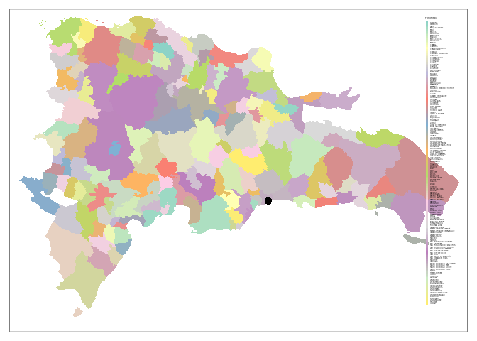

<!-- Este .md fue generado a partir del .Rmd homónimo. Edítese el .Rmd -->

# Introducción a R y análisis exploratorio de datos espaciales (ESDA)

## ¿Por qué R?

**En corto**: R cuenta con múltiples herramientas de análisis espacial y
geoestadística para crear flujos de trabajo reproducibles.

**En detalle**: Además de sus capacidades para análisis estadísticos
avanzados, R cuenta con un “ecosistema” de paquetes para análisis de
datos espaciales [muy
nutrido](https://cran.r-project.org/web/views/Spatial.html). Igualmente,
cuenta con [potentes y versátiles herramientas de representación
gráfica](https://www.r-graph-gallery.com/), dispone de un entorno de
desarrollo integrado (IDE) orientado a la reproducibilidad y al control
de versiones (e.g. [RStudio](https://rstudio.com/)) y, no menos
importante, ¡ES LIBRE\! Los programas basados en interfaz gráfico
difícilmente garantizan reproducibilidad, y no disponen de todas las
herramientas de análisis espacial con las que cuenta R.

<figure>


</figure>

Diferencias en énfasis entre software SIG con interfaz gráfico y R.
Fuente: Lovelace, Nowosad, & Muenchow (2019)

## Introducción a R

### Recursos

Verás a continuación algunas fuentes de referencia sobre los programas y
servicios que manejarás.

  - Sobre [R](https://www.r-project.org/)
      - [Vídeo corto sobre la historia de
        R](https://es.coursera.org/lecture/intro-data-science-programacion-estadistica-r/historia-e-introduccion-a-r-alNk0),
        donde aprenderás algunas características de R y el software
        libre en general, ventajas y desventajas de R, así como algunas
        aplicaciones.
      - [Libro R4DS, R for Data Science](https://r4ds.had.co.nz/), una
        fuente muy completa realizada principalmente por Wickham &
        Grolemund (2017), con apoyo de la comunidad R. [Fue traducido
        recientemente a español como “R para Ciencia de
        Datos”](https://es.r4ds.hadley.nz/) por la comunidad R de
        Latinoamérica, con el objetivo hacer R más accesible en la
        región. Es un buen punto de partida. La organización del libro,
        que prioriza el aparato gráfico sobre la parte programática,
        ayuda a mantener la motivación en el aprendizaje de R.
      - [Este es un manual de
        R](https://cran.r-project.org/doc/contrib/rdebuts_es.pdf) con
        enfoque orientado a la programación, y es todo un clásico
        (Paradis, 2003).
      - [Esta web](https://oscarperpinan.github.io/R/) es bastante
        completa para un nivel introductorio a R, y es a la vez un buen
        lugar de referencia (Lamigueiro, 2015).
      - [Geocomputation with R](https://geocompr.robinlovelace.net/)
        (Lovelace et al., 2019), el cual, como aseguran sus autores,
        trata sobre **hacer cosas con datos espaciales usando R**,
        enseñando destrezas como lectura y escrituras de datos
        espaciales, hacer mapas, modelizar fenómenos geográficos, entre
        otras.
      - [R-spatial](https://www.r-spatial.org/). Es un sitio web y blog
        dirigido a personas interesadas en usar R para anlizar datos
        espaciales y espacio-temporales. Además de publicar entradas
        periódicas sobre herramientas de análisis espacial con R, el
        sitio aloja el libro [Spatial Data
        Science](https://keen-swartz-3146c4.netlify.com/) (Pebesma &
        Bivand, 2019), que explica los conceptos que subyacen a los
        datos espaciales: puntos, líneas, polígonos, rásters, cubos de
        datos, entre otros. Aborda también conceptos de mayor nivel, por
        ejemplo, cómo afectan los atributos y las geometrías en el
        análisis espacial.
      - La existencia de una diversa y activa comunidad R incentiva a
        muchos/as usuarios/as a usar este entorno de programación. [A
        continuación](#twitter) verás algunas cuentas de Twitter, donde
        podrás observar en vivo una mínima parte de la actividad de la
        comunidad R. Hay muchas otras cuentas, foros, sitios web e
        incluso reuniones periódicas donde podrás interactuar con la
        comunidad. Te animo a descubrirlas.
      - [RStudio](https://www.rstudio.com/). Tanto la página de
        Wikipedia como [este
        vídeo](https://www.youtube.com/watch?v=5XeFFoTf2IY) explican
        muy bien en qué consiste este entorno de desarrollo integrado,
        además de que hace una breve introducción a qué es R.
  - [Git](https://git-scm.com/). Bueno, esta es una larga historia, que
    parece estar bien resumida en
    [Wikipedia](https://es.wikipedia.org/wiki/Git). Busca en YouTube, y
    verás otros aportes.
  - [GitHub](https://github.com/). Se erige como un servicio público
    para desarrolladores y desarrolladoras. Luce bien explicado
    [aquí](https://www.deustoformacion.com/blog/programacion-diseno-web/que-es-para-que-sirve-github).
    Recomiendo también el libro web [“*Happy Git and GitHub for the
    useR*”](https://happygitwithr.com/), de Jenny Bryan (Bryan, the STAT
    545 TAs, & Hester, 2019).
  - [GitHub Classroom](https://github.com/education/classroom%5D). En
    [esta
    web](https://www.genbeta.com/desarrollo/classroom-for-github-ayudando-a-los-profesores-a-gestionar-los-ejercicios-de-sus-clases)
    te explican para qué sirve. Con este servicio estoy asignándote
    trabajo. También te recomiendo que leas [ésta
    afirmación](https://github.com/education/classroom#who-is-classroom-for).
  - Foros de ayuda y listas de distribución, entre los que destacan
    [R-help](https://stat.ethz.ch/mailman/listinfo/r-help),
    [R-devel](https://stat.ethz.ch/mailman/listinfo/r-devel),
    [Stackoverflow](https://stackoverflow.com/). Las preguntas deben
    plantearse con un ejemplo reproducible. Si vas a plantear una, lee
    antes las guías de publicación. Existe una [lista de distribución de
    R-help en español](https://stat.ethz.ch/mailman/listinfo/r-help-es),
    así como de [Stackoverflow en
    español](https://es.stackoverflow.com/).
  - <a name="twitter"></a>Twitter:
      - [The R Foundation](https://twitter.com/_r_foundation)
      - [RStudio](https://twitter.com/rstudio)
      - [RLadies](https://twitter.com/RLadiesGlobal)
      - [We Are R-Ladies](https://twitter.com/WeAreRLadies)
      - [Comunidad R Hispano](https://twitter.com/r_hisp?lang=es)
      - [Hadley Wickham](https://twitter.com/hadleywickham)
      - [Gabriela de Queiroz](https://twitter.com/gdequeiroz)
      - [Jenny Bryan](https://twitter.com/JennyBryan)
      - [R Consortium](https://twitter.com/rconsortium)
      - [UseR\! 2020](https://twitter.com/useR2020stl)
      - [UseR\! 2019](https://twitter.com/UseR2019_Conf)

### Instalación y ejecución de R y RStudio

  - Puedes usar el servidor RStudio habilitado por el profesor. Revisa
    tu buzón de correo electrónico (también el *spam*), y localiza un
    mensaje donde te explico los detalles de acceso.

  - Si prefieres trabajar en tu propia PC, instala R y RStudio, y los
    paquetes requeridos en las asignaciones. La guía de instalación
    varía mucho según el sistema
        operativo:
    
      - [R](https://cloud.r-project.org/)
      - [RStudio](https://www.rstudio.com/products/rstudio/download/#download)

  - Igualmente, la forma de ejecutar estas aplicaciones dependerá del
    sistema operativo.
    
      - En GNU/Linux puedes ejecutar aplicaciones tanto desde el gestor
        de ventanas como desde el intérprete de línea de órdenes (CLI) o
        “terminal” (por ejemplo, para ejecutar R, presiona `CRTL+ALT+T`,
        escribe `R` y presiona `<enter>`).
      - En Windows y MacOS la ejecución se realiza desde el GUI.

### CRAN (Comprehensive R Archive Network)

  - [¿Qué es
    CRAN?](https://cran.r-project.org/doc/FAQ/R-FAQ.html#What-is-CRAN_003f)
  - Instalar paquetes: Ejemplo: `install.packages(pkgs = 'sf',
    dependencies = T)`. Si realizas tus asignaciones en el servidor
    RStudio habilitado por el profesor, no necesitarás instalar
    paquetes.

### Ayuda de R

``` r
help(package = 'base') #Ayuda sobre un paquete
library(help = 'base') #Documentación sobre un paquete
help(lm) #Ayuda sobre una función
?lm #Ídem
example(lm) #Ejemplo(s) sobre una función
help.search("matrix") #Busca la palabra clave en las ayudas de los paquetes
??matrix #Ídem
```

¡Usa los foros\! Si introduces un mensaje de error de R en el buscador
de tu preferencia (en inglés obtienes más resultados), encontrarás
varios punteros a foros con posibles soluciones.

## Análisis exploratorio de datos espaciales (ESDA)

Carguemos los paquetes que necesitaremos en esta introducción.

``` r
library(sf)
library(raster)
library(rgdal)
library(tidyverse)
library(readxl)
library(tmap)
```

Brevemente, con `sf` crearás y manipularás *simple features* (más
detalles a continuación), `raster` te ayudará a manipular y analizar
imágenes de dicho modelo, con `rgdal` tendrás varias funciones
*wrapper* para trabajar con `gdal`desde R, `tidyverse` carga una
colección de paquetes para manipular, limpiar y organizar datos de
`data.frame`, `readxl` te permitirá cargar archivos Excel, y con `tmap`
crearás mapas y los personalizarás. Busca más información sobre estos
paquetes, y comprobarás las múltiples capacidades de R para manipular
información espacial.

El siguiente bloque de código carga las regiones del país según la
división de 2010, a partir de un archivo GeoPackage, originalmente
*shapefiles* de la Oficina Nacional de Estadística (ONE) (2015) (de la
capa municipios, la geometría correspondiente al municipio “Guayubín”
resultó ser no válida y fue arreglada). Además de las regiones, este
GPKG contiene dos capas adicionales, provincias y municipios, que
cargaremos más
adelante.

``` r
reg.sf <- st_read(dsn = 'data/divisionRD.gpkg', layer = 'REGCenso2010', quiet = T)
plot(reg.sf)
```

<!-- -->

La función `st_read` lee la capa correspondiente del GPKG y la convierte
a un `simple features` de tipo `MULTIPOLYGON`. Este tipo de objetos los
analizaremos más adelante; por lo pronto, probemos algunas
visualizaciones más. Las regiones fueron coloreadas en función de los
campos `REG` y `TOPONIMIA`, pero se puede crear un campo de área
(simple, en m<sup>2</sup>) y aplicar estilos al mapa en función de éste.

``` r
reg.sf$area <- st_area(reg.sf)
plot(reg.sf['area'])
```

<!-- -->

> El mapa anterior es mejorable en muchos aspectos. En este mismo
> tutorial, probarás formas de diseñar mapas estilizados.

El bloque de código a continuación carga la capa de municipios desde el
GPKG.

``` r
mun.sf <- st_read(dsn = 'data/divisionRD.gpkg', layer = 'MUNCenso2010', quiet = T)
plot(mun.sf)
```

<!-- -->

``` r
mun.sf$area <- st_area(mun.sf)
plot(mun.sf['area'])
```

<!-- -->

``` r
nrow(mun.sf)
## [1] 155
```

Veamos lo básico sobre el modelo de datos *simple features*. Se trata de
un estándar abierto y jerárquico del Open Geospatial Consortium
(organización sin ánimo de lucro que agrupa a entidades públicas y
privadas comprometida con este tipo de estándares). Mediante *simple
features* se representan al menos 17 tipos de geometrías (sólo admite
vectoriales), de las que 7 son ampliamente usadas en análisis espacial
(ver figura a continuación).

<figure>


</figure>

Tipos de *simple features* admitidos por el paquete `sf`. Fuente:
Lovelace et al. (2019)

Por ejemplo, exploremos el objeto `mun.sf` en la consola; basta con
escribir su nombre para obtener un resumen que muestra el tipo de
geometría y otras características espaciales, como el sistema de
coordenadas de referencia (CRS). A continuación, mostrará los atributos
de los primeros 10 objetos (explicados más adelante).

``` r
mun.sf
## Simple feature collection with 155 features and 6 fields
## geometry type:  MULTIPOLYGON
## dimension:      XY
## bbox:           xmin: 182215.8 ymin: 1933512 xmax: 571429.3 ymax: 2205216
## epsg (SRID):    32619
## proj4string:    +proj=utm +zone=19 +datum=WGS84 +units=m +no_defs
## First 10 features:
##    PROV MUN REG               TOPONIMIA ENLACE
## 1    01  01  10 SANTO DOMINGO DE GUZMÁN 100101
## 2    02  01  05                    AZUA 050201
## 3    02  02  05             LAS CHARCAS 050202
## 4    02  03  05    LAS YAYAS DE VIAJAMA 050203
## 5    02  04  05         PADRE LAS CASAS 050204
## 6    02  05  05                 PERALTA 050205
## 7    02  06  05            SABANA YEGUA 050206
## 8    02  07  05            PUEBLO VIEJO 050207
## 9    02  08  05           TÁBARA ARRIBA 050208
## 10   02  09  05                GUAYABAL 050209
##                              geom            area
## 1  MULTIPOLYGON (((397122.7 20...  91517576 [m^2]
## 2  MULTIPOLYGON (((318830.5 20... 416324302 [m^2]
## 3  MULTIPOLYGON (((333950.3 20... 246669929 [m^2]
## 4  MULTIPOLYGON (((288107.3 20... 431079179 [m^2]
## 5  MULTIPOLYGON (((303931.9 21... 573880948 [m^2]
## 6  MULTIPOLYGON (((307770.9 20... 129370697 [m^2]
## 7  MULTIPOLYGON (((304091.3 20... 113799233 [m^2]
## 8  MULTIPOLYGON (((314474 2040...  48117190 [m^2]
## 9  MULTIPOLYGON (((302204.4 20... 274667489 [m^2]
## 10 MULTIPOLYGON (((313520.7 20... 235625110 [m^2]
```

Nos informa que se trata de un `Simple feature collection with 155
features and 6 fields` de tipo `MULTIPOLYGON` con dimensiones `XY y una
extensión mostrada en la línea`bbox\`. Igualmente, nos indica que el CRS
es EPSG:32619, o WGS84 UTM zona 19.

El modelo de datos de los *simple features* se basa en estructuras
similares a las que usan bases de datos espaciales, como PostGIS,
favoreciendo así la interoperabilidad. Otras ventajas que se señalan en
su favor son: mejor rendimiento para lectura, escritura y representación
(“ploteado”) de datos espaciales, maneja objetos tipo `data.frame` (ver
más abajo) y, no menos importante, las operaciones geométricas y de
atributos se pueden realizar mediante tuberías (*pipelines*) de la
colección `tidyverse`.

Los *simple features* se integran en R mediante el paquete `sf`
(Pebesma, 2018). El paquete `sf` supera significativamente a su
predecesor, `sp` en eficiencia y facilidad de uso. Asimismo, `sf`
depende de otros paquetes de R muy eficientes, y también de paquetes
externos mantenidos por una comunidad muy amplia (como GDAL, GEOS y
PROJ). A continuación se muestra un gráfico de las dependencias.

<figure>


</figure>

El paquete `sf` y sus dependencias. Las flechas sólidas indican
dependencia fuerte; las de trazo discontinuo, dependencia débil. Fuente:
Pebesma & Bivand (2019)

Los *simple features* se almacenan en…tablas. Sí, sí, tablas,
denominadas `data.frames` en R, que en el caso concreto serían “tablas
espaciales” (*spatial data frames*). Exploremos la estructura del objeto
`mun.sf` mediante la función `str`, la cual lo muestra como `Classes
'sf' and data.frame: 10 obs. of 4 variables` (155 observaciones o
geometrías, que en este caso son municipios dominicanas, y 4 variables o
atributos).

``` r
str(mun.sf)
## Classes 'sf' and 'data.frame':   155 obs. of  7 variables:
##  $ PROV     : Factor w/ 32 levels "01","02","03",..: 1 2 2 2 2 2 2 2 2 2 ...
##  $ MUN      : Factor w/ 11 levels "01","02","03",..: 1 1 2 3 4 5 6 7 8 9 ...
##  $ REG      : Factor w/ 10 levels "01","02","03",..: 10 5 5 5 5 5 5 5 5 5 ...
##  $ TOPONIMIA: Factor w/ 155 levels "ALTAMIRA","ARENOSO",..: 133 3 65 71 92 99 118 105 138 43 ...
##  $ ENLACE   : Factor w/ 155 levels "010901","010902",..: 148 68 69 70 71 72 73 74 75 76 ...
##  $ geom     :sfc_MULTIPOLYGON of length 155; first list element: List of 1
##   ..$ :List of 1
##   .. ..$ : num [1:3521, 1:2] 397123 397142 397176 397202 397239 ...
##   ..- attr(*, "class")= chr  "XY" "MULTIPOLYGON" "sfg"
##  $ area     :Object of class units:
##  num  9.15e+07 4.16e+08 2.47e+08 4.31e+08 5.74e+08 ...
##   ..- attr(*, "units")=List of 2
##   .. ..$ numerator  : chr  "m" "m"
##   .. ..$ denominator: chr 
##   .. ..- attr(*, "class")= chr "symbolic_units"
##  - attr(*, "sf_column")= chr "geom"
##  - attr(*, "agr")= Factor w/ 3 levels "constant","aggregate",..: NA NA NA NA NA NA
##   ..- attr(*, "names")= chr  "PROV" "MUN" "REG" "TOPONIMIA" ...
```

Al tratarse de un `data.frame`, los análisis estadísticos se ejecutan de
manera fluida y sin necesidad de extraer los datos a archivos externos.
Así, por ejemplo, la función `summary`, muy empleada en R para obtener
estadísticos descriptivos, devuelve en el acto estadísticos de todas las
columnas de atributos (incluida la de geometría, nombrada como `geom` en
este caso):

``` r
summary(mun.sf)
##       PROV          MUN          REG              TOPONIMIA  
##  04     : 11   01     :32   06     :24   ALTAMIRA      :  1  
##  02     : 10   02     :31   05     :23   ARENOSO       :  1  
##  18     :  9   03     :27   01     :22   AZUA          :  1  
##  25     :  9   04     :19   03     :17   BAJOS DE HAINA:  1  
##  21     :  8   05     :15   04     :17   BANÍ          :  1  
##  06     :  7   06     :12   09     :14   BÁNICA        :  1  
##  (Other):101   (Other):19   (Other):38   (Other)       :149  
##      ENLACE               geom          area          
##  010901 :  1   MULTIPOLYGON :155   Min.   :1.794e+07  
##  010902 :  1   epsg:32619   :  0   1st Qu.:1.220e+08  
##  010903 :  1   +proj=utm ...:  0   Median :2.117e+08  
##  010904 :  1                       Mean   :3.101e+08  
##  011801 :  1                       3rd Qu.:4.129e+08  
##  011802 :  1                       Max.   :2.016e+09  
##  (Other):149
```

La función `summary` actúa igualmente sobre una columna filtrada desde
el objeto `reg.sf`, en este caso `area`.

``` r
summary(mun.sf['area'])
##       area                      geom    
##  Min.   :1.794e+07   MULTIPOLYGON :155  
##  1st Qu.:1.220e+08   epsg:32619   :  0  
##  Median :2.117e+08   +proj=utm ...:  0  
##  Mean   :3.101e+08                      
##  3rd Qu.:4.129e+08                      
##  Max.   :2.016e+09
```

> Nota que la columna `geom` se mantiene en el resumen, puesto que
> siempre acompaña al objeto a menos que le indiquemos lo contrario
> (*sticky column*).

Normalmente, los datos espaciales se crean en aplicaciones con GUI
(e.g. como QGIS), o los obtienes de terceros. Sin embargo, para fines
didácticos, crearemos algunos objestos conteniendo los tipos de
geometrías más básicos. Primero, crearemos un `mun.sf.ll` en EPSG:4326
a partir de `mun.sf`, luego crearemos un punto en coordenadas
geográficas sobre la ciudad de Santo Domingo y finalmente los
representaremos a ambos.

``` r
mun.sf.ll <- st_transform(mun.sf, crs = 4326)
pt1 <- st_sfc(st_point(c(-69.9172, 18.4594)), crs = 4326) #Un punto sobre la ciudad de SD. ¿Dónde?
tmap_options(max.categories = 155)
tm_shape(mun.sf.ll) + tm_fill('TOPONIMIA', palette = ) +
  tm_shape(shp = pt1) + tm_dots('black', size = 0.5)
```

<!-- -->

``` r
pop.mun <- read_xls('pop_adm3.xls')
pop.mun
nrow(pop.mun)
pop.mun <- pop.mun %>%
  mutate(ENLACE = ifelse(
    nchar(Code)==5,
    paste0('0', Code),
    Code)
  )
match(mun.sf$ENLACE, pop.mun$ENLACE)

mun.sf.sex <- mun.sf %>% 
  inner_join(pop.mun) %>% 
  select(Hombres, Mujeres, TOPONIMIA) %>% 
  mutate(Total=Hombres+Mujeres)
plot(mun.sf.sex, breaks = 'jenks')
pop.mun.hom <- plot(mun.sf.sex['Hombres'], breaks = 'jenks')

dev.new()
mun.sf.sex %>%
  select(-TOPONIMIA) %>% 
  gather(variable, value, -geometry) %>%
  ggplot(aes(fill=value)) +
  geom_sf() +
  facet_wrap(~variable)

p1 <- tm_shape(mun.sf.sex) +
  tm_fill(col = "Hombres", style = 'jenks') +
  tm_borders()
p2 <- tm_shape(mun.sf.sex) +
  tm_fill(col = "Mujeres", style = 'jenks') +
  tm_borders()
p3 <- tm_shape(mun.sf.sex) +
  tm_fill(col = "Total", style = 'jenks') +
  tm_borders()
tmap_arrange(p1, p2, p3)

p1text <- tm_shape(mun.sf.sex) +
  tm_fill(col = "Hombres", style = 'jenks') +
  tm_borders() +
  tm_text('TOPONIMIA', size = 0.4)
tmap_arrange(p1text)
```

## Conclusión

Conociste las herramientas básicas para realizar un EDA ágilmente y
generando gráficos informativos. **El EDA es un paso imprescindible en
cualquier investigación**, así que, ya que no te lo podrás saltar, es
necesario que practiques con los datos de ejemplo mostrados aquí, o con
los tuyos propiamente.

Aunque los paquetes de análisis de datos ecológicos no están
“saborizados” al estilo `tidyverse`, al menos el EDA lo podrás
realizar utilizando tuberías de esta potente colección de paquetes.
Conocerás más herramientas de `tidyverse` en el siguiente capítulo de
esta novela.

## Situaciones comunes

  - R es sensible a las mayúsculas. No es lo mismo `Mi_objeto` que
    `mi_objeto`.
  - *“En RStudio, ¿Qué atajo de teclado es que usan para poner el
    operador de asignación `<-`?”* Debería funcionarte `ALT+-`, pero
    recuerda, sólo lo podrás usar en RStudio.
  - *“¿Y el pipe `%>%`?”* `CTRL+SHIFT+M`.
  - Más atajos de teclado de RStudio: `ALT+SHIFT+K`.
  - *“Me quedé trancá’ en la consola de R con un signo de `+`. ¿Qué hago
    pa’ salir de eso?”* Suele resolverse presionando la tecla `Escape`
    (`Esc`). Lee [este
    texto](https://support.rstudio.com/hc/en-us/community/posts/200792676-stuck-on-).

## Referencias

<div id="refs" class="references">

<div id="ref-bryan2019happy">

Bryan, J., the STAT 545 TAs, & Hester, J. (2019). *Happy Git and GitHub
for the useR*. Retrieved from <https://happygitwithr.com/>

</div>

<div id="ref-perpinan2019intro">

Lamigueiro, O. P. (2015). *Introducción a r*.
<https://oscarperpinan.github.io/R/>.

</div>

<div id="ref-lovelace2019geocomputation">

Lovelace, R., Nowosad, J., & Muenchow, J. (2019). *Geocomputation with
R*. Retrieved from <https://geocompr.robinlovelace.net/>

</div>

<div id="ref-one2015datos">

Oficina Nacional de Estadística (ONE). (2015). *Datos
georreferenciados*.
<https://www.one.gob.do/informaciones-cartograficas/shapefiles>.

</div>

<div id="ref-paradis2003r">

Paradis, E. (2003). *R para principiantes*. Institut des Sciences de l̕
Évolution. Universit Montpellier.

</div>

<div id="ref-pebesma2018simple">

Pebesma, E. (2018). Simple Features for R: Standardized Support for
Spatial Vector Data. *The R Journal*, *10*(1), 439–446.
<https://doi.org/10.32614/RJ-2018-009>

</div>

<div id="ref-pebesma2019spatial">

Pebesma, E., & Bivand, R. (2019). *Spatial Data Science*. Retrieved from
<https://keen-swartz-3146c4.netlify.com/>

</div>

<div id="ref-Wickham2017R">

Wickham, H., & Grolemund, G. (2017). *R for data science: Import, tidy,
transform, visualize, and model data* (1st ed.). Retrieved from
<http://r4ds.had.co.nz/>

</div>

</div>
