<!-- Este .md fue generado a partir del .Rmd homónimo. Edítese el .Rmd -->

# Introducción a R, *simple features* y análisis exploratorio de datos espaciales (ESDA)

## ¿Por qué R?

**En corto**: R cuenta con múltiples herramientas de análisis espacial y
geoestadística para crear flujos de trabajo reproducibles.

**En detalle**: Además de sus capacidades para análisis estadísticos
avanzados, R cuenta con un “ecosistema” de paquetes para análisis de
datos espaciales [muy
nutrido](https://cran.r-project.org/web/views/Spatial.html). Igualmente,
cuenta con [potentes y versátiles herramientas de representación
gráfica](https://www.r-graph-gallery.com/), dispone de un entorno de
desarrollo integrado (IDE) orientado a la reproducibilidad y al control
de versiones (e.g. [RStudio](https://rstudio.com/)) y, no menos
importante, ¡ES LIBRE\! Los programas basados en interfaz gráfico
difícilmente garantizan reproducibilidad, y no disponen de todas las
herramientas de análisis espacial con las que cuenta R.

<figure>


</figure>

Diferencias en énfasis entre software SIG con interfaz gráfico y R.
Fuente: Lovelace, Nowosad, & Muenchow (2019)

## Introducción a R

### Recursos

Verás a continuación algunas fuentes de referencia sobre los programas y
servicios que manejarás.

  - Sobre [R](https://www.r-project.org/)
      - [Vídeo corto sobre la historia de
        R](https://es.coursera.org/lecture/intro-data-science-programacion-estadistica-r/historia-e-introduccion-a-r-alNk0),
        donde aprenderás algunas características de este lenguaje y del
        software libre en general. Verás también ventajas y desventajas
        de R, así como algunas aplicaciones.
      - [Libro R4DS, R for Data Science](https://r4ds.had.co.nz/), una
        fuente muy completa realizada principalmente por Wickham &
        Grolemund (2017), con apoyo de la comunidad R. [Fue traducido
        recientemente a español como “R para Ciencia de
        Datos”](https://es.r4ds.hadley.nz/) por la comunidad R de
        Latinoamérica, con el objetivo de hacer R más accesible en la
        región. Es un buen punto de partida. La organización del libro,
        que prioriza el aparato gráfico sobre la parte programática,
        ayuda a mantener la motivación en el aprendizaje de R.
      - [Este es un manual de
        R](https://cran.r-project.org/doc/contrib/rdebuts_es.pdf) con
        enfoque orientado a la programación, y es todo un clásico
        (Paradis, 2003).
      - [Esta web](https://oscarperpinan.github.io/R/) es bastante
        completa para un nivel introductorio a R, y es a la vez un buen
        lugar de referencia (Lamigueiro, 2015).
      - [Geocomputation with R](https://geocompr.robinlovelace.net/)
        (Lovelace et al., 2019), el cual, como aseguran sus autores,
        trata sobre **hacer cosas con datos espaciales usando R**,
        enseñando destrezas como lectura y escritura de datos
        espaciales, elaboración de mapas, modelización de fenómenos
        geográficos, entre otras.
      - [R-spatial](https://www.r-spatial.org/). Es un sitio web y blog
        dirigido a personas interesadas en usar R para anlizar datos
        espaciales y espacio-temporales. Además de publicar entradas
        periódicas sobre herramientas de análisis espacial con R, el
        sitio aloja el libro [Spatial Data
        Science](https://keen-swartz-3146c4.netlify.com/) (Pebesma &
        Bivand, 2019), que explica los conceptos que subyacen a los
        datos espaciales: puntos, líneas, polígonos, rásters, cubos de
        datos, entre otros. Aborda también conceptos de mayor nivel, por
        ejemplo, cómo afectan los atributos y las geometrías en el
        análisis espacial.
      - La existencia de una diversa y activa comunidad R incentiva a
        muchos/as usuarios/as a usar este entorno de programación. [A
        continuación](#twitter) verás algunas cuentas de Twitter, donde
        podrás observar en vivo una mínima parte de la actividad de la
        comunidad R. Hay muchas otras cuentas, foros, sitios web e
        incluso reuniones periódicas donde podrás interactuar con la
        comunidad. Te animo a descubrirlas.
      - [RStudio](https://www.rstudio.com/). Tanto la página de
        Wikipedia como [este
        vídeo](https://www.youtube.com/watch?v=5XeFFoTf2IY) explican
        muy bien en qué consiste este entorno de desarrollo integrado.
  - [Git](https://git-scm.com/). Bueno, esta es una larga historia, que
    parece estar bien resumida en
    [Wikipedia](https://es.wikipedia.org/wiki/Git). Busca en YouTube, y
    verás otros aportes.
  - [GitHub](https://github.com/). Se erige como un servicio público
    para desarrolladores y desarrolladoras. Luce bien explicado
    [aquí](https://www.deustoformacion.com/blog/programacion-diseno-web/que-es-para-que-sirve-github).
    Recomiendo también el libro web [“*Happy Git and GitHub for the
    useR*”](https://happygitwithr.com/) (Bryan, the STAT 545 TAs, &
    Hester, 2019).
  - [GitHub Classroom](https://github.com/education/classroom%5D). En
    [esta
    web](https://www.genbeta.com/desarrollo/classroom-for-github-ayudando-a-los-profesores-a-gestionar-los-ejercicios-de-sus-clases)
    te explican para qué sirve. Con este servicio estoy asignándote
    trabajo. También te recomiendo que leas [ésta
    afirmación](https://github.com/education/classroom#who-is-github-classroom-for)
    sobre “Who is GitHub Classroom for?”.
  - Foros de ayuda y listas de distribución, entre los que destacan
    [R-help](https://stat.ethz.ch/mailman/listinfo/r-help),
    [R-devel](https://stat.ethz.ch/mailman/listinfo/r-devel),
    [Stackoverflow](https://stackoverflow.com/). Las preguntas deben
    plantearse con un ejemplo reproducible. Si vas a plantear una, lee
    antes las guías de publicación. Existe una [lista de distribución de
    R-help en español](https://stat.ethz.ch/mailman/listinfo/r-help-es),
    así como de [Stackoverflow en
    español](https://es.stackoverflow.com/).
  - <a name="twitter"></a>Twitter:
      - [The R Foundation](https://twitter.com/_r_foundation)
      - [RStudio](https://twitter.com/rstudio)
      - [RLadies](https://twitter.com/RLadiesGlobal)
      - [We Are R-Ladies](https://twitter.com/WeAreRLadies)
      - [Comunidad R Hispano](https://twitter.com/r_hisp?lang=es)
      - [Hadley Wickham](https://twitter.com/hadleywickham)
      - [Gabriela de Queiroz](https://twitter.com/gdequeiroz)
      - [Jenny Bryan](https://twitter.com/JennyBryan)
      - [R
Consortium](https://twitter.com/rconsortium)
      - [UseR\! 2020](https://twitter.com/useR2020stl)
      - [UseR\! 2019](https://twitter.com/UseR2019_Conf)

### Servidor RStudio habilitado por el profesor, o instalación y ejecución de R y RStudio en tu propia PC

  - Puedes usar el servidor RStudio habilitado por el profesor. Revisa
    tu buzón de correo electrónico (también el *spam*), y localiza un
    mensaje donde te explico los detalles de acceso.

  - Si prefieres trabajar en tu propia PC, instala R y RStudio, y los
    paquetes requeridos en las asignaciones. La guía de instalación
    varía mucho según el sistema
        operativo:
    
      - [R](https://cloud.r-project.org/)
      - [RStudio](https://www.rstudio.com/products/rstudio/download/#download)
      - Igualmente, la forma de ejecutar estas aplicaciones dependerá
        del sistema operativo.
          - En GNU/Linux puedes ejecutar aplicaciones tanto desde el
            gestor de ventanas como desde el intérprete de línea de
            órdenes (CLI) o “terminal” (por ejemplo, para ejecutar R,
            presiona `CRTL+ALT+T`, escribe `R` y presiona `<enter>`).
          - En Windows y MacOS la ejecución se realiza desde el GUI.

### CRAN (Comprehensive R Archive Network)

  - [¿Qué es
    CRAN?](https://cran.r-project.org/doc/FAQ/R-FAQ.html#What-is-CRAN_003f)
  - Instalar paquetes: Ejemplo: `install.packages(pkgs = 'sf',
    dependencies = T)`. Si realizas tus asignaciones en el servidor
    RStudio habilitado por el profesor, no necesitarás instalar
    paquetes.

### Ayuda de R

``` r
help(package = 'base') #Ayuda sobre un paquete
library(help = 'base') #Documentación sobre un paquete
help(lm) #Ayuda sobre una función
?lm #Ídem
example(lm) #Ejemplo(s) sobre una función
help.search("matrix") #Busca la palabra clave en las ayudas de los paquetes
??matrix #Ídem
```

¡Usa los foros\! Si introduces un mensaje de error (preferiblemente en
inglés) de R en el buscador de tu preferencia, encontrarás varios
punteros a foros con posibles soluciones.

## *Simple features*

### Paquetes

Carguemos los paquetes que necesitaremos en esta introducción.

``` r
library(sf)
library(raster)
library(rgdal)
library(tidyverse)
library(readxl)
library(tmap)
library(RColorBrewer)
library(units)
```

Brevemente, con `sf` crearás y manipularás *simple features*, `raster`
te ayudará a manipular y analizar imágenes de dicho modelo, con `rgdal`
tendrás varias funciones *wrapper* para trabajar con `gdal`desde R,
`tidyverse` carga una colección de paquetes para manipular, limpiar y
organizar datos de `data.frame`, `readxl` te permitirá cargar archivos
Excel, y con `tmap` crearás mapas y los personalizarás. Busca más
información sobre estos paquetes, y comprobarás las múltiples
capacidades de R para manipular información espacial.

### Mi primer mapa con *simple features*

El siguiente bloque de código carga las regiones de República Dominicana
según la división de 2010, a partir de un archivo GeoPackage que
contiene 3 capas (regiones propiamente, provincias y municipios\[1\]),
originalmente *shapefiles* de la Oficina Nacional de Estadística (ONE)
(2015).

``` r
reg.sf <- st_read(dsn = 'data/divisionRD.gpkg', layer = 'REGCenso2010', quiet = T)
plot(reg.sf)
```

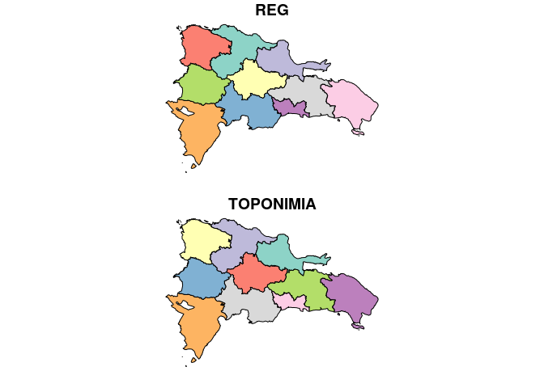

La función `st_read` lee la capa correspondiente del GPKG y la convierte
a un `simple features` de tipo `MULTIPOLYGON` (este tipo de objetos los
analizaremos más adelante).

Notar que la capa `REGCenso2010`, cuenta con dos campos, por lo que la
función `plot` representa a los municipios aplicándoles distintos
estilos en función del campo representado. Las regiones fueron
coloreadas en función de los campos `REG` y `TOPONIMIA`. Probemos una
visualización cuantitativa. Crearemos un campo de área mediante la
función `st_area` (en m<sup>2</sup>, que son las unidades del CRS, que
es EPSG:32619), representaremos el objeto `reg.sf` usando sólo dicho
campo (`reg.sf['area']`) y le aplicaremos estilos al mapa en función de
éste.

``` r
reg.sf$area <- st_area(reg.sf)
plot(reg.sf['area'])
```

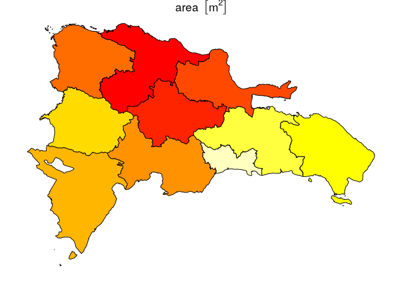

Finalmente, representaremos un panel simbolizando la región de código
`REG` igual a `01`, que es la región Cibao Norte, según los campos
disponibles (que son 3, `REG`, `TOPONIMIA` y `area`, esta último recién
creado).

``` r
plot(reg.sf[reg.sf$REG %in% '01', ])
```

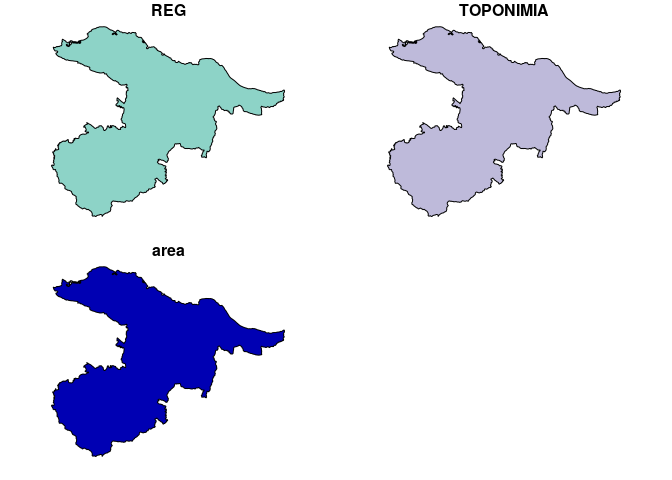

> Los mapas anteriores son mejorables en muchos aspectos. En este mismo
> tutorial, probarás formas de diseñar mapas estilizados.

El bloque de código a continuación carga la capa de municipios desde el
GPKG y la representa. Al igual que con la capa regional, dado que tiene
múltiples campos (en este caso, 3 adicionales), la función `plot`
representa a los municipios aplicándoles distintos estilos en función
del campo
representado.

``` r
mun.sf <- st_read(dsn = 'data/divisionRD.gpkg', layer = 'MUNCenso2010', quiet = T)
plot(mun.sf)
```

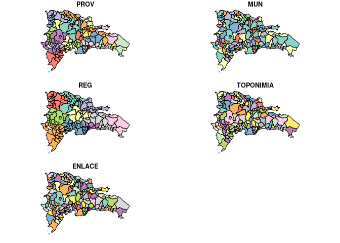

``` r
mun.sf$area <- st_area(mun.sf)
plot(mun.sf['area'])
```

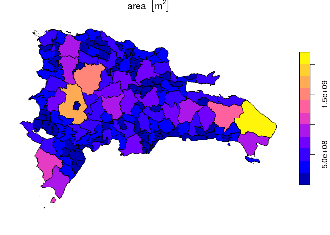

Puedes mostrar todas las áreas calculadas en forma de una tabla (a fin
de cuentas, los objetos `sf` son igualmente `data.frame`), pues el
resumen que obtienes al imprimir el objeto `sf` sólo incluye los
primeros 10 (depende de la configuración del paquete). Imprimiremos sólo
dos columnas, `TOPONIMIA` y `area`, y notarás que la columna de
geometría se mantendrá unida al objeto (más adelante se muestra cómo
imprimir la tabla de atributos sin dicha columna, deshaciéndonos de la
columna geométrica).

``` r
as.data.frame(mun.sf[,c('TOPONIMIA', 'area')])
##                     TOPONIMIA             area
## 1     SANTO DOMINGO DE GUZMÁN   91445631 [m^2]
## 2                        AZUA  416284424 [m^2]
## 3                 LAS CHARCAS  246501017 [m^2]
## 4        LAS YAYAS DE VIAJAMA  430949892 [m^2]
## 5             PADRE LAS CASAS  573677765 [m^2]
## 6                     PERALTA  129369696 [m^2]
## 7                SABANA YEGUA  113924640 [m^2]
## 8                PUEBLO VIEJO   48083834 [m^2]
## 9               TÁBARA ARRIBA  274922988 [m^2]
## 10                   GUAYABAL  235362759 [m^2]
## 11                  ESTEBANÍA  213054384 [m^2]
## 12                      NEIBA  282453220 [m^2]
## 13                     GALVÁN  281360014 [m^2]
## 14                     TAMAYO  434574839 [m^2]
## 15              VILLA JARAGUA  137111466 [m^2]
## 16                   LOS RÍOS  149323816 [m^2]
## 17                   BARAHONA  168423124 [m^2]
## 18                     CABRAL  121525151 [m^2]
## 19                 ENRIQUILLO  328159218 [m^2]
## 20                    PARAÍSO  136167915 [m^2]
## 21              VICENTE NOBLE  246177058 [m^2]
## 22                   EL PEÑÓN   42026036 [m^2]
## 23                 LA CIÉNAGA  116872263 [m^2]
## 24                  FUNDACIÓN   52288740 [m^2]
## 25                LAS SALINAS  126872654 [m^2]
## 26                       POLO  206701739 [m^2]
## 27                 JAQUIMEYES  115014952 [m^2]
## 28                    DAJABÓN  261085373 [m^2]
## 29            LOMA DE CABRERA  246499197 [m^2]
## 30                    PARTIDO  149784900 [m^2]
## 31               RESTAURACIÓN  275990329 [m^2]
## 32                    EL PINO   87737123 [m^2]
## 33   SAN FRANCISCO DE MACORÍS  759742818 [m^2]
## 34                    ARENOSO  144706319 [m^2]
## 35                   CASTILLO  133103321 [m^2]
## 36                   PIMENTEL  121458584 [m^2]
## 37                 VILLA RIVA  321181906 [m^2]
## 38               LAS GUÁRANAS   89929989 [m^2]
## 39    EUGENIO MARÍA DE HOSTOS   79284926 [m^2]
## 40                 COMENDADOR  256008021 [m^2]
## 41                     BÁNICA  266317525 [m^2]
## 42                   EL LLANO  100055906 [m^2]
## 43                HONDO VALLE  122592074 [m^2]
## 44              PEDRO SANTANA  548225357 [m^2]
## 45              JUAN SANTIAGO  102369101 [m^2]
## 46                   EL SEIBO 1345076520 [m^2]
## 47                     MICHES  443633367 [m^2]
## 48                       MOCA  339621113 [m^2]
## 49          CAYETANO GERMOSÉN   17805497 [m^2]
## 50           GASPAR HERNÁNDEZ  370682532 [m^2]
## 51             JAMAO AL NORTE  114088663 [m^2]
## 52                     JIMANÍ  472373739 [m^2]
## 53                    DUVERGÉ  441127553 [m^2]
## 54             LA DESCUBIERTA  192801526 [m^2]
## 55                POSTRER RÍO  122700435 [m^2]
## 56                  CRISTÓBAL  158623418 [m^2]
## 57                      MELLA  383000483 [m^2]
## 58                     HIGÜEY 2016344922 [m^2]
## 59        SAN RAFAEL DEL YUMA  979898486 [m^2]
## 60                  LA ROMANA  271984871 [m^2]
## 61                   GUAYMATE  262138831 [m^2]
## 62              VILLA HERMOSA  117428910 [m^2]
## 63                    LA VEGA  641837424 [m^2]
## 64                  CONSTANZA  850434648 [m^2]
## 65                  JARABACOA  674086867 [m^2]
## 66                 JIMA ABAJO  126270260 [m^2]
## 67                      NAGUA  544759687 [m^2]
## 68                    CABRERA  270423950 [m^2]
## 69                  EL FACTOR  146924838 [m^2]
## 70               RÍO SAN JUAN  244513580 [m^2]
## 71               MONTE CRISTI  515739154 [m^2]
## 72                CASTAÑUELAS   86762109 [m^2]
## 73                   GUAYUBÍN  833203278 [m^2]
## 74    LAS MATAS DE SANTA CRUZ   71722855 [m^2]
## 75            PEPILLO SALCEDO  151277850 [m^2]
## 76              VILLA VÁSQUEZ  224368442 [m^2]
## 77                 PEDERNALES 1120490262 [m^2]
## 78                     OVIEDO  959710212 [m^2]
## 79                       BANÍ  740571951 [m^2]
## 80                      NIZAO   44221828 [m^2]
## 81               PUERTO PLATA  502507159 [m^2]
## 82                   ALTAMIRA  177451517 [m^2]
## 83                  GUANANICO   59724898 [m^2]
## 84                     IMBERT  160922367 [m^2]
## 85               LOS HIDALGOS   97716045 [m^2]
## 86                    LUPERÓN  256092256 [m^2]
## 87                      SOSÚA  267473917 [m^2]
## 88              VILLA ISABELA  211764893 [m^2]
## 89           VILLA MONTELLANO   72163184 [m^2]
## 90                    SALCEDO  177180112 [m^2]
## 91                    TENARES  158488443 [m^2]
## 92                VILLA TAPIA   91571148 [m^2]
## 93                     SAMANÁ  410648188 [m^2]
## 94                    SÁNCHEZ  340554004 [m^2]
## 95               LAS TERRENAS  111812914 [m^2]
## 96              SAN CRISTÓBAL  212672914 [m^2]
## 97  SABANA GRANDE DE PALENQUE   30011820 [m^2]
## 98             BAJOS DE HAINA   39852696 [m^2]
## 99          CAMBITA GARABITOS  172789985 [m^2]
## 100          VILLA ALTAGRACIA  426247360 [m^2]
## 101                   YAGUATE  122348005 [m^2]
## 102     SAN GREGORIO DE NIGUA   51036558 [m^2]
## 103                LOS CACAOS  185907356 [m^2]
## 104                  SAN JUAN 1727990799 [m^2]
## 105                  BOHECHÍO  406147190 [m^2]
## 106                EL CERCADO  277764197 [m^2]
## 107           JUAN DE HERRERA   93048312 [m^2]
## 108       LAS MATAS DE FARFÁN  637578733 [m^2]
## 109                VALLEJUELO  221788791 [m^2]
## 110      SAN PEDRO DE MACORÍS  146920374 [m^2]
## 111                LOS LLANOS  439159881 [m^2]
## 112             RAMÓN SANTANA  250887121 [m^2]
## 113                  CONSUELO  131756281 [m^2]
## 114                 QUISQUEYA  149876368 [m^2]
## 115                GUAYACANES  135052241 [m^2]
## 116                     COTUÍ  661119633 [m^2]
## 117                   CEVICOS  245128517 [m^2]
## 118                   FANTINO   89111449 [m^2]
## 119                   LA MATA  190211490 [m^2]
## 120                  SANTIAGO  474513175 [m^2]
## 121                    BISONÓ   93008743 [m^2]
## 122                    JÁNICO  403004645 [m^2]
## 123            LICEY AL MEDIO   27219960 [m^2]
## 124     SAN JOSÉ DE LAS MATAS 1518632964 [m^2]
## 125                  TAMBORIL   70992773 [m^2]
## 126            VILLA GONZÁLEZ  100184216 [m^2]
## 127                     PUÑAL   60479410 [m^2]
## 128            SABANA IGLESIA   58809059 [m^2]
## 129   SAN IGNACIO DE SABANETA  801315610 [m^2]
## 130       VILLA LOS ALMÁCIGOS  207416941 [m^2]
## 131                   MONCIÓN  139263189 [m^2]
## 132                       MAO  414887995 [m^2]
## 133                 ESPERANZA  221638300 [m^2]
## 134             LAGUNA SALADA  186145433 [m^2]
## 135                     BONAO  677979547 [m^2]
## 136                    MAIMÓN   82715683 [m^2]
## 137             PIEDRA BLANCA  231290389 [m^2]
## 138               MONTE PLATA  631524403 [m^2]
## 139                 BAYAGUANA  872936433 [m^2]
## 140     SABANA GRANDE DE BOYÁ  527556285 [m^2]
## 141                    YAMASÁ  434145029 [m^2]
## 142                PERALVILLO  136035062 [m^2]
## 143                HATO MAYOR  643813509 [m^2]
## 144          SABANA DE LA MAR  511278630 [m^2]
## 145                  EL VALLE  162680380 [m^2]
## 146          SAN JOSÉ DE OCOA  485120638 [m^2]
## 147              SABANA LARGA  163476349 [m^2]
## 148             RANCHO ARRIBA  204953502 [m^2]
## 149        SANTO DOMINGO ESTE  169076525 [m^2]
## 150       SANTO DOMINGO OESTE   53765299 [m^2]
## 151       SANTO DOMINGO NORTE  387947106 [m^2]
## 152                BOCA CHICA  140252944 [m^2]
## 153     SAN ANTONIO DE GUERRA  283776984 [m^2]
## 154            LOS ALCARRIZOS   44822376 [m^2]
## 155               PEDRO BRAND  221759264 [m^2]
##                               geom
## 1   MULTIPOLYGON (((405218.1 20...
## 2   MULTIPOLYGON (((319065.3 20...
## 3   MULTIPOLYGON (((341415.3 20...
## 4   MULTIPOLYGON (((304058.1 20...
## 5   MULTIPOLYGON (((312890.8 20...
## 6   MULTIPOLYGON (((317370.6 20...
## 7   MULTIPOLYGON (((306745.8 20...
## 8   MULTIPOLYGON (((310447.9 20...
## 9   MULTIPOLYGON (((306556.7 20...
## 10  MULTIPOLYGON (((322129.5 20...
## 11  MULTIPOLYGON (((324223.8 20...
## 12  MULTIPOLYGON (((263083.9 20...
## 13  MULTIPOLYGON (((263083.9 20...
## 14  MULTIPOLYGON (((271940 2060...
## 15  MULTIPOLYGON (((236315.8 20...
## 16  MULTIPOLYGON (((235004.5 20...
## 17  MULTIPOLYGON (((278209.9 20...
## 18  MULTIPOLYGON (((265423.8 20...
## 19  MULTIPOLYGON (((260037.2 19...
## 20  MULTIPOLYGON (((266946.2 20...
## 21  MULTIPOLYGON (((289300.3 20...
## 22  MULTIPOLYGON (((271999.2 20...
## 23  MULTIPOLYGON (((274066.2 19...
## 24  MULTIPOLYGON (((278869.6 20...
## 25  MULTIPOLYGON (((259861.5 20...
## 26  MULTIPOLYGON (((266847.6 20...
## 27  MULTIPOLYGON (((290988.3 20...
## 28  MULTIPOLYGON (((235671.9 21...
## 29  MULTIPOLYGON (((230827 2160...
## 30  MULTIPOLYGON (((241083.3 21...
## 31  MULTIPOLYGON (((232445.6 21...
## 32  MULTIPOLYGON (((241182.7 21...
## 33  MULTIPOLYGON (((374434.8 21...
## 34  MULTIPOLYGON (((409755.3 21...
## 35  MULTIPOLYGON (((392616.3 21...
## 36  MULTIPOLYGON (((385882.1 21...
## 37  MULTIPOLYGON (((406760.2 21...
## 38  MULTIPOLYGON (((377123.5 21...
## 39  MULTIPOLYGON (((395656.3 21...
## 40  MULTIPOLYGON (((221606.8 20...
## 41  MULTIPOLYGON (((236565.8 21...
## 42  MULTIPOLYGON (((222949 2081...
## 43  MULTIPOLYGON (((220239.3 20...
## 44  MULTIPOLYGON (((235630.8 21...
## 45  MULTIPOLYGON (((227986.4 20...
## 46  MULTIPOLYGON (((487139.2 20...
## 47  MULTIPOLYGON (((523436.4 20...
## 48  MULTIPOLYGON (((352810.9 21...
## 49  MULTIPOLYGON (((347754.5 21...
## 50  MULTIPOLYGON (((385993.5 21...
## 51  MULTIPOLYGON (((352875.8 21...
## 52  MULTIPOLYGON (((203364.8 20...
## 53  MULTIPOLYGON (((233356.9 20...
## 54  MULTIPOLYGON (((205698.2 20...
## 55  MULTIPOLYGON (((227986.4 20...
## 56  MULTIPOLYGON (((262640.5 20...
## 57  MULTIPOLYGON (((242158.7 20...
## 58  MULTIPOLYGON (((560314.8 20...
## 59  MULTIPOLYGON (((560314.8 20...
## 60  MULTIPOLYGON (((528168.4 20...
## 61  MULTIPOLYGON (((507692.7 20...
## 62  MULTIPOLYGON (((498710.9 20...
## 63  MULTIPOLYGON (((343791.5 21...
## 64  MULTIPOLYGON (((340111.3 21...
## 65  MULTIPOLYGON (((340111.3 21...
## 66  MULTIPOLYGON (((360883.6 21...
## 67  MULTIPOLYGON (((408511.6 21...
## 68  MULTIPOLYGON (((408511.6 21...
## 69  MULTIPOLYGON (((409755.3 21...
## 70  MULTIPOLYGON (((395660.9 21...
## 71  MULTIPOLYGON (((238500.3 22...
## 72  MULTIPOLYGON (((243132.7 21...
## 73  MULTIPOLYGON (((241920.2 21...
## 74  MULTIPOLYGON (((241920.2 21...
## 75  MULTIPOLYGON (((227423.9 21...
## 76  MULTIPOLYGON (((253612.1 21...
## 77  MULTIPOLYGON (((236128.3 20...
## 78  MULTIPOLYGON (((242737.3 19...
## 79  MULTIPOLYGON (((360376.3 20...
## 80  MULTIPOLYGON (((374731.2 20...
## 81  MULTIPOLYGON (((329099.4 21...
## 82  MULTIPOLYGON (((313941.5 21...
## 83  MULTIPOLYGON (((302514 2181...
## 84  MULTIPOLYGON (((302720.7 21...
## 85  MULTIPOLYGON (((287039.6 21...
## 86  MULTIPOLYGON (((302963.2 22...
## 87  MULTIPOLYGON (((356467.6 21...
## 88  MULTIPOLYGON (((287039.6 21...
## 89  MULTIPOLYGON (((333708.2 21...
## 90  MULTIPOLYGON (((351917.7 21...
## 91  MULTIPOLYGON (((368431.6 21...
## 92  MULTIPOLYGON (((357845.3 21...
## 93  MULTIPOLYGON (((449750.2 21...
## 94  MULTIPOLYGON (((449607.8 21...
## 95  MULTIPOLYGON (((451347.4 21...
## 96  MULTIPOLYGON (((382444.8 20...
## 97  MULTIPOLYGON (((381312.8 20...
## 98  MULTIPOLYGON (((392353.5 20...
## 99  MULTIPOLYGON (((372254.2 20...
## 100 MULTIPOLYGON (((377168.7 20...
## 101 MULTIPOLYGON (((378910.7 20...
## 102 MULTIPOLYGON (((388742.2 20...
## 103 MULTIPOLYGON (((358342 2071...
## 104 MULTIPOLYGON (((276840.2 21...
## 105 MULTIPOLYGON (((293711.7 21...
## 106 MULTIPOLYGON (((240178.4 20...
## 107 MULTIPOLYGON (((271446.6 20...
## 108 MULTIPOLYGON (((222152 2089...
## 109 MULTIPOLYGON (((262248.7 20...
## 110 MULTIPOLYGON (((476086.8 20...
## 111 MULTIPOLYGON (((452573.4 20...
## 112 MULTIPOLYGON (((481850.9 20...
## 113 MULTIPOLYGON (((481850.9 20...
## 114 MULTIPOLYGON (((459914.2 20...
## 115 MULTIPOLYGON (((464065.8 20...
## 116 MULTIPOLYGON (((386948.8 21...
## 117 MULTIPOLYGON (((404915 2106...
## 118 MULTIPOLYGON (((368058.7 21...
## 119 MULTIPOLYGON (((384637.4 21...
## 120 MULTIPOLYGON (((330251.9 21...
## 121 MULTIPOLYGON (((308622.1 21...
## 122 MULTIPOLYGON (((315516.5 21...
## 123 MULTIPOLYGON (((332628.2 21...
## 124 MULTIPOLYGON (((301805.8 21...
## 125 MULTIPOLYGON (((337821 2158...
## 126 MULTIPOLYGON (((316798.7 21...
## 127 MULTIPOLYGON (((333479.8 21...
## 128 MULTIPOLYGON (((320157.4 21...
## 129 MULTIPOLYGON (((270283.9 21...
## 130 MULTIPOLYGON (((249007.3 21...
## 131 MULTIPOLYGON (((281080.9 21...
## 132 MULTIPOLYGON (((284359.6 21...
## 133 MULTIPOLYGON (((294006.8 21...
## 134 MULTIPOLYGON (((276526.9 21...
## 135 MULTIPOLYGON (((355595.2 21...
## 136 MULTIPOLYGON (((363389.1 20...
## 137 MULTIPOLYGON (((368432.5 20...
## 138 MULTIPOLYGON (((425067.1 20...
## 139 MULTIPOLYGON (((449654.6 20...
## 140 MULTIPOLYGON (((422830.4 21...
## 141 MULTIPOLYGON (((378253.2 20...
## 142 MULTIPOLYGON (((397928.5 20...
## 143 MULTIPOLYGON (((465415.7 20...
## 144 MULTIPOLYGON (((480938.9 21...
## 145 MULTIPOLYGON (((469091.6 20...
## 146 MULTIPOLYGON (((328661.2 20...
## 147 MULTIPOLYGON (((341042.8 20...
## 148 MULTIPOLYGON (((351336.1 20...
## 149 MULTIPOLYGON (((420233.1 20...
## 150 MULTIPOLYGON (((394557.7 20...
## 151 MULTIPOLYGON (((402718.9 20...
## 152 MULTIPOLYGON (((436805 2045...
## 153 MULTIPOLYGON (((439801.8 20...
## 154 MULTIPOLYGON (((395868 2050...
## 155 MULTIPOLYGON (((392640.4 20...
```

### ¿Qué son *simple features*?

Veamos lo básico sobre el modelo de datos *simple features*. Se trata de
un estándar abierto y jerárquico del Open Geospatial Consortium
(organización sin ánimo de lucro que agrupa a entidades públicas y
privadas comprometida con este tipo de estándares). Mediante *simple
features* se representan al menos 17 tipos de geometrías (sólo admite
vectoriales), de las que 7 son ampliamente usadas en análisis espacial
(ver figura a continuación).

<figure>


</figure>

Tipos de *simple features* admitidos por el paquete `sf`. Fuente:
Lovelace et al. (2019)

Por ejemplo, exploremos el objeto `mun.sf` en la consola; basta con
escribir su nombre para obtener un resumen que muestra el tipo de
geometría y otras características espaciales, como el sistema de
referencia espacial (CRS). A continuación, mostrará los atributos de los
primeros 10 objetos (explicados más adelante).

``` r
mun.sf
## Simple feature collection with 155 features and 6 fields
## geometry type:  MULTIPOLYGON
## dimension:      XY
## bbox:           xmin: 182215.8 ymin: 1933532 xmax: 571365.3 ymax: 2205216
## epsg (SRID):    32619
## proj4string:    +proj=utm +zone=19 +datum=WGS84 +units=m +no_defs
## First 10 features:
##    PROV MUN REG               TOPONIMIA ENLACE
## 1    01  01  10 SANTO DOMINGO DE GUZMÁN 100101
## 2    02  01  05                    AZUA 050201
## 3    02  02  05             LAS CHARCAS 050202
## 4    02  03  05    LAS YAYAS DE VIAJAMA 050203
## 5    02  04  05         PADRE LAS CASAS 050204
## 6    02  05  05                 PERALTA 050205
## 7    02  06  05            SABANA YEGUA 050206
## 8    02  07  05            PUEBLO VIEJO 050207
## 9    02  08  05           TÁBARA ARRIBA 050208
## 10   02  09  05                GUAYABAL 050209
##                              geom            area
## 1  MULTIPOLYGON (((405218.1 20...  91445631 [m^2]
## 2  MULTIPOLYGON (((319065.3 20... 416284424 [m^2]
## 3  MULTIPOLYGON (((341415.3 20... 246501017 [m^2]
## 4  MULTIPOLYGON (((304058.1 20... 430949892 [m^2]
## 5  MULTIPOLYGON (((312890.8 20... 573677765 [m^2]
## 6  MULTIPOLYGON (((317370.6 20... 129369696 [m^2]
## 7  MULTIPOLYGON (((306745.8 20... 113924640 [m^2]
## 8  MULTIPOLYGON (((310447.9 20...  48083834 [m^2]
## 9  MULTIPOLYGON (((306556.7 20... 274922988 [m^2]
## 10 MULTIPOLYGON (((322129.5 20... 235362759 [m^2]
```

Nos informa que se trata de un `Simple feature collection with 155
features and 6 fields` de tipo `MULTIPOLYGON` con dimensiones `XY` y una
extensión mostrada en la línea `bbox`. Igualmente, nos indica que el CRS
es EPSG:32619, o WGS84 UTM zona 19.

El modelo de datos de los *simple features* se basa en estructuras
similares a las que usan bases de datos espaciales, como PostGIS,
favoreciendo así la interoperabilidad. Otras ventajas que se señalan en
su favor son: mejor rendimiento para lectura, escritura y representación
(“ploteado”) de datos espaciales, maneja objetos tipo `data.frame` (ver
más abajo) y, no menos importante, las operaciones geométricas y de
atributos se pueden realizar mediante tuberías (*pipelines*) de la
colección `tidyverse`.

Los *simple features* se integran en R mediante el paquete `sf`
(Pebesma, 2018). El paquete `sf` supera significativamente a su
predecesor, `sp` en eficiencia y facilidad de uso. Asimismo, `sf`
depende de otros paquetes de R muy eficientes, y también de paquetes
externos mantenidos por una comunidad muy amplia (como GDAL, GEOS y
PROJ). A continuación se muestra un gráfico de las dependencias.

<figure>


</figure>

El paquete `sf` y sus dependencias. Las flechas sólidas indican
dependencia fuerte; las de trazo discontinuo, dependencia débil. Fuente:
Pebesma & Bivand (2019)

Los *simple features* se almacenan en…tablas. Sí, sí, tablas,
denominadas `data.frames` en R, que en el caso concreto serían “tablas
espaciales” (*spatial data frames*). Exploremos la estructura del objeto
`mun.sf` mediante la función `str`, la cual lo muestra como `Classes
'sf' and data.frame: 10 obs. of 4 variables` (155 observaciones o
geometrías, que en este caso son municipios dominicanos, y 4 variables o
atributos).

``` r
str(mun.sf)
## Classes 'sf' and 'data.frame':   155 obs. of  7 variables:
##  $ PROV     : Factor w/ 32 levels "01","02","03",..: 1 2 2 2 2 2 2 2 2 2 ...
##  $ MUN      : Factor w/ 11 levels "01","02","03",..: 1 1 2 3 4 5 6 7 8 9 ...
##  $ REG      : Factor w/ 10 levels "01","02","03",..: 10 5 5 5 5 5 5 5 5 5 ...
##  $ TOPONIMIA: Factor w/ 155 levels "ALTAMIRA","ARENOSO",..: 133 3 65 71 92 99 118 105 138 43 ...
##  $ ENLACE   : Factor w/ 155 levels "010901","010902",..: 148 68 69 70 71 72 73 74 75 76 ...
##  $ geom     :sfc_MULTIPOLYGON of length 155; first list element: List of 1
##   ..$ :List of 1
##   .. ..$ : num [1:71, 1:2] 405218 406287 407220 407479 407661 ...
##   ..- attr(*, "class")= chr  "XY" "MULTIPOLYGON" "sfg"
##  $ area     :Object of class units:
##  num  9.14e+07 4.16e+08 2.47e+08 4.31e+08 5.74e+08 ...
##   ..- attr(*, "units")=List of 2
##   .. ..$ numerator  : chr  "m" "m"
##   .. ..$ denominator: chr 
##   .. ..- attr(*, "class")= chr "symbolic_units"
##  - attr(*, "sf_column")= chr "geom"
##  - attr(*, "agr")= Factor w/ 3 levels "constant","aggregate",..: NA NA NA NA NA NA
##   ..- attr(*, "names")= chr  "PROV" "MUN" "REG" "TOPONIMIA" ...
```

Al tratarse de un `data.frame`, los análisis estadísticos se ejecutan de
manera fluida y sin necesidad de extraer los datos a archivos externos.
Así, por ejemplo, la función `summary`, muy empleada en R para obtener
estadísticos descriptivos, devuelve estadísticos de todas las columnas
de atributos (incluida la de geometría, nombrada como `geom` en este
caso):

``` r
summary(mun.sf)
##       PROV          MUN          REG              TOPONIMIA  
##  04     : 11   01     :32   06     :24   ALTAMIRA      :  1  
##  02     : 10   02     :31   05     :23   ARENOSO       :  1  
##  18     :  9   03     :27   01     :22   AZUA          :  1  
##  25     :  9   04     :19   03     :17   BAJOS DE HAINA:  1  
##  21     :  8   05     :15   04     :17   BANÍ          :  1  
##  06     :  7   06     :12   09     :14   BÁNICA        :  1  
##  (Other):101   (Other):19   (Other):38   (Other)       :149  
##      ENLACE               geom          area          
##  010901 :  1   MULTIPOLYGON :155   Min.   :1.781e+07  
##  010902 :  1   epsg:32619   :  0   1st Qu.:1.219e+08  
##  010903 :  1   +proj=utm ...:  0   Median :2.118e+08  
##  010904 :  1                       Mean   :3.101e+08  
##  011801 :  1                       3rd Qu.:4.128e+08  
##  011802 :  1                       Max.   :2.016e+09  
##  (Other):149
```

La función `summary` actúa igualmente sobre una columna filtrada desde
el objeto `reg.sf`, en este caso `area`.

``` r
summary(mun.sf['area'])
##       area                      geom    
##  Min.   :1.781e+07   MULTIPOLYGON :155  
##  1st Qu.:1.219e+08   epsg:32619   :  0  
##  Median :2.118e+08   +proj=utm ...:  0  
##  Mean   :3.101e+08                      
##  3rd Qu.:4.128e+08                      
##  Max.   :2.016e+09
```

> Nota que la columna `geom` se mantiene en el resumen, puesto que
> siempre acompaña al objeto a menos que le indiquemos lo contrario
> (*sticky column*).

### *Simple features*, de abajo a arriba

Normalmente, los datos espaciales se crean en aplicaciones con GUI
(e.g. QGIS), o los obtienes de terceros. Sin embargo, para fines
didácticos, crearemos algunos objetos conteniendo los tipos de
geometrías básicos en la forma de *simple feature geometries* (`sfg`)
en el siguiente bloque de código. Las crearemos utilizando **coordenadas
geográficas**, aunque no podremos definir un CRS, puesto que la clase
`sfg` no admite dicha funcionalidad. Las funciones que utilizaremos para
cada geometría serán punto `st_point`, línea `st_linestring` y polígono
`st_polygon`.

``` r
pto.sfg <- st_point(c(-70.3, 19))
pto.sfg
## POINT (-70.3 19)
plot(pto.sfg, col = 'red'); box()
matrizlin <- rbind(c(-71.5, 18), c(-71.2, 18),
                   c(-71.2, 18.4), c(-71.5, 18.4))
matrizlin
##       [,1] [,2]
## [1,] -71.5 18.0
## [2,] -71.2 18.0
## [3,] -71.2 18.4
## [4,] -71.5 18.4
lin.sfg <- st_linestring(matrizlin)
lin.sfg
## LINESTRING (-71.5 18, -71.2 18, -71.2 18.4, -71.5 18.4)
plot(lin.sfg, col = 'red'); box()
matrizpol <- list(
  rbind(c(-70.7, 18.6), c(-70.4, 18.6),
        c(-70.4, 18.9), c(-70.7, 18.9),
        c(-70.7, 18.6)))
pol.sfg <- st_polygon(matrizpol)
pol.sfg
## POLYGON ((-70.7 18.6, -70.4 18.6, -70.4 18.9, -70.7 18.9, -70.7 18.6))
plot(pol.sfg, col = 'red'); box()
```

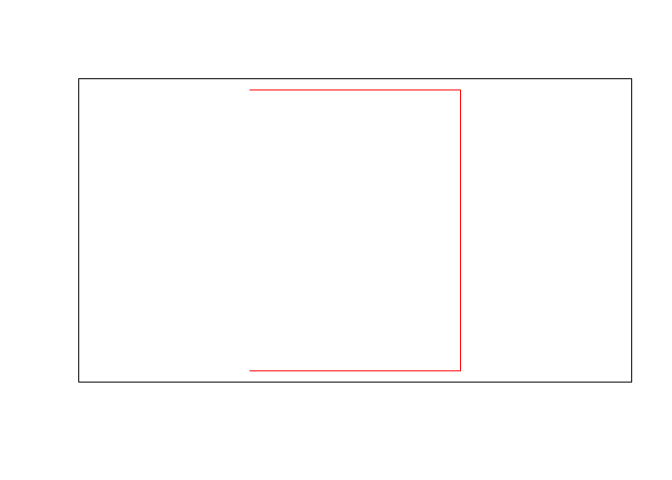

Si combinamos varios puntos generamos un elemento multipunto
(*multipoint*). Lo mismo aplica para las líneas (multilínea,
*multilinestring*) y los polígonos (multipolígono, *multipolygon*). El
siguiente bloque de código muestra cómo
crearlos.

``` r
mpto.sfg <- st_multipoint(rbind(c(-70.3, 19), c(-70.4, 19), c(-70.4, 19.1), c(-70.3, 19.1)))
mpto.sfg
## MULTIPOINT (-70.3 19, -70.4 19, -70.4 19.1, -70.3 19.1)
plot(mpto.sfg, col = 'red'); box()
matrizmlin <- list(rbind(c(-71.5, 18), c(-71.2, 18), c(-71.2, 18.4), c(-71.5, 18.4)),
                  rbind(c(-70.9, 18), c(-70.5, 18), c(-70.7, 18.4)))
matrizmlin
## [[1]]
##       [,1] [,2]
## [1,] -71.5 18.0
## [2,] -71.2 18.0
## [3,] -71.2 18.4
## [4,] -71.5 18.4
## 
## [[2]]
##       [,1] [,2]
## [1,] -70.9 18.0
## [2,] -70.5 18.0
## [3,] -70.7 18.4
mlin.sfg <- st_multilinestring(matrizmlin)
mlin.sfg
## MULTILINESTRING ((-71.5 18, -71.2 18, -71.2 18.4, -71.5 18.4), (-70.9 18, -70.5 18, -70.7 18.4))
plot(mlin.sfg, col = 'red'); box()
matrizmpol <- list(
  list(rbind(c(-70.7, 18.6), c(-70.4, 18.6), c(-70.4, 18.9), c(-70.7, 18.9), c(-70.7, 18.6))),
  list(rbind(c(-70, 18.6), c(-70.3, 18.6), c(-70.2, 18.9), c(-70, 18.6))))
mpol.sfg <- st_multipolygon(matrizmpol)
mpol.sfg
## MULTIPOLYGON (((-70.7 18.6, -70.4 18.6, -70.4 18.9, -70.7 18.9, -70.7 18.6)), ((-70 18.6, -70.3 18.6, -70.2 18.9, -70 18.6)))
plot(mpol.sfg, col = 'red'); box()
```

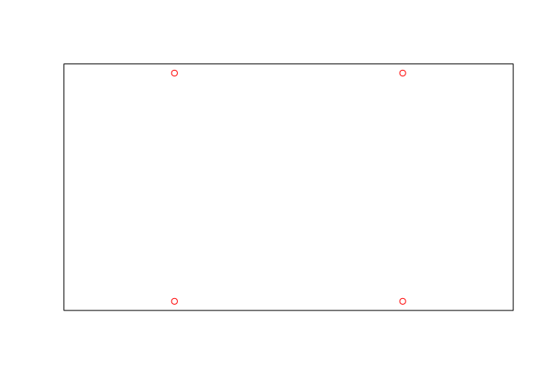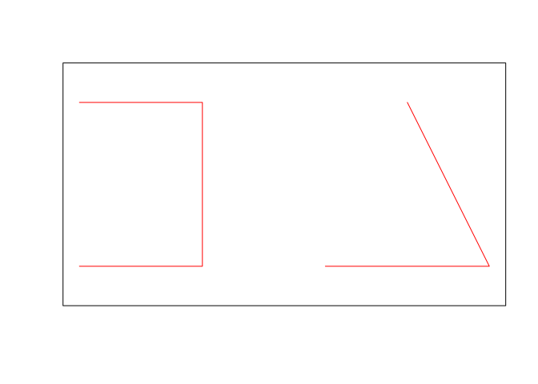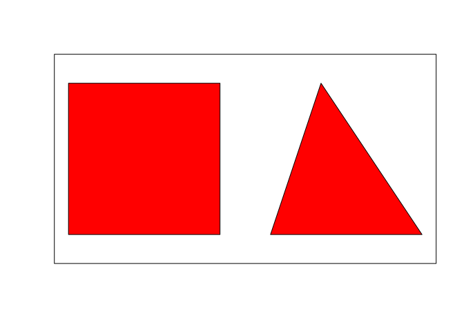

Finalmente, combinaremos varios elementos en una colección, para lo cual
usaremos los elementos creados anteriormente.

``` r
# colec <- c(pto, lin, pol)
colec1.sfg <- st_geometrycollection(list(pto.sfg, lin.sfg, pol.sfg))
plot(colec1.sfg, col = 'red'); box()
colec2.sfg <- st_geometrycollection(list(mpto.sfg, mlin.sfg, mpol.sfg))
plot(colec2.sfg, col = 'red'); box()
```

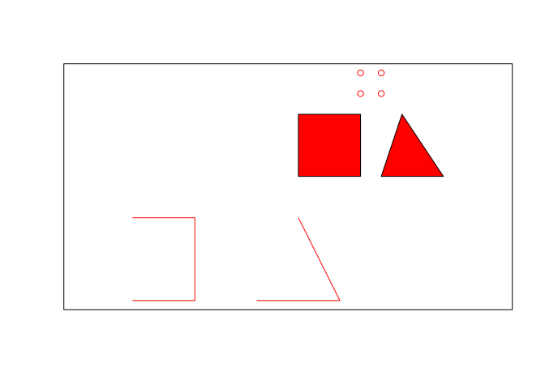

Recordemos que, hasta este punto, hemos creado elementos basados en
geometrías simples (*simple feature geometries*, `sfg`). Un objeto `sfg`
contiene sólo un elemento, que puede ser sencillo, multi\* o una
colección. Además, aunque las `sfg` se construyen usando coordenadas,
éstas no cuentan con sistema de referencia espacial (CRS). La *simple
feature column* (`sfc`), al ser una lista, permite alojar varios
elementos y también admite la definición de CRS. La `sfc` es importante
porque representa la columna geométrica de un *simple feature* (`sf`),
por lo que debemos reconocerla para comprender el modelo de un `sf`.
Generaremos una `sfc` a partir de algunos de los `sfg` del objeto
`pto.sfg` creado anteriormente (se podrían utilizar los otros
igualmente, o combinarlos), y no asignaremos por el momento CRS alguno.

``` r
pto.sfc <- st_sfc(pto.sfg)
pto.sfc
## Geometry set for 1 feature 
## geometry type:  POINT
## dimension:      XY
## bbox:           xmin: -70.3 ymin: 19 xmax: -70.3 ymax: 19
## epsg (SRID):    NA
## proj4string:    NA
## POINT (-70.3 19)
plot(pto.sfc, col = 'red'); box()
```

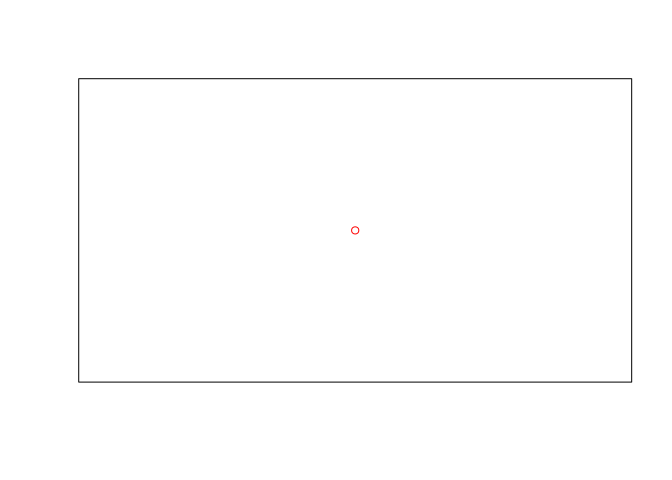

Aunque la representación gráfica de `pto.sfc` es idéntica a la de su
homólogo `pto.sfg`, la diferencia radica en la clase del objeto.

``` r
class(pto.sfg)
## [1] "XY"    "POINT" "sfg"
class(pto.sfc)
## [1] "sfc_POINT" "sfc"
```

Ahora creemos `sfc` basadas en las geometrías línea (`lin.sfg`),
polígono (`pol.sfg`), multipolígono (`mpol.sfg`) y colección
(`colec.sfg`).

``` r
lin.sfc <- st_sfc(lin.sfg)
lin.sfc
## Geometry set for 1 feature 
## geometry type:  LINESTRING
## dimension:      XY
## bbox:           xmin: -71.5 ymin: 18 xmax: -71.2 ymax: 18.4
## epsg (SRID):    NA
## proj4string:    NA
## LINESTRING (-71.5 18, -71.2 18, -71.2 18.4, -71...
plot(lin.sfc, col = 'red'); box()
pol.sfc <- st_sfc(pol.sfg)
pol.sfc
## Geometry set for 1 feature 
## geometry type:  POLYGON
## dimension:      XY
## bbox:           xmin: -70.7 ymin: 18.6 xmax: -70.4 ymax: 18.9
## epsg (SRID):    NA
## proj4string:    NA
## POLYGON ((-70.7 18.6, -70.4 18.6, -70.4 18.9, -...
plot(pol.sfc, col = 'red'); box()
mpol.sfc <- st_sfc(mpol.sfg)
mpol.sfc
## Geometry set for 1 feature 
## geometry type:  MULTIPOLYGON
## dimension:      XY
## bbox:           xmin: -70.7 ymin: 18.6 xmax: -70 ymax: 18.9
## epsg (SRID):    NA
## proj4string:    NA
## MULTIPOLYGON (((-70.7 18.6, -70.4 18.6, -70.4 1...
plot(mpol.sfc, col = 'red'); box()
colec1.sfc <- st_sfc(colec1.sfg)
colec1.sfc
## Geometry set for 1 feature 
## geometry type:  GEOMETRYCOLLECTION
## dimension:      XY
## bbox:           xmin: -71.5 ymin: 18 xmax: -70.3 ymax: 19
## epsg (SRID):    NA
## proj4string:    NA
## GEOMETRYCOLLECTION (POINT (-70.3 19), LINESTRIN...
plot(colec1.sfc, col = 'red'); box()
```

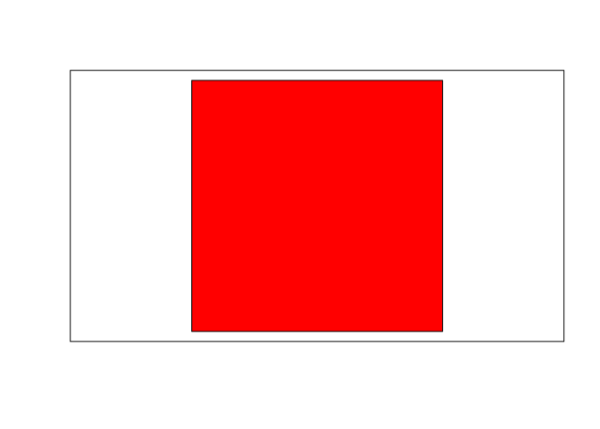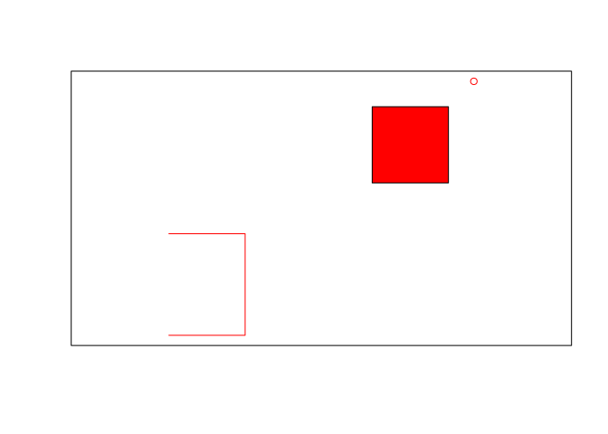

Los dos gráficos de arriba representan `sfc` de líneas y polígonos,
respectivamente. En la franja inferior: izquierda multipolígono, derecha
colección.

En el resumen de cada objeto podemos notar que no se ha definido ningún
CRS (`epsg (SRID): NA` y `proj4string: NA`. En cualquier caso, para
consultar el CRS de cualquier `sfc` utilizamos la función `st_crs`.

``` r
st_crs(pto.sfc)
## Coordinate Reference System: NA
```

Todas las geometrías dentro de una `sfc` deben tener el mismo CRS.
Podemos definir el CRS de un objeto al crear la `sfc`, o
alternativamente lo definimos luego de creado el objeto.

``` r
#Al crear el objeto, argumento crs de la función st_sfc
pto.sfc <- st_sfc(pto.sfg, crs = 4326)
pto.sfc
## Geometry set for 1 feature 
## geometry type:  POINT
## dimension:      XY
## bbox:           xmin: -70.3 ymin: 19 xmax: -70.3 ymax: 19
## epsg (SRID):    4326
## proj4string:    +proj=longlat +datum=WGS84 +no_defs
## POINT (-70.3 19)
#Alternativamente, usando la función st_crs()
st_crs(lin.sfc) <- 4326
lin.sfc
## Geometry set for 1 feature 
## geometry type:  LINESTRING
## dimension:      XY
## bbox:           xmin: -71.5 ymin: 18 xmax: -71.2 ymax: 18.4
## epsg (SRID):    4326
## proj4string:    +proj=longlat +datum=WGS84 +no_defs
## LINESTRING (-71.5 18, -71.2 18, -71.2 18.4, -71...
#También admite cadenas de texto proj4string:
st_crs(pol.sfc) <- '+proj=longlat +datum=WGS84 +no_defs'
pol.sfc
## Geometry set for 1 feature 
## geometry type:  POLYGON
## dimension:      XY
## bbox:           xmin: -70.7 ymin: 18.6 xmax: -70.4 ymax: 18.9
## epsg (SRID):    4326
## proj4string:    +proj=longlat +datum=WGS84 +no_defs
## POLYGON ((-70.7 18.6, -70.4 18.6, -70.4 18.9, -...
```

Finalmente, construyamos un *simple feature* `sf`. Disponemos de una
columna geométrica pero necesitamos atributos. Por lo tanto, primero que
crearemos atributos y luego `sf`.

``` r
#Primero el atributo
pto.atr <- data.frame(nombre='pto')
#Luego creamos el sf
pto.sf <- st_sf(pto.atr, geometry = pto.sfc)
```

¿Cuál sería el proceso si lo desarrolláramos desde cero? Primero creemos
la geometría para el punto, luego la columna geométrica, luego los
atributos y finalmente el *simple feature*.

``` r
#Geometría simple
pto.sfg <- st_point(c(-70.3, 19))
#Columna de geometría simple
pto.sfc <- st_sfc(pto.sfg, crs = 4326)
#Atributo
pto.atr <- data.frame(nombre='Mi punto')
pto.atr##Sólo un objeto, por lo tanto, sólo un atributo
##     nombre
## 1 Mi punto
#Simple feature
pto.sf <- st_sf(pto.atr, geometry = pto.sfc)
pto.sf
## Simple feature collection with 1 feature and 1 field
## geometry type:  POINT
## dimension:      XY
## bbox:           xmin: -70.3 ymin: 19 xmax: -70.3 ymax: 19
## epsg (SRID):    4326
## proj4string:    +proj=longlat +datum=WGS84 +no_defs
##     nombre         geometry
## 1 Mi punto POINT (-70.3 19)
#La clase es la misma que para mun.sf
class(pto.sf)
## [1] "sf"         "data.frame"
class(mun.sf)
## [1] "sf"         "data.frame"
```

Creemos `sf` a partir de la colección `pto.sfc`, `lin.sfc` y `pol.sfc`.
Necesitaremos crearles atributos y generar el `sf`.

``` r
lin.sfc
## Geometry set for 1 feature 
## geometry type:  LINESTRING
## dimension:      XY
## bbox:           xmin: -71.5 ymin: 18 xmax: -71.2 ymax: 18.4
## epsg (SRID):    4326
## proj4string:    +proj=longlat +datum=WGS84 +no_defs
## LINESTRING (-71.5 18, -71.2 18, -71.2 18.4, -71...
lin.atr <- data.frame(nombre = 'Mi línea')
lin.sf <- st_sf(lin.atr, lin.sfc)
lin.sf
## Simple feature collection with 1 feature and 1 field
## geometry type:  LINESTRING
## dimension:      XY
## bbox:           xmin: -71.5 ymin: 18 xmax: -71.2 ymax: 18.4
## epsg (SRID):    4326
## proj4string:    +proj=longlat +datum=WGS84 +no_defs
##     nombre                        lin.sfc
## 1 Mi línea LINESTRING (-71.5 18, -71.2...
pol.sfc
## Geometry set for 1 feature 
## geometry type:  POLYGON
## dimension:      XY
## bbox:           xmin: -70.7 ymin: 18.6 xmax: -70.4 ymax: 18.9
## epsg (SRID):    4326
## proj4string:    +proj=longlat +datum=WGS84 +no_defs
## POLYGON ((-70.7 18.6, -70.4 18.6, -70.4 18.9, -...
pol.atr <- data.frame(nombre = 'Mi polígono')
pol.sf <- st_sf(pol.atr, pol.sfc)
pol.sf
## Simple feature collection with 1 feature and 1 field
## geometry type:  POLYGON
## dimension:      XY
## bbox:           xmin: -70.7 ymin: 18.6 xmax: -70.4 ymax: 18.9
## epsg (SRID):    4326
## proj4string:    +proj=longlat +datum=WGS84 +no_defs
##        nombre                        pol.sfc
## 1 Mi polígono POLYGON ((-70.7 18.6, -70.4...
```

Finalmente, representemos `pto.sfc`, `lin.sfc` y `pol.sfc` sobre el mapa
de municipios de RD. Para fines de consistencia, transformaremos
`mun.sf` al CRS EPSG:4326, generando el objeto `mun.sf.ll`, el cual será
el mapa de fondo (se podría realizar la operación contraria, es decir,
convertir `pto.sfc`, `lin.sfc` y `pol.sfc` a EPSG:32619, pero sería más
trabajoso). Para la representación utilizaremos el paquete `tmap`, el
cual requiere, como mínimo, un objeto fuente y, posteriormente, uno o
varios elementos o capas de símbolos. Así, mediante la función
`tm_shape`, se especifica el objeto que contiene la geometría, y las
funciones `tm_dots`, `tm_lines`, `tm_borders` y `tm_fill` (entre otras)
definen cómo se representan las
geometrías.

``` r
mun.sf.ll <- st_transform(mun.sf, crs = 4326) #Transformación a EPSG:4326
tmap_options(max.categories = 155) #Aumentando el máx. número de categorías para tmap
tm_shape(mun.sf.ll) + tm_fill('TOPONIMIA', legend.show = F) +  tm_borders('grey') +
  tm_shape(shp = pto.sf) + tm_dots('black', size = 0.5) +
  tm_shape(shp = lin.sf) + tm_lines(col='black') +
  tm_shape(shp = pol.sf) + tm_fill(col='black')
```

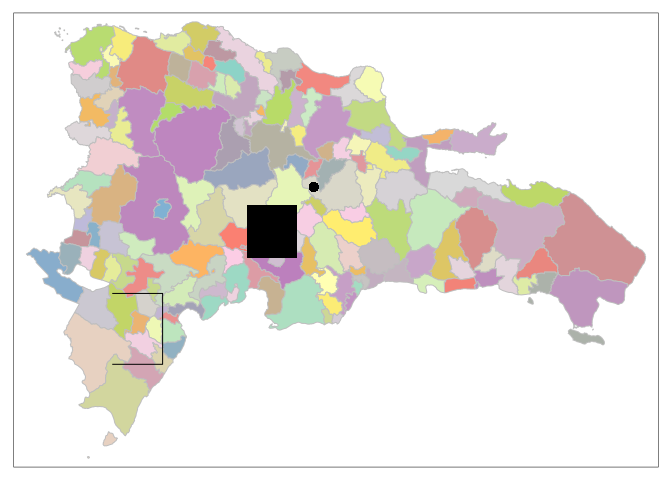

## Exportar datos

Puedes exportar los objetos creados anteriormente. Aunque se trata de
simples geometrías, en ocasiones querrás exportar objetos creados a
partir de análisis y operaciones geométricas o con atributos realizadas
en R. El paquete `sf` te ofrece una gama de formatos para exportar.
Probemos exportar el objeto `pto.sf` a la carpeta export del repo.

``` r
st_write(obj = pto.sf, dsn = 'export/pto.sf.gpkg', driver = 'GPKG')
## Updating layer `pto.sf' to data source `export/pto.sf.gpkg' using driver `GPKG'
## Updating existing layer pto.sf
## Writing 1 features with 1 fields and geometry type Point.
```

Puedes encontrar una lista de drivers ejecutando:

``` r
st_drivers()
##                          name
## PCIDSK                 PCIDSK
## netCDF                 netCDF
## JP2OpenJPEG       JP2OpenJPEG
## PDF                       PDF
## ESRI Shapefile ESRI Shapefile
## MapInfo File     MapInfo File
## UK .NTF               UK .NTF
## OGR_SDTS             OGR_SDTS
## S57                       S57
## DGN                       DGN
## OGR_VRT               OGR_VRT
## REC                       REC
## Memory                 Memory
## BNA                       BNA
## CSV                       CSV
## NAS                       NAS
## GML                       GML
## GPX                       GPX
## LIBKML                 LIBKML
## KML                       KML
## GeoJSON               GeoJSON
## Interlis 1         Interlis 1
## Interlis 2         Interlis 2
## OGR_GMT               OGR_GMT
## GPKG                     GPKG
## SQLite                 SQLite
## OGR_DODS             OGR_DODS
## ODBC                     ODBC
## WAsP                     WAsP
## PGeo                     PGeo
## MSSQLSpatial     MSSQLSpatial
## OGR_OGDI             OGR_OGDI
## PostgreSQL         PostgreSQL
## MySQL                   MySQL
## OpenFileGDB       OpenFileGDB
## XPlane                 XPlane
## DXF                       DXF
## CAD                       CAD
## Geoconcept         Geoconcept
## GeoRSS                 GeoRSS
## GPSTrackMaker   GPSTrackMaker
## VFK                       VFK
## PGDUMP                 PGDUMP
## OSM                       OSM
## GPSBabel             GPSBabel
## SUA                       SUA
## OpenAir               OpenAir
## OGR_PDS               OGR_PDS
## WFS                       WFS
## SOSI                     SOSI
## HTF                       HTF
## AeronavFAA         AeronavFAA
## Geomedia             Geomedia
## EDIGEO                 EDIGEO
## GFT                       GFT
## SVG                       SVG
## CouchDB               CouchDB
## Cloudant             Cloudant
## Idrisi                 Idrisi
## ARCGEN                 ARCGEN
## SEGUKOOA             SEGUKOOA
## SEGY                     SEGY
## XLS                       XLS
## ODS                       ODS
## XLSX                     XLSX
## ElasticSearch   ElasticSearch
## Walk                     Walk
## Carto                   Carto
## AmigoCloud         AmigoCloud
## SXF                       SXF
## Selafin               Selafin
## JML                       JML
## PLSCENES             PLSCENES
## CSW                       CSW
## VDV                       VDV
## GMLAS                   GMLAS
## TIGER                   TIGER
## AVCBin                 AVCBin
## AVCE00                 AVCE00
## HTTP                     HTTP
##                                                                    long_name
## PCIDSK                                                  PCIDSK Database File
## netCDF                                            Network Common Data Format
## JP2OpenJPEG                       JPEG-2000 driver based on OpenJPEG library
## PDF                                                           Geospatial PDF
## ESRI Shapefile                                                ESRI Shapefile
## MapInfo File                                                    MapInfo File
## UK .NTF                                                              UK .NTF
## OGR_SDTS                                                                SDTS
## S57                                                           IHO S-57 (ENC)
## DGN                                                         Microstation DGN
## OGR_VRT                                             VRT - Virtual Datasource
## REC                                                            EPIInfo .REC 
## Memory                                                                Memory
## BNA                                                                Atlas BNA
## CSV                                             Comma Separated Value (.csv)
## NAS                                                              NAS - ALKIS
## GML                                          Geography Markup Language (GML)
## GPX                                                                      GPX
## LIBKML                                      Keyhole Markup Language (LIBKML)
## KML                                            Keyhole Markup Language (KML)
## GeoJSON                                                              GeoJSON
## Interlis 1                                                        Interlis 1
## Interlis 2                                                        Interlis 2
## OGR_GMT                                             GMT ASCII Vectors (.gmt)
## GPKG                                                              GeoPackage
## SQLite                                                   SQLite / Spatialite
## OGR_DODS                                                            OGR_DODS
## ODBC                                                                    ODBC
## WAsP                                                        WAsP .map format
## PGeo                                               ESRI Personal GeoDatabase
## MSSQLSpatial                           Microsoft SQL Server Spatial Database
## OGR_OGDI                                       OGDI Vectors (VPF, VMAP, DCW)
## PostgreSQL                                                PostgreSQL/PostGIS
## MySQL                                                                  MySQL
## OpenFileGDB                                                     ESRI FileGDB
## XPlane                                  X-Plane/Flightgear aeronautical data
## DXF                                                              AutoCAD DXF
## CAD                                                           AutoCAD Driver
## Geoconcept                                                        Geoconcept
## GeoRSS                                                                GeoRSS
## GPSTrackMaker                                                  GPSTrackMaker
## VFK                                     Czech Cadastral Exchange Data Format
## PGDUMP                                                   PostgreSQL SQL dump
## OSM                                                OpenStreetMap XML and PBF
## GPSBabel                                                            GPSBabel
## SUA                          Tim Newport-Peace's Special Use Airspace Format
## OpenAir                                                              OpenAir
## OGR_PDS                                         Planetary Data Systems TABLE
## WFS                                            OGC WFS (Web Feature Service)
## SOSI                                                 Norwegian SOSI Standard
## HTF                                             Hydrographic Transfer Vector
## AeronavFAA                                                       Aeronav FAA
## Geomedia                                                       Geomedia .mdb
## EDIGEO                                         French EDIGEO exchange format
## GFT                                                     Google Fusion Tables
## SVG                                                 Scalable Vector Graphics
## CouchDB                                                   CouchDB / GeoCouch
## Cloudant                                                  Cloudant / CouchDB
## Idrisi                                                  Idrisi Vector (.vct)
## ARCGEN                                                     Arc/Info Generate
## SEGUKOOA                                                SEG-P1 / UKOOA P1/90
## SEGY                                                                   SEG-Y
## XLS                                                          MS Excel format
## ODS                     Open Document/ LibreOffice / OpenOffice Spreadsheet 
## XLSX                                          MS Office Open XML spreadsheet
## ElasticSearch                                                 Elastic Search
## Walk                                                                    Walk
## Carto                                                                  Carto
## AmigoCloud                                                        AmigoCloud
## SXF                                              Storage and eXchange Format
## Selafin                                                              Selafin
## JML                                                             OpenJUMP JML
## PLSCENES                                              Planet Labs Scenes API
## CSW                                   OGC CSW (Catalog  Service for the Web)
## VDV                                      VDV-451/VDV-452/INTREST Data Format
## GMLAS          Geography Markup Language (GML) driven by application schemas
## TIGER                                                 U.S. Census TIGER/Line
## AVCBin                                              Arc/Info Binary Coverage
## AVCE00                                         Arc/Info E00 (ASCII) Coverage
## HTTP                                                   HTTP Fetching Wrapper
##                write  copy is_raster is_vector   vsi
## PCIDSK          TRUE FALSE      TRUE      TRUE  TRUE
## netCDF          TRUE  TRUE      TRUE      TRUE FALSE
## JP2OpenJPEG    FALSE  TRUE      TRUE      TRUE  TRUE
## PDF             TRUE  TRUE      TRUE      TRUE  TRUE
## ESRI Shapefile  TRUE FALSE     FALSE      TRUE  TRUE
## MapInfo File    TRUE FALSE     FALSE      TRUE  TRUE
## UK .NTF        FALSE FALSE     FALSE      TRUE FALSE
## OGR_SDTS       FALSE FALSE     FALSE      TRUE FALSE
## S57             TRUE FALSE     FALSE      TRUE  TRUE
## DGN             TRUE FALSE     FALSE      TRUE FALSE
## OGR_VRT        FALSE FALSE     FALSE      TRUE  TRUE
## REC            FALSE FALSE     FALSE      TRUE FALSE
## Memory          TRUE FALSE     FALSE      TRUE FALSE
## BNA             TRUE FALSE     FALSE      TRUE  TRUE
## CSV             TRUE FALSE     FALSE      TRUE  TRUE
## NAS            FALSE FALSE     FALSE      TRUE FALSE
## GML             TRUE FALSE     FALSE      TRUE  TRUE
## GPX             TRUE FALSE     FALSE      TRUE  TRUE
## LIBKML          TRUE FALSE     FALSE      TRUE  TRUE
## KML             TRUE FALSE     FALSE      TRUE  TRUE
## GeoJSON         TRUE FALSE     FALSE      TRUE  TRUE
## Interlis 1      TRUE FALSE     FALSE      TRUE FALSE
## Interlis 2      TRUE FALSE     FALSE      TRUE FALSE
## OGR_GMT         TRUE FALSE     FALSE      TRUE FALSE
## GPKG            TRUE  TRUE      TRUE      TRUE  TRUE
## SQLite          TRUE FALSE     FALSE      TRUE  TRUE
## OGR_DODS       FALSE FALSE     FALSE      TRUE FALSE
## ODBC            TRUE FALSE     FALSE      TRUE FALSE
## WAsP            TRUE FALSE     FALSE      TRUE  TRUE
## PGeo           FALSE FALSE     FALSE      TRUE FALSE
## MSSQLSpatial    TRUE FALSE     FALSE      TRUE FALSE
## OGR_OGDI       FALSE FALSE     FALSE      TRUE FALSE
## PostgreSQL      TRUE FALSE     FALSE      TRUE FALSE
## MySQL           TRUE FALSE     FALSE      TRUE FALSE
## OpenFileGDB    FALSE FALSE     FALSE      TRUE  TRUE
## XPlane         FALSE FALSE     FALSE      TRUE  TRUE
## DXF             TRUE FALSE     FALSE      TRUE  TRUE
## CAD            FALSE FALSE      TRUE      TRUE  TRUE
## Geoconcept      TRUE FALSE     FALSE      TRUE FALSE
## GeoRSS          TRUE FALSE     FALSE      TRUE  TRUE
## GPSTrackMaker   TRUE FALSE     FALSE      TRUE  TRUE
## VFK            FALSE FALSE     FALSE      TRUE FALSE
## PGDUMP          TRUE FALSE     FALSE      TRUE  TRUE
## OSM            FALSE FALSE     FALSE      TRUE  TRUE
## GPSBabel        TRUE FALSE     FALSE      TRUE FALSE
## SUA            FALSE FALSE     FALSE      TRUE  TRUE
## OpenAir        FALSE FALSE     FALSE      TRUE  TRUE
## OGR_PDS        FALSE FALSE     FALSE      TRUE  TRUE
## WFS            FALSE FALSE     FALSE      TRUE  TRUE
## SOSI           FALSE FALSE     FALSE      TRUE FALSE
## HTF            FALSE FALSE     FALSE      TRUE  TRUE
## AeronavFAA     FALSE FALSE     FALSE      TRUE  TRUE
## Geomedia       FALSE FALSE     FALSE      TRUE FALSE
## EDIGEO         FALSE FALSE     FALSE      TRUE  TRUE
## GFT             TRUE FALSE     FALSE      TRUE FALSE
## SVG            FALSE FALSE     FALSE      TRUE  TRUE
## CouchDB         TRUE FALSE     FALSE      TRUE FALSE
## Cloudant        TRUE FALSE     FALSE      TRUE FALSE
## Idrisi         FALSE FALSE     FALSE      TRUE  TRUE
## ARCGEN         FALSE FALSE     FALSE      TRUE  TRUE
## SEGUKOOA       FALSE FALSE     FALSE      TRUE  TRUE
## SEGY           FALSE FALSE     FALSE      TRUE  TRUE
## XLS            FALSE FALSE     FALSE      TRUE FALSE
## ODS             TRUE FALSE     FALSE      TRUE  TRUE
## XLSX            TRUE FALSE     FALSE      TRUE  TRUE
## ElasticSearch   TRUE FALSE     FALSE      TRUE FALSE
## Walk           FALSE FALSE     FALSE      TRUE FALSE
## Carto           TRUE FALSE     FALSE      TRUE FALSE
## AmigoCloud      TRUE FALSE     FALSE      TRUE FALSE
## SXF            FALSE FALSE     FALSE      TRUE FALSE
## Selafin         TRUE FALSE     FALSE      TRUE  TRUE
## JML             TRUE FALSE     FALSE      TRUE  TRUE
## PLSCENES       FALSE FALSE      TRUE      TRUE FALSE
## CSW            FALSE FALSE     FALSE      TRUE FALSE
## VDV             TRUE FALSE     FALSE      TRUE  TRUE
## GMLAS          FALSE  TRUE     FALSE      TRUE  TRUE
## TIGER           TRUE FALSE     FALSE      TRUE  TRUE
## AVCBin         FALSE FALSE     FALSE      TRUE FALSE
## AVCE00         FALSE FALSE     FALSE      TRUE FALSE
## HTTP           FALSE FALSE      TRUE      TRUE FALSE
```

## Rásters

La lectura, escritura y manipulación de rásters normalmente exige muchos
recursos de memoria. No es la excepción en R, por lo que cuando quieras
ejecutar operaciones con rásters, considera las siguientes cuestiones:

  - Primero lo primero: recorta tus fuentes de manera que sólo abarque
    el área de interés. Para esto, no es necesario utilizar R ni
    software de interfaz de gráfico. Recurre mejor a las herramientas
    `gdal`, que son altamente eficientes y confiables. Tan pronto cortes
    el área de interés, elimina el archivo fuente, pero consérvalo
    (preferiblemente comprimido) en algún repositorio accesible, por si
    hubiese que realizar operaciones de corte posteriores.

  - Considera tratar tus imágenes con código, y sólo recurre al interfaz
    gráfico para visualizar algún resultado de interés. Serás más
    eficiente codificando que teniendo que abrir capas completas que
    pudieran exigir muchos recursos de memoria.

  - Intenta la paralelización de operaciones. Si vas a realizar álgebra
    de mapas o estadística zonal, utiliza herramientas de paralelización
    (R disponde paquetes para ello) para agilizar los cálculos.

Probemos con un ráster pequeño, en este caso, un modelo digital de
elevaciones (MDE) no proyectado (EPSG:4326), de la subcuenca del arroyo
Parra, cuenca del río Ocoa.

``` r
r <- raster('data/MDE_SRTM_30m_Naranjal_Parra.tif')
summary(r)
##         MDE_SRTM_30m_Naranjal_Parra
## Min.                            388
## 1st Qu.                         650
## Median                          834
## 3rd Qu.                        1054
## Max.                           1514
## NA's                              0
plot(r, col = terrain.colors(n = 255))
```

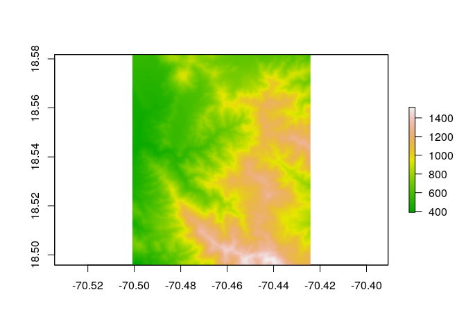

El `plot` simboliza las elevaciones usando la paleta `terrain.colors`,
donde verde es “bajo” y blanco/salmón es “elevado”. Realizaremos
operaciones más complejas con rásters en la medida que avance la
asignatura.

Una de las operaciones más comunes que realizamos con rásters, consiste
en obtener información de las celdas que conforman un ráster. Este
proceso se conoce como extracción, y comúnmente interactúan un ráster y
un vectorial, o dos rásters. Una de las capas es la ráster que contiene
las celdas sobre las que queremos indagar, y la segunda es uno o varios
polígonos, líneas, puntos o píxeles rásters que tocan las celdas que
queremos analizar. Al realizar la extracción, aislamos los píxeles de
interés y los sometemos a análisis estadísticos.

Veamos un ejemplo con el ráster anterior, del cual extraeremos las
celdas que coinciden con el límite de la subcuencas de los arroyos
Naranjal y Hondo, ambas partes de la subcuenca del Parra (las capas
están proyectadas, EPSG:32619). Por eficiencia, usaremos un ráster
agregado (por promedio) en un factor de 10 con la función
`raster::aggregate`, de manera que usaremos una fuente donde una celda
representa el promedio de 10 celdas del original:

``` r
naranjal <- st_read(dsn = 'data/subcuenca_naranjal.gpkg')
## Reading layer `subcuenca_naranjal2' from data source `/home/jr/Documentos/clases_UASD/201902/maestria-geotel-analisis-espacial/material-de-apoyo/data/subcuenca_naranjal.gpkg' using driver `GPKG'
## Simple feature collection with 1 feature and 2 fields
## geometry type:  MULTIPOLYGON
## dimension:      XY
## bbox:           xmin: 342970 ymin: 2050720 xmax: 345910 ymax: 2054920
## epsg (SRID):    32619
## proj4string:    +proj=utm +zone=19 +datum=WGS84 +units=m +no_defs
hondo <- st_read(dsn = 'data/subcuenca_hondo.gpkg')
## Reading layer `subcuenca_hondo2' from data source `/home/jr/Documentos/clases_UASD/201902/maestria-geotel-analisis-espacial/material-de-apoyo/data/subcuenca_hondo.gpkg' using driver `GPKG'
## Simple feature collection with 1 feature and 2 fields
## geometry type:  MULTIPOLYGON
## dimension:      XY
## bbox:           xmin: 343660 ymin: 2049430 xmax: 347740 ymax: 2053120
## epsg (SRID):    32619
## proj4string:    +proj=utm +zone=19 +datum=WGS84 +units=m +no_defs
r10 <- raster::aggregate(r, 10)
naranjalext <- raster::extract(r10, naranjal)
## Warning in .local(x, y, ...): Transforming SpatialPolygons to the CRS of
## the Raster
#Nota que la capa vectorial fue reproyectada al CRS del ráster
summary(naranjalext[[1]])
##    Min. 1st Qu.  Median    Mean 3rd Qu.    Max. 
##   544.7   585.5   641.5   665.3   739.3   934.4
hondoext <- raster::extract(r10, hondo)
## Warning in .local(x, y, ...): Transforming SpatialPolygons to the CRS of
## the Raster
summary(hondoext[[1]])
##    Min. 1st Qu.  Median    Mean 3rd Qu.    Max. 
##   539.3   721.8   826.9   846.9   969.9  1185.5
```

Fíjate en el resumen: la diferencia en cuanto a elevaciones máxima y
media entre ambas subcuencas es notoria; Hondo es una subcuenca más
alta, al menos en cabecera, que Naranjal.

## Análisis exploratorio de datos espaciales (ESDA)

Cerremos con un ligero análisis exploratorio de datos espaciales (ESDA).
Aunque en lecciones posteriores abordaremos el ESDA en profundidad, en
este cierre veremos los pasos básicos para hacer que las geometrías
“brillen” con atributos reales. Tendremos que unir los datos
espaciales con atributos externos (la unión tradicional, o *join*),
utilizando un campo común entre ambos. Como suele ocurrir en cualquier
flujo de trabajo de análisis de datos, el 80% del esfuerzo lo dedicamos
a limpiar y organizar; en este caso no será diferente.

No hace falta abordar el problema de la unidad de área modificable en
este punto. Baste decir por el momento que cualquier división que
utilicemos es y será arbitraria. Si bien la mayoría de las agencias
nacionales de estadística sirven sus datos a nivel de términos
municipales, regiones o provincias (u otras unidades), no olvidemos que
existe un sesgo inherente, puesto que una división arbitraria no
garantiza la independencia de observaciones.

A modo de justificación del análisis exploratorio de datos espaciales, y
dado que trabajaremos con mapas, valga esta advertencia tomada de
Bivand, Pebesma, & Gomez-Rubio (2013):

> Trying to detect pattern in maps of residuals visually is not an
> acceptable choice, although one sometimes hears comments explaining
> the lack of formal analysis such as ‘they looked random’, or
> alternatively ‘I can see the clusters’.

> Tratar de detectar un patrón visualmente en mapas de residuos no es
> una opción aceptable, aunque algunas veces se escuchan comentarios que
> explican la falta de análisis formal, tales como ‘la variable se veía
> aleatoria’, o, alternativamente, ‘veo grupos/conglomerados’.

Tómese también en cuenta el mito de John Snow (Brody, Rip,
Vinten-Johansen, Paneth, & Rachman, 2000). En definitiva, demos a los
mapas su justa valoración, no los mitifiquemos, pero tampoco los
ignoremos. Hoy en día “cualquiera puede hacer mapas”, pero no cualquiera
puede interpretarlos.

Exploraremos los datos de población a nivel municipal del IX Censo
Nacional de Población y Vivienda 2010, algo que probablemente has
realizado previamente en paquete SIG. La fuente es la [Oficina Nacional
de Estadística (ONE)](https://www.one.gob.do/), a través de la
[plataforma
REDATAM](https://www.one.gob.do/recursos-automatizados/consulta-en-linea-redatam).
Descargué una consulta con algunas variables, incluyendo agregados de
población totales y por sexo. La plataforma ofrece formatos Excel y PDF.
Descargué un archivo Excel y lo convertí a formato “valores separados
por coma”, que no es propietario. El archivo resultante está alojado en
el repo, concretamente en
`data/pop_adm3.csv`.

``` r
pop.mun <- read_csv('data/pop_adm3.csv') #read_csv pertenece al paquete readr, de la colección tidyverse
## Parsed with column specification:
## cols(
##   .default = col_double(),
##   `Municipio de residencia` = col_character()
## )
## See spec(...) for full column specifications.
pop.mun
## # A tibble: 155 x 256
##    Código `Municipio de r… `Jefa o jefe` `Esposo (a) o c… `Hijo (a)`
##     <dbl> <chr>                    <dbl>            <dbl>      <dbl>
##  1  10901 Municipio Moca           48032            28717      67964
##  2  10902 Municipio Cayet…          2095             1118       2461
##  3  10903 Municipio Gaspa…         11270             6144      13433
##  4  10904 Municipio Jamao…          2330             1248       2646
##  5  11801 Municipio Puert…         48041            25936      56957
##  6  11802 Municipio Altam…          5875             3130       6073
##  7  11803 Municipio Guana…          2010             1097       1900
##  8  11804 Municipio Imbert          6937             3524       7487
##  9  11805 Municipio Los H…          3653             2033       3997
## 10  11806 Municipio Luper…          5170             2841       5177
## # … with 145 more rows, and 251 more variables: `Hijo (a) de
## #   crianza` <dbl>, `Padre o madre` <dbl>, `Nieto (a)` <dbl>, `Suegro
## #   (a)` <dbl>, `Abuelo (a)` <dbl>, `Hermano (a)` <dbl>, `Empleado (a)
## #   doméstico (a)` <dbl>, `Otro pariente` <dbl>, `Yerno o nuera` <dbl>,
## #   `No pariente` <dbl>, `Miembro de un hogar colectivo` <dbl>,
## #   Hombres <dbl>, Mujeres <dbl>, `0` <dbl>, `1` <dbl>, `2` <dbl>,
## #   `3` <dbl>, `4` <dbl>, `5` <dbl>, `6` <dbl>, `7` <dbl>, `8` <dbl>,
## #   `9` <dbl>, `10` <dbl>, `11` <dbl>, `12` <dbl>, `13` <dbl>, `14` <dbl>,
## #   `15` <dbl>, `16` <dbl>, `17` <dbl>, `18` <dbl>, `19` <dbl>,
## #   `20` <dbl>, `21` <dbl>, `22` <dbl>, `23` <dbl>, `24` <dbl>,
## #   `25` <dbl>, `26` <dbl>, `27` <dbl>, `28` <dbl>, `29` <dbl>,
## #   `30` <dbl>, `31` <dbl>, `32` <dbl>, `33` <dbl>, `34` <dbl>,
## #   `35` <dbl>, `36` <dbl>, `37` <dbl>, `38` <dbl>, `39` <dbl>,
## #   `40` <dbl>, `41` <dbl>, `42` <dbl>, `43` <dbl>, `44` <dbl>,
## #   `45` <dbl>, `46` <dbl>, `47` <dbl>, `48` <dbl>, `49` <dbl>,
## #   `50` <dbl>, `51` <dbl>, `52` <dbl>, `53` <dbl>, `54` <dbl>,
## #   `55` <dbl>, `56` <dbl>, `57` <dbl>, `58` <dbl>, `59` <dbl>,
## #   `60` <dbl>, `61` <dbl>, `62` <dbl>, `63` <dbl>, `64` <dbl>,
## #   `65` <dbl>, `66` <dbl>, `67` <dbl>, `68` <dbl>, `69` <dbl>,
## #   `70` <dbl>, `71` <dbl>, `72` <dbl>, `73` <dbl>, `74` <dbl>,
## #   `75` <dbl>, `76` <dbl>, `77` <dbl>, `78` <dbl>, `79` <dbl>,
## #   `80` <dbl>, `81` <dbl>, `82` <dbl>, `83` <dbl>, `84` <dbl>,
## #   `85` <dbl>, `86` <dbl>, …
nrow(pop.mun)
## [1] 155
ncol(pop.mun)
## [1] 256
```

Recordemos que para hacer la unión necesitamos un campo común entre los
objetos que se unirán. Lamentablemente, el campo `Código` en el archivo
fuente suprime el `0` a la izquierda en el código del municipio, por lo
que no es comparable con su homólogo en el objeto de geometrías. El
campo `Código` es de tipo “heredado”: cada nivel de la división del país
deja su impronta en el campo `Código` del municipio. Así, los dos
primeros dígitos corresponden a la región (por ejemplo, `01`, `02`, …,
`10`), los dos siguientes a la provincia y los últimos al municipio. Por
lo tanto, para el nivel municipal, cada `Código` debe componerse por 6
dígitos, tal como aparece en el campo homólogo del objeto `mun.sf.ll`,
el cual se denomina `ENLACE`. Veamos el caso en detalle.

> Los distritos municipales se analizan como parte del municipio
> correspondiente.

``` r
pop.mun$Código #Campo código de pop.mun
##   [1]  10901  10902  10903  10904  11801  11802  11803  11804  11805  11806
##  [11]  11807  11808  11809  12501  12502  12503  12504  12505  12506  12507
##  [21]  12508  12509  21301  21302  21303  21304  22401  22402  22403  22404
##  [31]  22801  22802  22803  30601  30602  30603  30604  30605  30606  30607
##  [41]  31401  31402  31403  31404  31901  31902  31903  32001  32002  32003
##  [51]  40501  40502  40503  40504  40505  41501  41502  41503  41504  41505
##  [61]  41506  42601  42602  42603  42701  42702  42703  50201  50202  50203
##  [71]  50204  50205  50206  50207  50208  50209  50210  51701  51702  52101
##  [81]  52102  52103  52104  52105  52106  52107  52108  53101  53102  53103
##  [91]  60301  60302  60303  60304  60305  60401  60402  60403  60404  60405
## [101]  60406  60407  60408  60409  60410  60411  61001  61002  61003  61004
## [111]  61005  61006  61601  61602  70701  70702  70703  70704  70705  70706
## [121]  72201  72202  72203  72204  72205  72206  80801  80802  81101  81102
## [131]  81201  81202  81203  92301  92302  92303  92304  92305  92306  92901
## [141]  92902  92903  92904  92905  93001  93002  93003 100101 103201 103202
## [151] 103203 103204 103205 103206 103207
mun.sf.ll$ENLACE #Campo ENLACE de mun.sf.ll
##   [1] 100101 050201 050202 050203 050204 050205 050206 050207 050208 050209
##  [11] 050210 060301 060302 060303 060304 060305 060401 060402 060403 060404
##  [21] 060405 060406 060407 060408 060409 060410 060411 040501 040502 040503
##  [31] 040504 040505 030601 030602 030603 030604 030605 030606 030607 070701
##  [41] 070702 070703 070704 070705 070706 080801 080802 010901 010902 010903
##  [51] 010904 061001 061002 061003 061004 061005 061006 081101 081102 081201
##  [61] 081202 081203 021301 021302 021303 021304 031401 031402 031403 031404
##  [71] 041501 041502 041503 041504 041505 041506 061601 061602 051701 051702
##  [81] 011801 011802 011803 011804 011805 011806 011807 011808 011809 031901
##  [91] 031902 031903 032001 032002 032003 052101 052102 052103 052104 052105
## [101] 052106 052107 052108 072201 072202 072203 072204 072205 072206 092301
## [111] 092302 092303 092304 092305 092306 022401 022402 022403 022404 012501
## [121] 012502 012503 012504 012505 012506 012507 012508 012509 042601 042602
## [131] 042603 042701 042702 042703 022801 022802 022803 092901 092902 092903
## [141] 092904 092905 093001 093002 093003 053101 053102 053103 103201 103202
## [151] 103203 103204 103205 103206 103207
## 155 Levels: 010901 010902 010903 010904 011801 011802 011803 ... 103207
match(pop.mun$Código, mun.sf.ll$ENLACE) #Prueba de emparejamiento. Los "NA" son casos sin emparejamiento
##   [1]  NA  NA  NA  NA  NA  NA  NA  NA  NA  NA  NA  NA  NA  NA  NA  NA  NA
##  [18]  NA  NA  NA  NA  NA  NA  NA  NA  NA  NA  NA  NA  NA  NA  NA  NA  NA
##  [35]  NA  NA  NA  NA  NA  NA  NA  NA  NA  NA  NA  NA  NA  NA  NA  NA  NA
##  [52]  NA  NA  NA  NA  NA  NA  NA  NA  NA  NA  NA  NA  NA  NA  NA  NA  NA
##  [69]  NA  NA  NA  NA  NA  NA  NA  NA  NA  NA  NA  NA  NA  NA  NA  NA  NA
##  [86]  NA  NA  NA  NA  NA  NA  NA  NA  NA  NA  NA  NA  NA  NA  NA  NA  NA
## [103]  NA  NA  NA  NA  NA  NA  NA  NA  NA  NA  NA  NA  NA  NA  NA  NA  NA
## [120]  NA  NA  NA  NA  NA  NA  NA  NA  NA  NA  NA  NA  NA  NA  NA  NA  NA
## [137]  NA  NA  NA  NA  NA  NA  NA  NA  NA  NA  NA   1 149 150 151 152 153
## [154] 154 155
```

Notamos que sólo los municipios con seis dígitos de `pop.mun$Código`
tienen un “parejo” (hacen `match`) con los de `mun.sf.ll$ENLACE`. Si los
campos no son comparables es imposible hacer unión. Por lo tanto, el
primer paso consiste en corregir este problema. Aprovecho esta
inconsistencia para introducir los flujos de trabajo (tuberías) de
`tidyverse`, concretamente de `dplyr`.

El código a continuación toma el objeto `pop.mun`, genera una columna
denominada `ENLACE` (como la de `mun.sf.ll`), que evalúa en cada “celda”
del campo `Código` si hay 5 caracteres, en cuyo caso le añade un `0` por
delante; en caso contrario, lo deja tal
cual.

``` r
pop.mun <- pop.mun %>% mutate(ENLACE = ifelse(nchar(Código)==5, paste0('0', Código),Código))
pop.mun$ENLACE #Muestra la nueva variable creada
##   [1] "010901" "010902" "010903" "010904" "011801" "011802" "011803"
##   [8] "011804" "011805" "011806" "011807" "011808" "011809" "012501"
##  [15] "012502" "012503" "012504" "012505" "012506" "012507" "012508"
##  [22] "012509" "021301" "021302" "021303" "021304" "022401" "022402"
##  [29] "022403" "022404" "022801" "022802" "022803" "030601" "030602"
##  [36] "030603" "030604" "030605" "030606" "030607" "031401" "031402"
##  [43] "031403" "031404" "031901" "031902" "031903" "032001" "032002"
##  [50] "032003" "040501" "040502" "040503" "040504" "040505" "041501"
##  [57] "041502" "041503" "041504" "041505" "041506" "042601" "042602"
##  [64] "042603" "042701" "042702" "042703" "050201" "050202" "050203"
##  [71] "050204" "050205" "050206" "050207" "050208" "050209" "050210"
##  [78] "051701" "051702" "052101" "052102" "052103" "052104" "052105"
##  [85] "052106" "052107" "052108" "053101" "053102" "053103" "060301"
##  [92] "060302" "060303" "060304" "060305" "060401" "060402" "060403"
##  [99] "060404" "060405" "060406" "060407" "060408" "060409" "060410"
## [106] "060411" "061001" "061002" "061003" "061004" "061005" "061006"
## [113] "061601" "061602" "070701" "070702" "070703" "070704" "070705"
## [120] "070706" "072201" "072202" "072203" "072204" "072205" "072206"
## [127] "080801" "080802" "081101" "081102" "081201" "081202" "081203"
## [134] "092301" "092302" "092303" "092304" "092305" "092306" "092901"
## [141] "092902" "092903" "092904" "092905" "093001" "093002" "093003"
## [148] "100101" "103201" "103202" "103203" "103204" "103205" "103206"
## [155] "103207"
match(mun.sf$ENLACE, pop.mun$ENLACE) #Prueba si hay emparejamiento. Todos emparejados, no hay "NA"
##   [1] 148  68  69  70  71  72  73  74  75  76  77  91  92  93  94  95  96
##  [18]  97  98  99 100 101 102 103 104 105 106  51  52  53  54  55  34  35
##  [35]  36  37  38  39  40 115 116 117 118 119 120 127 128   1   2   3   4
##  [52] 107 108 109 110 111 112 129 130 131 132 133  23  24  25  26  41  42
##  [69]  43  44  56  57  58  59  60  61 113 114  78  79   5   6   7   8   9
##  [86]  10  11  12  13  45  46  47  48  49  50  80  81  82  83  84  85  86
## [103]  87 121 122 123 124 125 126 134 135 136 137 138 139  27  28  29  30
## [120]  14  15  16  17  18  19  20  21  22  62  63  64  65  66  67  31  32
## [137]  33 140 141 142 143 144 145 146 147  88  89  90 149 150 151 152 153
## [154] 154 155
```

La tubería `dplyr` se compone de dos tipos de elementos: acción/es y un
“empalme/s”. La acción en este caso es la función `mutate` y el
empalme es el operador `%>%` (*pipe*, pipa), que pertenece al paquete
`magrittr`. El *pipe* “entuba” el resultado hacia adelante en una
función o una llamada. En otras palabras, la pipa envía como valor del
primer argumento de la función a su derecha lo que se encuentre a su
derecha. Si lo prefieres, traduce `%>%` a “…entonces…”. Así, el valor
del primer agrumento de `mutate` es `pop.mun`. La acción `mutate`
significa en este ejemplo “añadir una variable”.

Si lo leemos en lenguaje humano, le estamos ordenando a R lo siguiente:
“Toma `pop.mun` como fuente de datos, y añade la variable `ENLACE`
(nos conviene usar el mismo nombre que aparece en el objeto
`mun.sf.ll`), que obtendrá su valor de la variable `Código` con una
condición: si `Código` tiene 5 caracteres, pon un cero a la izquierda,
de lo contrario, toma el valor de la variable `Código`”.

Es importante notar que no se añadirá una variable propiamente a
`pop.mun`, sino que en RAM se creará una réplica de `pop.mun` que
contendrá una nueva variable. Si no lo asignásemos, mediante `<-`, la
réplica no quedará disponible en la RAM para ser llamada nuevamente en
el futuro. En este caso, se sobreescribe el objeto `pop.mun`.

Ahora usemos una función para unir ambas tablas. Recordemos que
`mun.sf.ll` es un `data.frame` con columna de geometría (`sf`).
Igualmente, `pop.mun` es un `data.frame`, por lo que estaremos uniendo
dos `data.frame`, de tal forma que los datos de población quedarán
disponibles en objeto que crearemos a partir de dicha unión al que
nombraremos
`mun.sf.pop`.

``` r
mun.sf.pop <- mun.sf.ll %>% #El objeto sf como fuente, al que le uniremos pop.mun
  inner_join(pop.mun, by = 'ENLACE') #Unión con pop.mun a través del campo ENLACE
## Warning: Column `ENLACE` joining factor and character vector, coercing into
## character vector
mun.sf.pop
## Simple feature collection with 155 features and 262 fields
## geometry type:  MULTIPOLYGON
## dimension:      XY
## bbox:           xmin: -72.01147 ymin: 17.47033 xmax: -68.32354 ymax: 19.93211
## epsg (SRID):    4326
## proj4string:    +proj=longlat +datum=WGS84 +no_defs
## First 10 features:
##    PROV MUN REG               TOPONIMIA ENLACE            area Código
## 1    01  01  10 SANTO DOMINGO DE GUZMÁN 100101  91445631 [m^2] 100101
## 2    02  01  05                    AZUA 050201 416284424 [m^2]  50201
## 3    02  02  05             LAS CHARCAS 050202 246501017 [m^2]  50202
## 4    02  03  05    LAS YAYAS DE VIAJAMA 050203 430949892 [m^2]  50203
## 5    02  04  05         PADRE LAS CASAS 050204 573677765 [m^2]  50204
## 6    02  05  05                 PERALTA 050205 129369696 [m^2]  50205
## 7    02  06  05            SABANA YEGUA 050206 113924640 [m^2]  50206
## 8    02  07  05            PUEBLO VIEJO 050207  48083834 [m^2]  50207
## 9    02  08  05           TÁBARA ARRIBA 050208 274922988 [m^2]  50208
## 10   02  09  05                GUAYABAL 050209 235362759 [m^2]  50209
##              Municipio de residencia Jefa o jefe
## 1  Municipio Santo Domingo de Guzmán      289084
## 2                     Municipio Azua       23041
## 3              Municipio Las Charcas        3186
## 4     Municipio Las Yayas de Viajama        4815
## 5          Municipio Padre las Casas        5258
## 6                  Municipio Peralta        3204
## 7             Municipio Sabana Yegua        4901
## 8             Municipio Pueblo Viejo        2935
## 9            Municipio Tábara Arriba        4200
## 10                Municipio Guayabal        1389
##    Esposo (a) o compañero (a) Hijo (a) Hijo (a) de crianza Padre o madre
## 1                      143544   355071               14247          8556
## 2                       13123    35896                2008           567
## 3                        1844     4244                 270            56
## 4                        2559     6309                 340            81
## 5                        3318     7838                 459           131
## 6                        1902     5962                 318            71
## 7                        2643     6583                 469            90
## 8                        1470     4046                 269            43
## 9                        2441     6122                 457           101
## 10                        799     2236                 120            16
##    Nieto (a) Suegro (a) Abuelo (a) Hermano (a) Empleado (a) doméstico (a)
## 1      54302       2262        621       23359                       5731
## 2       9520        155         47        1392                         34
## 3        839         17          7         153                         12
## 4       2008         37          6         248                          1
## 5       1657         28          7         243                          9
## 6       1830         33          1         347                         24
## 7       2221         24          1         369                          9
## 8       1422         22          3         199                          1
## 9       1960         27          6         318                          4
## 10       403          1          0          53                          3
##    Otro pariente Yerno o nuera No pariente Miembro de un hogar colectivo
## 1          48877          5078       12315                          1993
## 2           3955           924         635                            48
## 3            393            94         117                            11
## 4            841           117         257                             1
## 5            765           111         208                             9
## 6           1037           209         313                             6
## 7            998           215         488                             9
## 8            544           109         168                             4
## 9            966           170         361                           514
## 10           153            32          58                             0
##    Hombres Mujeres     0     1     2     3     4     5     6     7     8
## 1   460903  504137 17865 16677 16408 15275 15094 16356 15471 16180 17192
## 2    46280   45065  2096  1756  1853  1886  1755  1911  1829  2063  2188
## 3     5962    5281   263   252   253   238   235   281   272   235   262
## 4     9513    8107   376   311   354   368   328   397   355   436   438
## 5    10695    9346   327   367   347   381   397   395   365   422   461
## 6     8189    7068   278   248   264   315   259   265   263   315   343
## 7    10352    8668   434   332   392   320   353   449   377   379   443
## 8     5861    5374   285   240   233   241   254   288   259   303   290
## 9     9999    7648   373   326   357   306   340   383   324   355   401
## 10    2994    2269    88    70    95    78   106   109    93   117   111
##        9    10    11    12    13    14    15    16    17    18    19    20
## 1  16901 18198 16701 16666 16479 16478 17565 17560 17947 19644 18828 20559
## 2   2087  2295  2086  2077  2173  2003  2133  2105  2038  2083  1706  1892
## 3    213   285   251   279   240   214   229   252   209   235   206   269
## 4    438   444   381   439   358   398   462   433   414   434   329   369
## 5    457   560   538   520   464   493   569   475   476   477   342   435
## 6    320   348   328   367   301   346   380   318   304   338   257   352
## 7    414   451   401   456   419   381   415   394   447   423   382   460
## 8    261   262   203   241   260   235   230   274   260   264   218   254
## 9    395   372   323   370   336   343   382   391   413   417   349   413
## 10   131   123   127   137   129   131   140   130   123   137   110   112
##       21    22    23    24    25    26    27    28    29    30    31    32
## 1  18830 18298 17885 17863 17828 16684 16695 16839 15350 17160 16019 14583
## 2   1656  1470  1543  1498  1572  1280  1367  1406  1149  1361  1297  1149
## 3    202   223   210   213   214   176   171   176   167   197   163   187
## 4    273   280   268   252   266   249   247   205   214   252   245   216
## 5    299   329   325   327   265   248   251   258   228   285   239   232
## 6    267   323   254   274   313   235   272   263   196   377   233   259
## 7    356   363   367   373   331   299   320   316   289   323   269   271
## 8    184   174   191   209   236   209   181   209   163   174   136   122
## 9    307   332   324   344   358   275   301   316   271   301   248   209
## 10    94   110    93    80    93    75    78    68    61    74    62    68
##       33    34    35    36    37    38    39    40    41    42    43    44
## 1  14058 13966 14613 12732 13438 13392 12069 14341 11700 12592 11937 11669
## 2   1181  1232  1259  1045  1049  1113  1084  1255   896  1028  1026   918
## 3    129   131   166   131   162   139   139   153   115   103   119    97
## 4    198   199   227   201   195   249   158   253   155   180   169   157
## 5    214   183   264   224   220   234   200   298   168   201   206   205
## 6    193   214   288   206   166   211   156   335   110   195   135   137
## 7    247   255   271   179   232   231   201   245   154   195   191   187
## 8    128   107   146   139   122   142   109   145   101   118   101    92
## 9    233   237   279   234   208   196   171   234   177   185   223   173
## 10    46    70    90    56    59    59    59    49    44    51    44    57
##       45    46    47   48   49    50   51   52   53   54   55   56   57
## 1  14028 11192 11733 9978 9868 10908 9434 9114 8667 8881 8755 8364 7609
## 2   1126   870   982  717  711   903  798  683  743  727  739  710  545
## 3    140    93   111   75   91   120   80   76   89   69   92   57   69
## 4    189   111   186  146  124   191  160  175  111  153  204  133  128
## 5    255   177   226  150  188   258  198  180  138  182  154  167  138
## 6    230   125   153   94  136   227   91  105   79   93  144  123   73
## 7    209   184   203  143  139   204  162  134  143  132  173  129  116
## 8    156   101   115   98   84    98   98   85   78   95   84   80   68
## 9    175   151   159  126  138   199  136  143  127  138  158  131  134
## 10    51    47    71   45   45    73   52   39   27   35   47   36   39
##      58   59   60   61   62   63   64   65   66   67   68   69   70   71
## 1  7469 6497 7804 6445 6290 5598 5839 5108 4543 4443 4516 3374 4802 3477
## 2   587  484  705  474  479  441  460  454  382  396  407  297  422  250
## 3    62   59   84   61   71   59   50   45   32   34   43   26   60   28
## 4   123   93  171  106   98   95   97  110   82   86   84   55   98   59
## 5   166  140  179  114  107  128  107   98  115   88  103   69  158   66
## 6    84   88  153   61   57   65   66   66   49   53   43   31  123   37
## 7   134   97  144   98   94   94  111   98   93   78  108   51  102   47
## 8    72   47   85   51   47   58   45   62   37   34   39   18   35   34
## 9   118   96  161  105  107   97   89   87   80   65   82   51   96   50
## 10   45   38   42   29   28   38   30   37   22   23   32   19   42   12
##      72   73   74   75   76   77   78   79   80   81   82   83   84   85
## 1  3372 3405 3162 3163 2648 2404 2315 1879 3049 1830 1668 1512 1438 1357
## 2   260  271  241  273  262  197  186  137  276   95  105   88   77   87
## 3    34   37   27   26   29   18   15   12   21    7    8    8   10   10
## 4    57   61   46   53   63   44   33   27   77   30   30   12   25   23
## 5    51   76   56   91   43   58   71   31  102   26   34   22   18   18
## 6    43   49   45   47   39   25   27   19   51   15   13   11   10   21
## 7    59   62   50   55   45   44   46   24   59   17   25   13   18   20
## 8    28   29   33   41   31   21   19   16   23    8   11    6   15    6
## 9    62   44   42   56   38   43   29   33   85   17   20   19   30   14
## 10   20   14   12   25   16   18    9   14   13    9    6    2    5    2
##      86  87  88  89  90  91  92  93  94  95  96  97  98  99 100 101 102
## 1  1039 870 751 585 862 349 397 252 285 194 174 137 128 130 107  32  19
## 2    70  61  24  35  74  22  30  18  13  17  13  10  24  10   8   5   1
## 3     6   4   5   3  14   2   1   1   1   3   1   0   1   0   2   1   1
## 4    11   7  16   6  19   5   4   3   4   3   3   1   7   3   1   0   2
## 5    10  12  14   8  18   6   9   3   7   6   2   5   5   6   3   2   0
## 6     6   6   6   3  22   2   6   2   4   0   2   0   4   1   1   2   2
## 7     9  12   9  11   8   3   5   0   4   2   0   2   0   3   4   0   1
## 8     8   6  10   2   7   1   5   2   3   3   0   1   0   0   0   0   0
## 9    14  10  13   6  30   5   3   0   3   1   1   1   4   4   4   0   1
## 10    1   1   2   1   1   0   0   2   1   3   0   2   1   0   1   1   0
##    103 104 105 106 107 108 109 110 Municipio de residencial actual
## 1   21  22  25  14   9  25  12  78                          603299
## 2    2   1   2   0   2   0   0   7                           79417
## 3    0   0   0   2   1   0   0   0                            8636
## 4    0   1   2   0   0   0   1   2                           13754
## 5    1   0   2   1   1   1   1   1                           17443
## 6    0   0   1   0   0   0   1   1                           14137
## 7    0   1   0   1   0   0   0   1                           11426
## 8    0   0   0   0   0   0   1   2                           10133
## 9    0   1   3   1   1   0   2   3                           14379
## 10   0   0   0   0   0   0   0   0                            4533
##    En otro municipio En otro país Afganistán Argelia Andorra Angola
## 1             317773        43968          2       1       0      0
## 2              10431         1497          0       0       0      0
## 3               1776          831          0       0       0      0
## 4               3687          179          0       0       0      0
## 5               2262          336          0       0       0      0
## 6                685          435          0       0       0      0
## 7               6200         1394          0       0       0      0
## 8                707          395          0       0       0      0
## 9               2379          889          0       0       0      0
## 10               623          107          0       0       0      0
##    Antigua y Barbuda Argentina Australia Austria Bahamas Bangladesh
## 1                  8       486         5      19       5          1
## 2                  0         0         0       0       0          0
## 3                  0         0         0       0       0          0
## 4                  0         0         0       0       0          0
## 5                  0         0         0       0       0          0
## 6                  0         0         0       0       0          0
## 7                  0         0         0       0       0          0
## 8                  0         0         0       0       0          0
## 9                  0         0         0       0       0          0
## 10                 0         0         0       0       0          0
##    Armenia Barbados Bélgica Bermuda Estado Plurinacional de Bolivia Brasil
## 1        1        4      35       5                             109    326
## 2        0        0       1       0                               1      3
## 3        0        0       0       0                               0      0
## 4        0        0       0       0                               0      0
## 5        0        0       0       0                               0      0
## 6        0        0       0       0                               0      0
## 7        0        0       1       0                               0      0
## 8        0        0       0       0                               0      0
## 9        0        0       0       0                               0      0
## 10       0        0       0       0                               0      0
##    Belice Islas Vírgenes Británicas Brunei Darussalam Bulgaria
## 1       5                         6                 0       45
## 2       0                         0                 0        0
## 3       0                         0                 0        0
## 4       0                         0                 0        0
## 5       0                         0                 0        0
## 6       0                         0                 0        0
## 7       0                         0                 0        0
## 8       0                         0                 0        0
## 9       0                         0                 0        0
## 10      0                         0                 0        0
##    Unión De Myanmar (Burma) Belarus Camerún Canadá Islas Caymán
## 1                         1       1      20    163            1
## 2                         0       0       0      0            0
## 3                         0       0       0      0            0
## 4                         0       0       0      0            0
## 5                         0       0       0      1            0
## 6                         0       0       0      0            0
## 7                         0       0       0      1            0
## 8                         0       0       0      0            0
## 9                         0       0       0      0            0
## 10                        0       0       0      0            0
##    República Central Africana Sri Lanka Chile China
## 1                          38         0   353   454
## 2                           0         0     0    32
## 3                           0         0     0     1
## 4                           0         0     0     2
## 5                           0         0     0     0
## 6                           0         0     0     0
## 7                           0         0     0     0
## 8                           0         0     0     0
## 9                           0         0     0     1
## 10                          0         0     0     0
##    Taiwan, Republica China Colombia Mayotte Congo
## 1                      209     1669       1     8
## 2                        0       14       0     0
## 3                        0        0       0     0
## 4                        0        0       0     0
## 5                        0        0       0     0
## 6                        0        0       0     0
## 7                        0        0       0     0
## 8                        0        0       0     0
## 9                        0        1       0     0
## 10                       0        0       0     0
##    República Democrática del Congo Costa Rica Croacia Cuba Chipre
## 1                                0        115       3 1814      1
## 2                                0          1       0    2      0
## 3                                0          0       0    1      0
## 4                                0          0       0    0      0
## 5                                0          1       0    0      0
## 6                                0          0       0    0      0
## 7                                0          2       0    3      0
## 8                                0          0       0    0      0
## 9                                0          0       0    0      0
## 10                               0          0       0    0      0
##    República Checa República de Benin Dinamarca Dominica
## 1                6                  0         5        2
## 2                0                  0         0        0
## 3                0                  0         0        0
## 4                0                  0         0        0
## 5                0                  0         0        0
## 6                0                  0         0        0
## 7                0                  0         0        0
## 8                0                  0         0        0
## 9                0                  0         0        0
## 10               0                  0         0        0
##    República Dominicana Ecuador El Salvador Etiopía Estonia Finlandia
## 1                921072     196         109       1       0        12
## 2                 89848       1           2       0       0         0
## 3                 10412       0           0       0       0         0
## 4                 17441       0           0       0       0         0
## 5                 19705       0           0       0       0         0
## 6                 14822       0           0       0       0         0
## 7                 17626       0           0       0       0         0
## 8                 10840       0           0       0       0         0
## 9                 16758       0           0       0       0         0
## 10                 5156       0           0       0       0         0
##    Francia Guayana Francesa Gabón Georgia Territorios Ocupados Palestinos
## 1      566                0     1       0                               8
## 2        2                0     0       0                               0
## 3        0                0     0       0                               0
## 4        0                0     0       0                               0
## 5        1                0     0       0                               0
## 6        0                0     0       0                               0
## 7        0                0     0       0                               0
## 8        0                0     0       0                               0
## 9        0                0     0       0                               0
## 10       0                0     0       0                               0
##    Alemania Ghana Gibraltar Grecia Granada Guadalupe Guam Guatemala Guinea
## 1       188     0         0     17       1         8    1       175      2
## 2         2     0         0      0       0         0    0         2      0
## 3         1     0         0      0       0         0    0         0      0
## 4         0     0         0      0       0         0    0         0      0
## 5         0     0         0      0       0         0    0         1      0
## 6         0     0         0      0       0         0    0         0      0
## 7         0     0         0      0       0         0    0         0      0
## 8         0     0         0      0       0         0    0         0      0
## 9         1     0         0      0       0         0    0         0      0
## 10        0     0         0      0       0         0    0         0      0
##    Guyana Haití Honduras
## 1       4 19135      133
## 2       0  1090        5
## 3       0   787        4
## 4       0   142        0
## 5       0   291        1
## 6       0   399        0
## 7       0  1269        0
## 8       0   364        0
## 9       0   772        2
## 10      0    93        0
##    Hong Kong (Región Administrativa Especial del Pueblo de La República de China)
## 1                                                                              22
## 2                                                                               0
## 3                                                                               0
## 4                                                                               0
## 5                                                                               0
## 6                                                                               0
## 7                                                                               0
## 8                                                                               0
## 9                                                                               0
## 10                                                                              0
##    Hungría Islandia India Indonesia República Islámica de Irán Iraq
## 1        4        0    40         2                         17   13
## 2        0        0     0         0                          0    0
## 3        0        0     0         0                          0    0
## 4        0        0     0         0                          0    0
## 5        0        0     0         0                          0    0
## 6        0        0     0         0                          0    0
## 7        0        0     0         0                          0    0
## 8        0        0     0         0                          0    0
## 9        0        0     0         0                          0    0
## 10       0        0     0         0                          0    0
##    Irlanda Israel Italia Jamaica Japón República de Kazakhstan Jordania
## 1        5     26    778      38   134                       1        5
## 2        1      0     14       0     4                       0        0
## 3        0      0      1       0     0                       0        0
## 4        0      0      0       0     0                       0        0
## 5        0      0      1       0     0                       0        0
## 6        0      0      0       0     0                       0        0
## 7        0      0      4       0     0                       0        0
## 8        0      0      1       0     0                       0        0
## 9        0      0      0       0     0                       0        0
## 10       0      0      0       0     0                       0        0
##    Kenya República de Corea Kuwait Líbano Lesotho Latvia Libya Lituania
## 1      2                 97      0     80       0      0     0        0
## 2      0                  0      0      0       0      0     0        0
## 3      0                  0      0      0       0      0     0        0
## 4      0                  0      0      0       0      0     0        0
## 5      0                  0      0      0       0      0     0        0
## 6      0                  0      0      0       0      0     0        0
## 7      0                  0      0      0       0      0     0        0
## 8      0                  0      0      0       0      0     0        0
## 9      0                  0      0      0       0      0     0        0
## 10     0                  0      0      0       0      0     0        0
##    Luxemburgo Madagascar Malasia Malta Martinique Mauritania Méjico Mónaco
## 1           0          1      15     0         13          0    666      0
## 2           0          0       0     0          1          0      2      0
## 3           0          0       0     0          0          0      0      0
## 4           0          0       0     0          0          0      0      0
## 5           0          0       0     0          0          0      0      0
## 6           0          0       0     0          0          0      0      0
## 7           0          0       0     0          0          0      0      0
## 8           0          0       0     0          0          0      0      0
## 9           0          0       0     0          0          0      3      0
## 10          0          0       0     0          0          0      0      0
##    Moldova Montenegro Montserrat Morocco Mozambique Namibia Nauru Nepal
## 1        3          0          0      10          2       0     0     0
## 2        0          0          0       0          0       0     0     0
## 3        0          0          0       0          0       0     0     0
## 4        0          0          0       0          0       0     0     0
## 5        0          0          0       0          0       0     0     0
## 6        0          0          0       0          0       0     0     0
## 7        0          0          0       0          0       0     0     0
## 8        0          0          0       0          0       0     0     0
## 9        0          0          0       0          0       0     0     0
## 10       0          0          0       0          0       0     0     0
##    Holanda Aruba Curacao San Martin(Parte Holandesa) Nueva Caledonia
## 1       89    19      63                          21               1
## 2        2     2       0                           0               0
## 3        0     0       0                           0               0
## 4        0     0       0                           0               0
## 5        0     0       0                           0               0
## 6        0     0       0                           0               0
## 7        1     2       0                           1               0
## 8        0     0       0                           0               0
## 9        0     0       1                           0               0
## 10       0     0       0                           0               0
##    Nueva Zelanda Nicaragua Nigeria Noruega Pakistán Panamá Paraguay Perú
## 1              1       111       6       8       52    176       11  505
## 2              0         0       0       0        0      7        0    5
## 3              0         1       0       0        0      0        0    1
## 4              0         2       0       0        0      3        0    0
## 5              0         0       0       0        0      0        0    0
## 6              0         0       0       0        0      0        0    0
## 7              0         0       0       0        0      0        0    1
## 8              0         0       0       0        0      0        0    0
## 9              0         0       0       0        0      1        0    1
## 10             0         0       0       0        0      0        0    0
##    Filipinas Polonia Portugal Puerto Rico Qatar Rumania Federación Rusa
## 1         15      11       32        1760     1      13             111
## 2          0       0        0          39     0       0               0
## 3          0       0        0           1     0       0               0
## 4          0       0        0           0     0       0               0
## 5          0       0        0           8     0       0               1
## 6          0       0        0           1     0       0               0
## 7          0       0        1           6     0       0               0
## 8          0       0        0           2     0       0               0
## 9          0       0        0           3     0       0               0
## 10         0       0        0           0     0       0               0
##    Rwanda                           geom
## 1       0 MULTIPOLYGON (((-69.89794 1...
## 2       0 MULTIPOLYGON (((-70.71457 1...
## 3       0 MULTIPOLYGON (((-70.50185 1...
## 4       0 MULTIPOLYGON (((-70.85774 1...
## 5       0 MULTIPOLYGON (((-70.77551 1...
## 6       0 MULTIPOLYGON (((-70.73131 1...
## 7       0 MULTIPOLYGON (((-70.83014 1...
## 8       0 MULTIPOLYGON (((-70.79387 1...
## 9       0 MULTIPOLYGON (((-70.83352 1...
## 10      0 MULTIPOLYGON (((-70.68664 1...
```

Notemos que el objeto `mun.sf.pop` conserva las columnas que contenía
inicialmente `mun.sf.ll` y se añaden todas las columnas `pop.mun`. El
resumen del objeto `mun.sf.pop`, en el encabezado indica `Simple feature
collection with 155 features and 262 fields`, lo que supone que se han
conservado todos los municipios (cada fila un municipio) y se han
añadido 256 columnas de las 257 disponibles (`ENLACE` no se añade, por
tratarse del campo de unión).

Creemos un objeto nuevo al que llamaremos `mun.sf.sex`, seleccionando de
`mun.sf.pop` las columnas de `ENLACE`, `TOPONIMIA`, `Hombres` y
`Mujeres` (número de hombres y mujeres, respectivamente). Al mismo
tiempo, crearemos la columna `Total`, que contendrá la suma de la
población de hombres y mujeres. Finalmente, imprimiremos el objeto
`mun.sf.sex` como `data.frame` deshaciéndonos de la columna geométrica
(esto sólo tiene efectos sobre la llamada impresa, que no queda alojada
en la RAM, mientras que el objeto original `mun.sf.sex` queda intacto),
ordenado descendentemente por población total

``` r
mun.sf.sex <- mun.sf.pop %>%
  dplyr::select(ENLACE, TOPONIMIA, REG, Hombres, Mujeres, area) %>% #Selecciona sólo las columnas de población por sexo y el nombre del municipio 
  mutate(Total=Hombres+Mujeres) #Calcula el total de hombres y mujeres
mun.sf.sex %>% dplyr::select(TOPONIMIA, Total) %>% arrange(desc(Total)) %>% st_drop_geometry()
##                     TOPONIMIA  Total
## 1     SANTO DOMINGO DE GUZMÁN 965040
## 2          SANTO DOMINGO ESTE 948885
## 3                    SANTIAGO 691262
## 4         SANTO DOMINGO NORTE 529390
## 5         SANTO DOMINGO OESTE 363321
## 6              LOS ALCARRIZOS 272776
## 7                      HIGÜEY 251243
## 8                     LA VEGA 248089
## 9               SAN CRISTÓBAL 232769
## 10       SAN PEDRO DE MACORÍS 195307
## 11   SAN FRANCISCO DE MACORÍS 188118
## 12                       MOCA 179829
## 13               PUERTO PLATA 158756
## 14                       BANÍ 157316
## 15                 BOCA CHICA 142019
## 16                  LA ROMANA 139671
## 17                   SAN JUAN 132177
## 18                      BONAO 125338
## 19             BAJOS DE HAINA 124193
## 20                       AZUA  91345
## 21              VILLA HERMOSA  89204
## 22           VILLA ALTAGRACIA  84312
## 23                   BARAHONA  83619
## 24                      NAGUA  76993
## 25                        MAO  76863
## 26                      COTUÍ  76554
## 27                PEDRO BRAND  74016
## 28                   EL SEIBO  66867
## 29                  ESPERANZA  62205
## 30                 HATO MAYOR  61517
## 31                  CONSTANZA  59052
## 32                     SAMANÁ  58156
## 33                  JARABACOA  56803
## 34                     YAMASÁ  55348
## 35                   TAMBORIL  51695
## 36                      SOSÚA  49593
## 37                MONTE PLATA  46723
## 38                      PUÑAL  46516
## 39        LAS MATAS DE FARFÁN  44163
## 40      SAN ANTONIO DE GUERRA  43963
## 41                    YAGUATE  42325
## 42                     BISONÓ  42092
## 43                    SALCEDO  39557
## 44           SAN JOSÉ DE OCOA  39451
## 45                    LA MATA  38962
## 46      SAN JOSÉ DE LAS MATAS  38628
## 47           GASPAR HERNÁNDEZ  37378
## 48             VILLA GONZÁLEZ  37349
## 49                      NEIBA  36511
## 50                   GUAYUBÍN  35923
## 51    SAN IGNACIO DE SABANETA  34540
## 52                 VILLA RIVA  33663
## 53                  BAYAGUANA  31889
## 54      SABANA GRANDE DE BOYÁ  31096
## 55          CAMBITA GARABITOS  31057
## 56      SAN GREGORIO DE NIGUA  30268
## 57                 JIMA ABAJO  30261
## 58                   CONSUELO  30051
## 59                    DAJABÓN  28071
## 60                    TENARES  27765
## 61                      NIZAO  27028
## 62                     TAMAYO  26772
## 63                 COMENDADOR  25924
## 64             LICEY AL MEDIO  25539
## 65                VILLA TAPIA  24871
## 66               MONTE CRISTI  24644
## 67                    CABRERA  24524
## 68                    SÁNCHEZ  24509
## 69                 PEDERNALES  24291
## 70                  EL FACTOR  24240
## 71              LAGUNA SALADA  23962
## 72                 LOS LLANOS  22573
## 73                    FANTINO  22117
## 74                     IMBERT  22058
## 75        SAN RAFAEL DEL YUMA  21967
## 76              VICENTE NOBLE  21605
## 77              PIEDRA BLANCA  20934
## 78                 PERALVILLO  20900
## 79                 EL CERCADO  20843
## 80                     MICHES  20813
## 81            PADRE LAS CASAS  20041
## 82           VILLA MONTELLANO  19717
## 83                  QUISQUEYA  19034
## 84               SABANA YEGUA  19020
## 85                     MAIMÓN  18952
## 86                   ALTAMIRA  18868
## 87               LAS TERRENAS  18829
## 88                   PIMENTEL  17864
## 89              TÁBARA ARRIBA  17647
## 90       LAS YAYAS DE VIAJAMA  17620
## 91              VILLA ISABELA  17169
## 92                     JÁNICO  16993
## 93                   GUAYMATE  16558
## 94                     JIMANÍ  16510
## 95                    LUPERÓN  16464
## 96           SABANA DE LA MAR  16272
## 97                   CASTILLO  15709
## 98                     GALVÁN  15702
## 99            LOMA DE CABRERA  15624
## 100 SABANA GRANDE DE PALENQUE  15466
## 101                   PARAÍSO  15390
## 102                   PERALTA  15257
## 103              RÍO SAN JUAN  15168
## 104               CASTAÑUELAS  14921
## 105                    CABRAL  14823
## 106              LAS GUÁRANAS  14661
## 107                GUAYACANES  14592
## 108             VILLA VÁSQUEZ  14424
## 109                   ARENOSO  14062
## 110                   CEVICOS  13759
## 111            SABANA IGLESIA  13348
## 112                ENRIQUILLO  13164
## 113           JUAN DE HERRERA  13062
## 114              LOS HIDALGOS  12639
## 115                VALLEJUELO  12403
## 116                   DUVERGÉ  12029
## 117                   MONCIÓN  11753
## 118               LAS CHARCAS  11243
## 119              PUEBLO VIEJO  11235
## 120       VILLA LOS ALMÁCIGOS  11183
## 121             VILLA JARAGUA  10619
## 122               HONDO VALLE  10587
## 123   LAS MATAS DE SANTA CRUZ  10559
## 124             RANCHO ARRIBA  10299
## 125              SABANA LARGA   9794
## 126                  BOHECHÍO   9685
## 127                LOS CACAOS   9540
## 128           PEPILLO SALCEDO   9136
## 129                LA CIÉNAGA   9112
## 130             RAMÓN SANTANA   8901
## 131                  EL LLANO   8344
## 132            LA DESCUBIERTA   8310
## 133                      POLO   8186
## 134                 FUNDACIÓN   8042
## 135            JAMAO AL NORTE   7820
## 136                  LOS RÍOS   7709
## 137                    OVIEDO   7296
## 138             PEDRO SANTANA   7281
## 139              RESTAURACIÓN   7274
## 140                  EL VALLE   7228
## 141                   PARTIDO   6951
## 142         CAYETANO GERMOSÉN   6911
## 143                    BÁNICA   6533
## 144                 CRISTÓBAL   6431
## 145                 GUANANICO   6333
## 146                   EL PINO   6035
## 147               POSTRER RÍO   5668
## 148                 ESTEBANÍA   5640
## 149   EUGENIO MARÍA DE HOSTOS   5497
## 150                  GUAYABAL   5263
## 151               LAS SALINAS   4703
## 152                JAQUIMEYES   4491
## 153             JUAN SANTIAGO   4360
## 154                  EL PEÑÓN   3970
## 155                     MELLA   3641
```

El objeto `mun.sf.sex` tiene los mismo 155 municipios, pero sólo 5
campos. Representemos la población por sexo y total en un panel (la
función `plot` representa la misma geometría según cada uno de los
campos disponibles)

``` r
plot(mun.sf.sex, breaks = 'jenks') #Panel
```

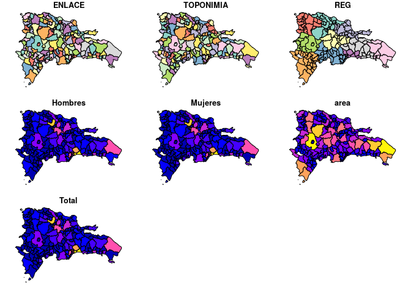

Hagamos lo propio sólo para la población de mujeres.

``` r
plot(mun.sf.sex['Mujeres'], breaks = 'jenks') #Población de mujeres
```

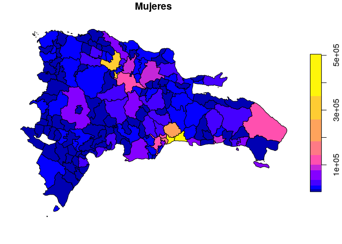

Tal como indiqué arriba, los mapas generados con la función `plot` son
muy mejorables. En R no es fácil cumplir con los estándares propios de
un mapa cartográficamente apropiado. Por ejemplo, eliminar el “efecto
isla” requeriría retocar manualmente el mapa anterior; colocar y rotular
objetos de referencia requeriría también acciones manuales. Sin embargo,
no debemos olvidar que en R lo que más nos interesa es explorar e
interpretar patrones, por lo que la simbología actúa primordialmente
sobre la o las variables de interés.

En tal sentido, los paquetes `ggplot2` (parte de `tidyverse`) y `tmap`
ofrecen herramientas versátiles para conseguir mapas informativos, al
menos en lo que respecta a la variable de interés. Probemos primero con
`ggplot2`. Este paquete incorpora función `geom_sf` para añadir capas de
objetos `sf`. Una breve introducción al funcionamiento de `ggplot2`:
mediante la función `ggplot` se crea un espacio de coordenadas según los
datos disponibles en el `data.frame` que se introduzca en el argumento
`data`. A continuación, se definen las variables estéticas sobre las que
se construirá la simbología. Finalmente, se definen propiedades del
gráfico, como por ejemplo, tema o plantilla base, escala de colores,
tamaño de letra, variables para representar en forma de panel, entre
otras. Utilicemos el objeto `mun.sf.sex` para hacer un mapa básico de
población total.

Para fines didácticos, avancemos añadiendo fuentes de datos y capas paso
a paso. Primero crearemos el espacio de coordenadas y lo asignaremos a
`p0`, y sobre éste acumularemos las siguientes funciones en subsecuentes
objetos `p#`. En el futuro no necesitarás realizar tus gráficos de forma
acumulativa y crearás *scripts* más fluidos.

``` r
p0 <- ggplot(mun.sf.sex)
p0
```


El espacio de coordenadas ya está creado, y `ggplot2` está preparado
para aceptar variables. Como variable a representar (mapear, `map`),
usaremos la “población total”, que en la tabla `mun.sf.sex` se denomina
`Total`. Nota que acumularemos usando `+`.

``` r
p1 <- p0 + aes(fill = Total)
p1
```


Dado que nuestro gráfico se basará en población total, `ggplot2` está
preparado para recibir capas, o geometrías. Las capas son las que
definen el cuerpo del gráfico. Si no añadimos capas, el gráfico
permanecerá vacío. En este caso, añadiremos la capa `geom_sf`, que
tomará las geometrías de la fuente de datos y la estilizará con un
borde de `0.2`.

``` r
p2 <- p1 + geom_sf(lwd = 0.2)
p2
```

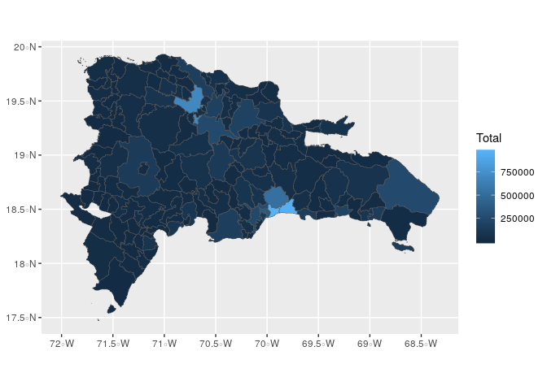

`ggplot2`, al reconocer que la variable `Total` es cuantitativa, utiliza
un gradiente como escala de simbología, en este caso, un gradiente de
azules, desde el oscuro al claro. Nótese que la simbología es bastante
pobre, por dos razones principalmente. Por una parte, la variable visual
empleada es intensidad, pero ésta sobre una escala lineal. Por otro
lado, la escala lineal no favorece una adecuada representación. En casos
como éste, donde se tienen muchas unidades con valores muy pequeños, y
unas pocas con valores muy grandes, la escala lineal esconde una parte
importante de los patrones. Un histograma básico refleja recoje este
sesgo de la distribución:

``` r
hist(mun.sf.sex$Total)
```

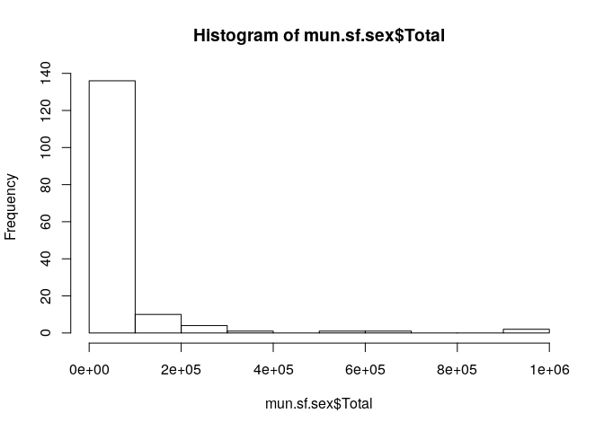

La variable población total muestra un fuerte sesgo hacia la derecha,
influido especialmente por las unidades de mucha población (los
municipios Santo Domingo \*, Los Alcarrizos y Santiago, con más de
250,000 cada uno, y que acumulaban casi 4 millones de habitantes en
2010). Por tal razón, una escala logarítimica (puede ser en base e como
en base 10) ayuda a mejorar la visualización.

``` r
hist(log10(mun.sf.sex$Total))
```


Aplicaremos dicha escala en `ggplot2`, utilizando el argumento
`trans=log10` en la escala de gradiente, y usaremos una función de
gradiente versátil que permite definir una paleta. En este caso,
elegimos una paleta de rojos de la colección
[ColorBrewer](http://colorbrewer2.org).

``` r
p3 <- p2 + scale_fill_gradientn(colours = brewer.pal(9, name = 'Reds'), trans = 'log10')
p3
```

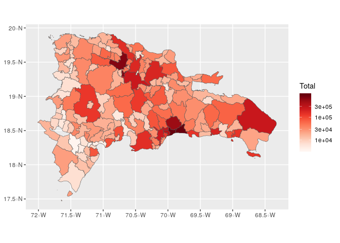

Para fines de referencia, y aunque no sea muy estético, generaremos un
mapa con algunos rótulos a los municipios (no lo asignaremos, puesto que
no lo usaremos posteriormente).

``` r
p3 + geom_sf_text(aes(label=TOPONIMIA), check_overlap = T, size = 1.5)
## Warning in st_point_on_surface.sfc(sf::st_zm(x)): st_point_on_surface may
## not give correct results for longitude/latitude data
```

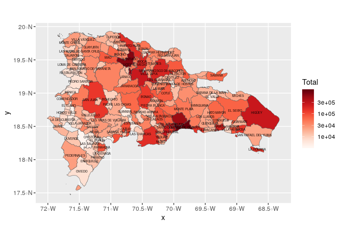

En este mapa reconocemos múltiples patrones “ocultos” en el mapa
anterior, como que hay municipios poco poblados en el entorno de la Hoya
de Enriquillo (véase el área rodeada por los municipios rotulados como
Cristóbal y Duvergé), y en parte de la frontera Domínico-Haitiana (hacia
el oeste, e.g. Pedro Santana). Igualmente, gracias a la simbología, los
municipios muy poblados se distinguen ahora más del resto (Santiago,
Santo Domingo de Guzmán).

Nótese que se está representando población total, no densidad de
población. Calculemos la densidad poblacional en habitantes por
kilómetro cuadrado y, posteriormente, generemos un mapa cuya simbología
sea dicha
variable.

``` r
mun.sf.sex.dpob <- mun.sf.sex %>% mutate(areakm2 = set_units(area, km^2)) %>%
  mutate(dpob = drop_units(Total/areakm2))
mun.sf.sex.dpob
## Simple feature collection with 155 features and 9 fields
## geometry type:  MULTIPOLYGON
## dimension:      XY
## bbox:           xmin: -72.01147 ymin: 17.47033 xmax: -68.32354 ymax: 19.93211
## epsg (SRID):    4326
## proj4string:    +proj=longlat +datum=WGS84 +no_defs
## First 10 features:
##    ENLACE               TOPONIMIA REG Hombres Mujeres            area
## 1  100101 SANTO DOMINGO DE GUZMÁN  10  460903  504137  91445631 [m^2]
## 2  050201                    AZUA  05   46280   45065 416284424 [m^2]
## 3  050202             LAS CHARCAS  05    5962    5281 246501017 [m^2]
## 4  050203    LAS YAYAS DE VIAJAMA  05    9513    8107 430949892 [m^2]
## 5  050204         PADRE LAS CASAS  05   10695    9346 573677765 [m^2]
## 6  050205                 PERALTA  05    8189    7068 129369696 [m^2]
## 7  050206            SABANA YEGUA  05   10352    8668 113924640 [m^2]
## 8  050207            PUEBLO VIEJO  05    5861    5374  48083834 [m^2]
## 9  050208           TÁBARA ARRIBA  05    9999    7648 274922988 [m^2]
## 10 050209                GUAYABAL  05    2994    2269 235362759 [m^2]
##                              geom  Total          areakm2        dpob
## 1  MULTIPOLYGON (((-69.89794 1... 965040  91.44563 [km^2] 10553.15590
## 2  MULTIPOLYGON (((-70.71457 1...  91345 416.28442 [km^2]   219.42930
## 3  MULTIPOLYGON (((-70.50185 1...  11243 246.50102 [km^2]    45.61036
## 4  MULTIPOLYGON (((-70.85774 1...  17620 430.94989 [km^2]    40.88642
## 5  MULTIPOLYGON (((-70.77551 1...  20041 573.67776 [km^2]    34.93425
## 6  MULTIPOLYGON (((-70.73131 1...  15257 129.36970 [km^2]   117.93334
## 7  MULTIPOLYGON (((-70.83014 1...  19020 113.92464 [km^2]   166.95247
## 8  MULTIPOLYGON (((-70.79387 1...  11235  48.08383 [km^2]   233.65441
## 9  MULTIPOLYGON (((-70.83352 1...  17647 274.92299 [km^2]    64.18888
## 10 MULTIPOLYGON (((-70.68664 1...   5263 235.36276 [km^2]    22.36123
ggplot(mun.sf.sex.dpob) + aes(fill = dpob) + geom_sf(lwd = 0.2) +
  scale_fill_gradientn(colours = brewer.pal(9, name = 'Reds'), trans = 'log10')
```

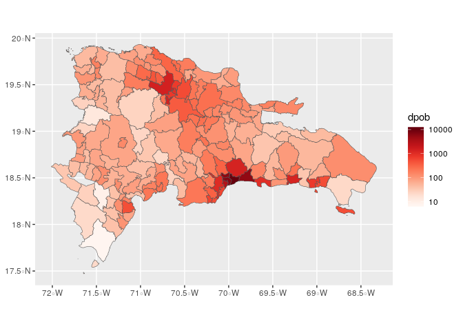

Si comparamos este mapa con el anterior, el de población total, veremos
que afloran nuevos patrones, puesto que el área relativiza el efecto de
la población absoluta. Por ejemplo, Higüey queda como municipio de
densidad poblacional intermedia, mientras que según su población
absoluta podría considerarse como municipio muy poblado.

Finalmente, la colección `tidyverse`, a través de sus paquetes `tidyr` y
`ggplot2`, cuenta con funciones de reorganización de datos para
facilitarnos la tara de representar múltiples variables en un único
panel. Por ejemplo, sería útil representar la población de mujeres y
hombres en un mismo panel, para facilitarnos la tarea de comparar y
encontrar patrones diferenciados, si los hubiere. Para fines didácticos,
generemos los datos fuente paso a paso. Primero necesitamos seleccionar
las columnas que nos interesan (`Mujeres`, `Hombres` y `TOPONIMIA`)

``` r
mun.sf.sex1 <- mun.sf.sex %>%
  dplyr::select(TOPONIMIA, REG, Mujeres, Hombres)
mun.sf.sex1
## Simple feature collection with 155 features and 4 fields
## geometry type:  MULTIPOLYGON
## dimension:      XY
## bbox:           xmin: -72.01147 ymin: 17.47033 xmax: -68.32354 ymax: 19.93211
## epsg (SRID):    4326
## proj4string:    +proj=longlat +datum=WGS84 +no_defs
## First 10 features:
##                  TOPONIMIA REG Mujeres Hombres
## 1  SANTO DOMINGO DE GUZMÁN  10  504137  460903
## 2                     AZUA  05   45065   46280
## 3              LAS CHARCAS  05    5281    5962
## 4     LAS YAYAS DE VIAJAMA  05    8107    9513
## 5          PADRE LAS CASAS  05    9346   10695
## 6                  PERALTA  05    7068    8189
## 7             SABANA YEGUA  05    8668   10352
## 8             PUEBLO VIEJO  05    5374    5861
## 9            TÁBARA ARRIBA  05    7648    9999
## 10                GUAYABAL  05    2269    2994
##                              geom
## 1  MULTIPOLYGON (((-69.89794 1...
## 2  MULTIPOLYGON (((-70.71457 1...
## 3  MULTIPOLYGON (((-70.50185 1...
## 4  MULTIPOLYGON (((-70.85774 1...
## 5  MULTIPOLYGON (((-70.77551 1...
## 6  MULTIPOLYGON (((-70.73131 1...
## 7  MULTIPOLYGON (((-70.83014 1...
## 8  MULTIPOLYGON (((-70.79387 1...
## 9  MULTIPOLYGON (((-70.83352 1...
## 10 MULTIPOLYGON (((-70.68664 1...
```

¿Qué pasó? Pues simplemente, seleccionamos las columnas que nos
interesan de la tabla de atributos. El objeto sigue siendo un *simple
feature*, puesto que la columna `geom` es “pegajosa” y no abandona el
objeto a menos que se lo indiquemos expresamente. Ahora viene la parte
interesante, donde reuniremos las columnas `Hombres` y `Mujeres` en una
única columna clave denominada `variable`, y los valores de cada una de
éstas terminarán en una columna de valores denominada `valor`. Se
conservarán, como columnas pivotantes, `TOPONIMIA` y `geom`.

``` r
mun.sf.sex2 <- mun.sf.sex1 %>% 
  gather(variable, valor, Mujeres:Hombres)
mun.sf.sex2
## Simple feature collection with 310 features and 4 fields
## geometry type:  MULTIPOLYGON
## dimension:      XY
## bbox:           xmin: -72.01147 ymin: 17.47033 xmax: -68.32354 ymax: 19.93211
## epsg (SRID):    4326
## proj4string:    +proj=longlat +datum=WGS84 +no_defs
## First 10 features:
##                  TOPONIMIA REG variable  valor
## 1  SANTO DOMINGO DE GUZMÁN  10  Mujeres 504137
## 2                     AZUA  05  Mujeres  45065
## 3              LAS CHARCAS  05  Mujeres   5281
## 4     LAS YAYAS DE VIAJAMA  05  Mujeres   8107
## 5          PADRE LAS CASAS  05  Mujeres   9346
## 6                  PERALTA  05  Mujeres   7068
## 7             SABANA YEGUA  05  Mujeres   8668
## 8             PUEBLO VIEJO  05  Mujeres   5374
## 9            TÁBARA ARRIBA  05  Mujeres   7648
## 10                GUAYABAL  05  Mujeres   2269
##                              geom
## 1  MULTIPOLYGON (((-69.89794 1...
## 2  MULTIPOLYGON (((-70.71457 1...
## 3  MULTIPOLYGON (((-70.50185 1...
## 4  MULTIPOLYGON (((-70.85774 1...
## 5  MULTIPOLYGON (((-70.77551 1...
## 6  MULTIPOLYGON (((-70.73131 1...
## 7  MULTIPOLYGON (((-70.83014 1...
## 8  MULTIPOLYGON (((-70.79387 1...
## 9  MULTIPOLYGON (((-70.83352 1...
## 10 MULTIPOLYGON (((-70.68664 1...
```

El objeto resultante tiene 310 elementos, que corresponden a los 155
municipios con su número de mujeres y otros 155 con su número de
hombres. Con los datos organizados de esta manera, es posible generar un
panel usando la función `facet_wrap`. Observa que generaremos el mapa
“de un tirón”, insertando la función `ggplot` dentro de la tubería
`dplyr`. De esta manera, la función `ggplot` no necesita el argumento
`data = mun.sf.sex2` porque, al usarse la pipa (`%>%`), el objeto a su
izquierda se inserta como primer argumento de la función a su derecha.

``` r
mun.sf.sex2 %>% 
  ggplot() + aes(fill = valor) + geom_sf(lwd = 0.2) +
  facet_wrap(~variable) + theme(text = element_text(size = 8)) +
  scale_fill_gradientn(colours = brewer.pal(9, name = 'Reds'), trans = 'log10')
```

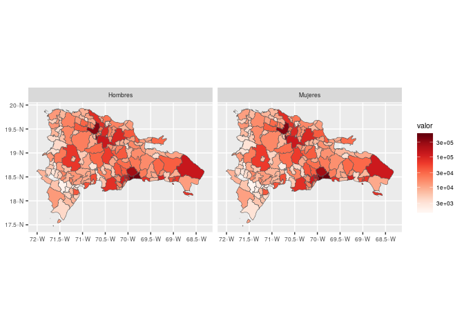

> Para conseguir una visualización apropiada, se incluyó la función
> `theme(text = element_text(size = 8))`.

Ambos mapas son prácticamente un calco el uno del otro. Pocos municipios
presentan patrones diferenciados. De hecho, una prueba pareada *t* de
*Student* revela que no hay evidencia de que existan diferencias
significativas de la variable población por sexo.

``` r
with(mun.sf.sex1, t.test(Mujeres, Hombres, paired = T))
## 
##  Paired t-test
## 
## data:  Mujeres and Hombres
## t = -0.5413, df = 154, p-value = 0.5891
## alternative hypothesis: true difference in means is not equal to 0
## 95 percent confidence interval:
##  -983.7469  560.5856
## sample estimates:
## mean of the differences 
##               -211.5806
```

Sin embargo, destacan algunos casos puntuales, como Higüey y San Juan,
que tienen una población de mujeres ligeramente menor que la de hombres,
al igual que como ocurre en los municipios septentrionales de las
provincias Peravia y San Cristóbal. Por el contrario, el número de
mujeres es ligeramente mayor en los municipios Santo Domingo de Guzmán,
Santo Domingo Este y Santiago. Una inspección del siguiente panel de
gráficos de barras, donde cada cuadro recoge los municipios por
regiones dominicanas, complementa lo reflejado en la mancha
cartográfica:

``` r
mun.sf.sex2 %>% ggplot() +
  aes(x = TOPONIMIA, y = valor, fill = variable, group = variable) +
  geom_col(position = 'dodge') + scale_y_continuous() +
  theme(axis.text.x = element_text(angle = 90), text = element_text(size = 6)) +
  facet_wrap(REG~., scales = 'free', ncol = 2) + coord_flip()
```

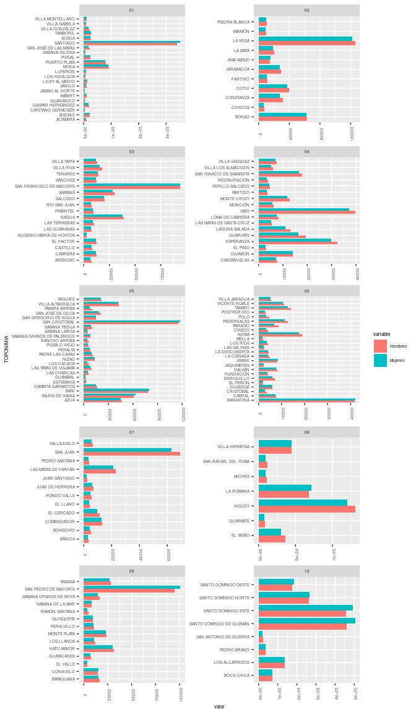

## Conclusión

Conociste las herramientas básicas sobre creación y gestión de *simple
features*. También te introduciste en la realización de ESDA, incluyendo
soporte gráfico. **El ESDA es un paso imprescindible en cualquier
investigación**, así que, ya que no te lo podrás saltar, es necesario
que practiques con los datos de ejemplo mostrados aquí, o con los tuyos
propiamente.

El paquete `sf` tiene la ventaja de que está “saborizado” al estilo
`tidyverse`, y esto te ayudará a realizar tu ESDA mediante las tuberías
de esta potente colección de paquetes.

## Situaciones comunes

  - R es sensible a las mayúsculas. No es lo mismo `Mi_objeto` que
    `mi_objeto`.
  - *“En RStudio, ¿Qué atajo de teclado es que usan para poner el
    operador de asignación `<-`?”* Debería funcionarte `ALT+-`, pero
    recuerda, sólo lo podrás usar en RStudio.
  - *“¿Y el pipe `%>%`?”* `CTRL+SHIFT+M`.
  - Más atajos de teclado de RStudio: `ALT+SHIFT+K`.
  - *“Me quedé trancá’ en la consola de R con un signo de `+`. ¿Qué hago
    pa’ salir de eso?”* Suele resolverse presionando la tecla `Escape`
    (`Esc`). Lee [este
    texto](https://support.rstudio.com/hc/en-us/community/posts/200792676-stuck-on-).

## Referencias

<div id="refs" class="references">

<div id="ref-bivand2013applied">

Bivand, R. S., Pebesma, E. J., & Gomez-Rubio, V. (2013). *Applied
spatial data analysis with R*. Springer.

</div>

<div id="ref-brody2000map">

Brody, H., Rip, M. R., Vinten-Johansen, P., Paneth, N., & Rachman, S.
(2000). Map-making and myth-making in broad street: The london cholera
epidemic, 1854. *The Lancet*, *356*(9223), 64–68.

</div>

<div id="ref-bryan2019happy">

Bryan, J., the STAT 545 TAs, & Hester, J. (2019). *Happy Git and GitHub
for the useR*. Retrieved from <https://happygitwithr.com/>

</div>

<div id="ref-perpinan2019intro">

Lamigueiro, O. P. (2015). *Introducción a R*.
<https://oscarperpinan.github.io/R/>.

</div>

<div id="ref-lovelace2019geocomputation">

Lovelace, R., Nowosad, J., & Muenchow, J. (2019). *Geocomputation with
R*. Retrieved from <https://geocompr.robinlovelace.net/>

</div>

<div id="ref-one2015datos">

Oficina Nacional de Estadística (ONE). (2015). *Datos
georreferenciados*.
<https://www.one.gob.do/informaciones-cartograficas/shapefiles>.

</div>

<div id="ref-paradis2003r">

Paradis, E. (2003). *R para principiantes*. Institut des Sciences de l̕
Évolution. Universit Montpellier.

</div>

<div id="ref-pebesma2018simple">

Pebesma, E. (2018). Simple Features for R: Standardized Support for
Spatial Vector Data. *The R Journal*, *10*(1), 439–446.
<https://doi.org/10.32614/RJ-2018-009>

</div>

<div id="ref-pebesma2019spatial">

Pebesma, E., & Bivand, R. (2019). *Spatial Data Science*. Retrieved from
<https://keen-swartz-3146c4.netlify.com/>

</div>

<div id="ref-Wickham2017R">

Wickham, H., & Grolemund, G. (2017). *R for data science: Import, tidy,
transform, visualize, and model data* (1st ed.). Retrieved from
<http://r4ds.had.co.nz/>

</div>

</div>

1.  De la capa municipios, la geometría correspondiente al municipio
    “Guayubín” resultó ser no válida y fue arreglada
