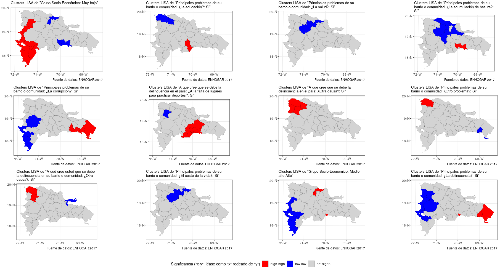

```{r setup, include=FALSE}
knitr::opts_knit$set(root.dir = "..")
knitr::opts_chunk$set(
  echo = TRUE,
  collapse=FALSE,
  fig.path = "../img/",
  out.width='100%'
)
```

<!-- Este .md fue generado a partir del .Rmd homónimo. Edítese el .Rmd -->

# Modelización de datos espaciales basados en geometrías poligonales

## Introducción

La mayor parte de los servicios de estadística nacionales ofrecen sus datos basados en geometrías poligonales. Esto implica que la mayor parte de los datos están afectados por el __problema de la unidad de área modificable__ (PUAM, MAUP por sus siglas en inglés). Este problema se define como una fuente de sesgo estadístico que ocurre a partir de asignar a un área determinada (probablemente heterogénea) datos puntuales colectados dentro de ella. La delimitación de la misma, por lo tanto, puede cambiar completamente el resultado obtenido. Si a esto se le añade que la delimitación de las áreas cambia en el tiempo, el problema no es sólo espacial, sino también temporal, produciendo inconsistencias en la base de datos que es necesario corregir.

Una solución apropiada para estos casos consiste en producir regresores que consideren los efectos locales (e.g. modelizaciones autorregresivas), de manera que los efectos de sesgo producidos por el PUAM se atenúen. Las modelizaciones autorregresivas requieren considerar la autocorrelación espacial, puesto que, normalmente, las geometrías poligonales contienen observaciones que no son independientes entre sí, con lo cual se viola uno de los supuestos más importantes de la regresión tradicional.

La modelización espacial autorregresiva tiene varias aplicaciones:

* Predecir el valor de una variable en un lugar no muestreado. Normalmente, los datos poligonales cubren un territorio de manera exhaustiva, por lo que esta aplicación no es común en modelizaciones espaciales.

* Explorar el grado de asociación entre una o varias variables independientes con una dependiente. Esta es una de las aplicaciones más empleadas, puesto que normalmente nos interesa conocer si existe asociación estadística una vez se han considerado el PUAM y la autocorrelación espacial.

* Predecir el valor de una variable dependiente, a partir de valores asignados deliberadamente a las independientes en simulaciones que exploran escenarios distintos al que sirvió para construir el modelo original.

La clave en toda modelización consiste en seleccionar adecuadamente las variables independientes, de manera que se produzcan resultados con sentido. La significancia estadística no es el objetivo central, sino alcanzarla para un modelo que haga sentido.

## Modelización espacial

### Cargar paquetes

```{r, warning=FALSE, message=FALSE}
library(tidyverse)
library(sf)
library(spdep)
library(lmtest)
```

### Cargar datos

Visto lo anterior, y para mantenerlo lo menos complejo posible, exploremos la asociación de una variable de la Encuesta Nacional de Hogares de Propósitos Múltiples de 2017 (ENHOGAR-2017, descripción [aquí](https://www.one.gob.do/encuestas/enhogar), datos fuente [aquí](http://redatam.one.gob.do/cgibin/RpWebEngine.exe/PortalAction?&MODE=MAIN&BASE=ENH2017&MAIN=WebServerMain.inl)), con otras variables de la propia encuesta. 

Utilicemos objetos generados a partir de ENHOGAR 2017, basados en los principios explicados en la sección de [vecindad](ref/vecindad.md) y [autocorrelación](ref/autocorrelacion.md). Carguemos el archivo `objetos_para_modelizacion.RData` localizado en la carpeta `data`, el cual subirá a memoria los siguientes objetos:

* `proven17`, `sf` con los datos fuente.

* `proven17.w.W`, pesos estandarizados por filas (estilo "W").

* `proven17.w.B`, pesos binarios  (estilo "B").

```{r}
download.file(
  paste0('https://github.com/maestria-geotel-master/',
         'unidad-3-asignacion-1-vecindad-autocorrelacion-espacial/',
         'blob/master/objetos-para-modelizacion.RData?raw=true'),
  'data/objetos-para-modelizacion.RData')
load('data/objetos-para-modelizacion.RData')
```

### Selección de variables

En este ejemplo exploraremos el grado de asociación entre la variable dependiente `Grupo Socio-Económico: Muy bajo` y las siguientes variables seleccionadas como independientes:

* `Sexo del jefe(a) del hogar: Hombre`
* `Sexo del jefe(a) del hogar: Mujer`
* `Principales problemas de su barrio o comunidad: ¿La falta de energía eléctrica?: Si`
* `Principales problemas de su barrio o comunidad: ¿La delincuencia?: Si`
* `Principales problemas de su barrio o comunidad: ¿El desempleo?: Si`
* `Principales problemas de su barrio o comunidad: ¿El consumo de drogas?: Si`
* `Principales problemas de su barrio o comunidad: ¿La corrupción?: Si`
* `Tipo de hogar: Unipersonal`
* `Tipo de hogar: Nuclear`
* `Tipo de hogar: Extendido`
* `Tipo de hogar: Compuesto`


Primero las seleccionamos, atribuyéndoles nombres cortos (debemos conservar el campo `muestra` para relativizar a continuación):

```{r}
varsel <- proven17 %>% dplyr::select(
  ENLACE = ENLACE,
  TOPONIMIA = TOPONIMIA,
  GRUPOMUYBAJO = `Grupo Socio-Económico: Muy bajo`,
  HOMBRE = `Sexo del jefe(a) del hogar: Hombre`,
  MUJER = `Sexo del jefe(a) del hogar: Mujer`,
  ELECTRICA = `Principales problemas de su barrio o comunidad: ¿La falta de energía eléctrica?: Si`,
  DELINCUENCIA = `Principales problemas de su barrio o comunidad: ¿La delincuencia?: Si`,
  DESEMPLEO = `Principales problemas de su barrio o comunidad: ¿El desempleo?: Si`,
  DROGAS = `Principales problemas de su barrio o comunidad: ¿El consumo de drogas?: Si`,
  CORRUPCION = `Principales problemas de su barrio o comunidad: ¿La corrupción?: Si`,
  HOGARUNI = `Tipo de hogar: Unipersonal`,
  HOGARNUC = `Tipo de hogar: Nuclear`,
  HOGAREXT = `Tipo de hogar: Extendido`,
  HOGARCOMP = `Tipo de hogar: Compuesto`,
  MUESTRA = muestra)
```

Posteriormente relativizamos todas las columnas numéricas con el campo `MUESTRA` (nuevo nombre del anterior `muestra`), generando así nuevas columnas de porcentaje (nombre de columnas con sufijo `_PCT`). Al mismo tiempo, obtendremos los logaritmos en base `e` de los porcentajes (nombre de columnas con sufijo `_PCTLOG`)

```{r}
varselpctlog <- varsel %>% mutate_each(
  funs(PCT=round(./MUESTRA,4)*100,
       PCTLOG=log(round(./MUESTRA,4)*100)),
  -1, -2, -geom, -MUESTRA)
```

### Evaluación de autocorrelación, normalidad y homocedasticidad

En el siguiente panel de mapas, nótese que la variable `Grupo Socio-Económico: Muy bajo` está autocorrelacionada localmente (arriba-izquierda):



Comprobemos igualmente su autocorrelación mediante la prueba global:

```{r}
(gmoranw <- moran.test(x = varselpctlog$GRUPOMUYBAJO_PCT, listw = proven17.w.W))
(gmoranb <- moran.test(x = varselpctlog$GRUPOMUYBAJO_PCT, listw = proven17.w.B))
(gmoranwl <- moran.test(x = varselpctlog$GRUPOMUYBAJO_PCTLOG, listw = proven17.w.W))
(gmoranbl <- moran.test(x = varselpctlog$GRUPOMUYBAJO_PCTLOG, listw = proven17.w.B))

```

Si el valor de p es inferior al nivel de significancia (comúnmente fijado en 0.05 o 0.01), se rechaza la hipótesis nula "No hay autocorrelación espacial". Por lo tanto, concluimos que hay, a priori, autocorrelación espacial, tanto para la variable original (sufijo `_PCT`) como la versión transformada (sufijo `_PCTLOG`).


Evaluemos si el supuesto de normalidad se cumple:

```{r}
shapiro.test(varselpctlog$GRUPOMUYBAJO_PCT)
shapiro.test(varselpctlog$GRUPOMUYBAJO_PCTLOG)
```

Al menos sí se cumple para la versión transformada sí cumple el supuesto de normalidad.

Construyamos ahora un modelo lineal común, utilizando las versiones transformadas de las variables, veamos su resumen y evaluemos homocedasticidad:

```{r}
modlin <- varselpctlog %>% select(contains('_PCTLOG')) %>%
  st_drop_geometry() %>% lm(GRUPOMUYBAJO_PCTLOG ~ ., .)
modlin %>% summary
modlin %>% bptest
```

Aunque la selección tiene muchas variables, de éstas sólo resulta significativa `DELINCUENCIA_PCTLOG`. 

Finalmente, ejecutemos el modelo espacial autorregresivo, en este caso, la variate *Simultaneous Autorregresive Model*.

```{r, warning=FALSE, message=FALSE}
sar <- varselpctlog %>% select(contains('_PCTLOG')) %>%
  st_drop_geometry() %>%
  spautolm(
    formula = GRUPOMUYBAJO_PCTLOG ~ .,
    data = .,
    listw = proven17.w.W)
summary(sar)
```

```{r, warning=FALSE, message=FALSE}
sar2 <- varselpctlog %>% select(contains('_PCTLOG')) %>%
  st_drop_geometry() %>%
  spautolm(
    formula = GRUPOMUYBAJO_PCTLOG ~ HOMBRE_PCTLOG + DELINCUENCIA_PCTLOG + DROGAS_PCTLOG + CORRUPCION_PCTLOG + HOGARUNI_PCTLOG,
    data = .,
    listw = proven17.w.W)
summary(sar2)
```

```{r, warning=FALSE, message=FALSE}
sar3 <- varselpctlog %>% select(contains('_PCTLOG')) %>%
  st_drop_geometry() %>%
  spautolm(
    formula = GRUPOMUYBAJO_PCTLOG ~ HOMBRE_PCTLOG + DELINCUENCIA_PCTLOG + DROGAS_PCTLOG + HOGARUNI_PCTLOG,
    data = .,
    listw = proven17.w.W)
summary(sar3)
```

```{r, warning=FALSE, message=FALSE}
sar4 <- varselpctlog %>% select(contains('_PCTLOG')) %>%
  st_drop_geometry() %>%
  spautolm(
    formula = GRUPOMUYBAJO_PCTLOG ~ HOMBRE_PCTLOG + DELINCUENCIA_PCTLOG + DROGAS_PCTLOG,
    data = .,
    listw = proven17.w.W)
summary(sar4)
```

```{r, warning=FALSE, message=FALSE}
sar5 <- varselpctlog %>% select(contains('_PCTLOG')) %>%
  st_drop_geometry() %>%
  spautolm(
    formula = GRUPOMUYBAJO_PCTLOG ~ DELINCUENCIA_PCTLOG + DROGAS_PCTLOG +  + HOGARUNI_PCTLOG,
    data = .,
    listw = proven17.w.W)
summary(sar5)
```


## Referencias
