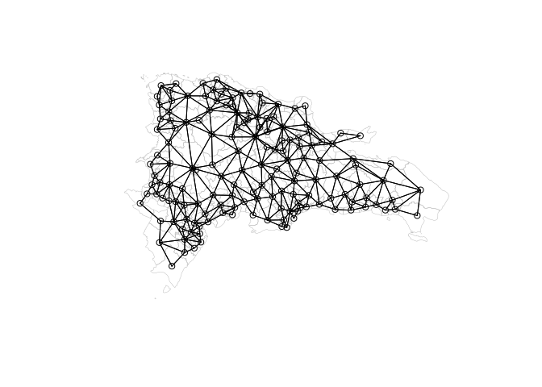
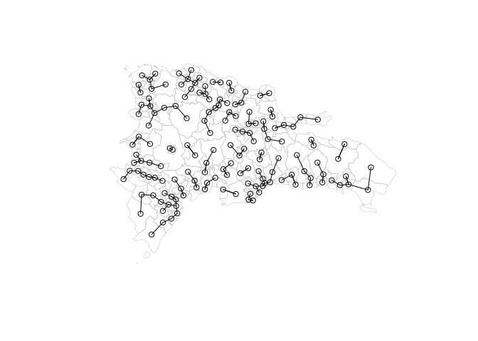
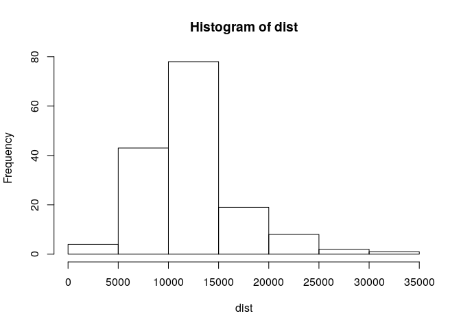

<!-- Este .md fue generado a partir del .Rmd homónimo. Edítese el .Rmd -->

# Vecindad y pesos espaciales

## Vecindad

La determinación del tipo de vecindad es un paso necesario en el
análisis espacial. El objetivo es verificar si existe algún patrón
espacial en los residuos. El primer paso consiste en dar un peso
determinado (no cero) a aquellos objetos que se relacionan entre sí, es
decir, definir el tipo de vínculo de vecindad. Detectar patrones en
mapas no es una opción aceptable, y hacerlo supone una ausencia de
análisis formal (Bivand, Pebesma, & Gomez-Rubio, 2008).

Antes que nada, carguemos paquetes y datos. Utilizaremos como ejemplo,
la capa de división municipal (Oficina Nacional de Estadística -ONE-,
2015) y los datos de población del Censo de Población y Vivienda de 2010
desagregados a nivel municipal (Oficina Nacional de Estadística -ONE-,
2012). Es necesario ajustar el campo `Código` de la tabla de datos de
población.

``` r
library(sf)
library(tidyverse)
library(spdep) #Para crear vecinos y pesos

#Municipios
mun.sf <- st_read(dsn = 'data/divisionRD.gpkg', layer = 'MUNCenso2010', quiet = T)

#Población
pop.mun <- read_csv('data/pop_adm3.csv')
pop.mun
## # A tibble: 155 x 256
##    Código `Municipio de r… `Jefa o jefe` `Esposo (a) o c… `Hijo (a)`
##     <dbl> <chr>                    <dbl>            <dbl>      <dbl>
##  1  10901 Municipio Moca           48032            28717      67964
##  2  10902 Municipio Cayet…          2095             1118       2461
##  3  10903 Municipio Gaspa…         11270             6144      13433
##  4  10904 Municipio Jamao…          2330             1248       2646
##  5  11801 Municipio Puert…         48041            25936      56957
##  6  11802 Municipio Altam…          5875             3130       6073
##  7  11803 Municipio Guana…          2010             1097       1900
##  8  11804 Municipio Imbert          6937             3524       7487
##  9  11805 Municipio Los H…          3653             2033       3997
## 10  11806 Municipio Luper…          5170             2841       5177
## # … with 145 more rows, and 251 more variables: `Hijo (a) de
## #   crianza` <dbl>, `Padre o madre` <dbl>, `Nieto (a)` <dbl>, `Suegro
## #   (a)` <dbl>, `Abuelo (a)` <dbl>, `Hermano (a)` <dbl>, `Empleado (a)
## #   doméstico (a)` <dbl>, `Otro pariente` <dbl>, `Yerno o nuera` <dbl>,
## #   `No pariente` <dbl>, `Miembro de un hogar colectivo` <dbl>,
## #   Hombres <dbl>, Mujeres <dbl>, `0` <dbl>, `1` <dbl>, `2` <dbl>,
## #   `3` <dbl>, `4` <dbl>, `5` <dbl>, `6` <dbl>, `7` <dbl>, `8` <dbl>,
## #   `9` <dbl>, `10` <dbl>, `11` <dbl>, `12` <dbl>, `13` <dbl>, `14` <dbl>,
## #   `15` <dbl>, `16` <dbl>, `17` <dbl>, `18` <dbl>, `19` <dbl>,
## #   `20` <dbl>, `21` <dbl>, `22` <dbl>, `23` <dbl>, `24` <dbl>,
## #   `25` <dbl>, `26` <dbl>, `27` <dbl>, `28` <dbl>, `29` <dbl>,
## #   `30` <dbl>, `31` <dbl>, `32` <dbl>, `33` <dbl>, `34` <dbl>,
## #   `35` <dbl>, `36` <dbl>, `37` <dbl>, `38` <dbl>, `39` <dbl>,
## #   `40` <dbl>, `41` <dbl>, `42` <dbl>, `43` <dbl>, `44` <dbl>,
## #   `45` <dbl>, `46` <dbl>, `47` <dbl>, `48` <dbl>, `49` <dbl>,
## #   `50` <dbl>, `51` <dbl>, `52` <dbl>, `53` <dbl>, `54` <dbl>,
## #   `55` <dbl>, `56` <dbl>, `57` <dbl>, `58` <dbl>, `59` <dbl>,
## #   `60` <dbl>, `61` <dbl>, `62` <dbl>, `63` <dbl>, `64` <dbl>,
## #   `65` <dbl>, `66` <dbl>, `67` <dbl>, `68` <dbl>, `69` <dbl>,
## #   `70` <dbl>, `71` <dbl>, `72` <dbl>, `73` <dbl>, `74` <dbl>,
## #   `75` <dbl>, `76` <dbl>, `77` <dbl>, `78` <dbl>, `79` <dbl>,
## #   `80` <dbl>, `81` <dbl>, `82` <dbl>, `83` <dbl>, `84` <dbl>,
## #   `85` <dbl>, `86` <dbl>, …

#Corrección de códigos en pop.mun
pop.mun <- pop.mun %>% mutate(ENLACE = ifelse(nchar(Código)==5, paste0('0', Código),Código))
match(pop.mun$ENLACE, mun.sf$ENLACE)
##   [1]  48  49  50  51  81  82  83  84  85  86  87  88  89 120 121 122 123
##  [18] 124 125 126 127 128  63  64  65  66 116 117 118 119 135 136 137  33
##  [35]  34  35  36  37  38  39  67  68  69  70  90  91  92  93  94  95  28
##  [52]  29  30  31  32  71  72  73  74  75  76 129 130 131 132 133 134   2
##  [69]   3   4   5   6   7   8   9  10  11  79  80  96  97  98  99 100 101
##  [86] 102 103 146 147 148  12  13  14  15  16  17  18  19  20  21  22  23
## [103]  24  25  26  27  52  53  54  55  56  57  77  78  40  41  42  43  44
## [120]  45 104 105 106 107 108 109  46  47  58  59  60  61  62 110 111 112
## [137] 113 114 115 138 139 140 141 142 143 144 145   1 149 150 151 152 153
## [154] 154 155

#Municipios-Población unidos
mun.sf.pop <- mun.sf %>% inner_join(pop.mun, by = 'ENLACE')
mun.sf.pop
## Simple feature collection with 155 features and 261 fields
## geometry type:  MULTIPOLYGON
## dimension:      XY
## bbox:           xmin: 182215.8 ymin: 1933532 xmax: 571365.3 ymax: 2205216
## epsg (SRID):    32619
## proj4string:    +proj=utm +zone=19 +datum=WGS84 +units=m +no_defs
## First 10 features:
##    PROV MUN REG               TOPONIMIA ENLACE Código
## 1    01  01  10 SANTO DOMINGO DE GUZMÁN 100101 100101
## 2    02  01  05                    AZUA 050201  50201
## 3    02  02  05             LAS CHARCAS 050202  50202
## 4    02  03  05    LAS YAYAS DE VIAJAMA 050203  50203
## 5    02  04  05         PADRE LAS CASAS 050204  50204
## 6    02  05  05                 PERALTA 050205  50205
## 7    02  06  05            SABANA YEGUA 050206  50206
## 8    02  07  05            PUEBLO VIEJO 050207  50207
## 9    02  08  05           TÁBARA ARRIBA 050208  50208
## 10   02  09  05                GUAYABAL 050209  50209
##              Municipio de residencia Jefa o jefe
## 1  Municipio Santo Domingo de Guzmán      289084
## 2                     Municipio Azua       23041
## 3              Municipio Las Charcas        3186
## 4     Municipio Las Yayas de Viajama        4815
## 5          Municipio Padre las Casas        5258
## 6                  Municipio Peralta        3204
## 7             Municipio Sabana Yegua        4901
## 8             Municipio Pueblo Viejo        2935
## 9            Municipio Tábara Arriba        4200
## 10                Municipio Guayabal        1389
##    Esposo (a) o compañero (a) Hijo (a) Hijo (a) de crianza Padre o madre
## 1                      143544   355071               14247          8556
## 2                       13123    35896                2008           567
## 3                        1844     4244                 270            56
## 4                        2559     6309                 340            81
## 5                        3318     7838                 459           131
## 6                        1902     5962                 318            71
## 7                        2643     6583                 469            90
## 8                        1470     4046                 269            43
## 9                        2441     6122                 457           101
## 10                        799     2236                 120            16
##    Nieto (a) Suegro (a) Abuelo (a) Hermano (a) Empleado (a) doméstico (a)
## 1      54302       2262        621       23359                       5731
## 2       9520        155         47        1392                         34
## 3        839         17          7         153                         12
## 4       2008         37          6         248                          1
## 5       1657         28          7         243                          9
## 6       1830         33          1         347                         24
## 7       2221         24          1         369                          9
## 8       1422         22          3         199                          1
## 9       1960         27          6         318                          4
## 10       403          1          0          53                          3
##    Otro pariente Yerno o nuera No pariente Miembro de un hogar colectivo
## 1          48877          5078       12315                          1993
## 2           3955           924         635                            48
## 3            393            94         117                            11
## 4            841           117         257                             1
## 5            765           111         208                             9
## 6           1037           209         313                             6
## 7            998           215         488                             9
## 8            544           109         168                             4
## 9            966           170         361                           514
## 10           153            32          58                             0
##    Hombres Mujeres     0     1     2     3     4     5     6     7     8
## 1   460903  504137 17865 16677 16408 15275 15094 16356 15471 16180 17192
## 2    46280   45065  2096  1756  1853  1886  1755  1911  1829  2063  2188
## 3     5962    5281   263   252   253   238   235   281   272   235   262
## 4     9513    8107   376   311   354   368   328   397   355   436   438
## 5    10695    9346   327   367   347   381   397   395   365   422   461
## 6     8189    7068   278   248   264   315   259   265   263   315   343
## 7    10352    8668   434   332   392   320   353   449   377   379   443
## 8     5861    5374   285   240   233   241   254   288   259   303   290
## 9     9999    7648   373   326   357   306   340   383   324   355   401
## 10    2994    2269    88    70    95    78   106   109    93   117   111
##        9    10    11    12    13    14    15    16    17    18    19    20
## 1  16901 18198 16701 16666 16479 16478 17565 17560 17947 19644 18828 20559
## 2   2087  2295  2086  2077  2173  2003  2133  2105  2038  2083  1706  1892
## 3    213   285   251   279   240   214   229   252   209   235   206   269
## 4    438   444   381   439   358   398   462   433   414   434   329   369
## 5    457   560   538   520   464   493   569   475   476   477   342   435
## 6    320   348   328   367   301   346   380   318   304   338   257   352
## 7    414   451   401   456   419   381   415   394   447   423   382   460
## 8    261   262   203   241   260   235   230   274   260   264   218   254
## 9    395   372   323   370   336   343   382   391   413   417   349   413
## 10   131   123   127   137   129   131   140   130   123   137   110   112
##       21    22    23    24    25    26    27    28    29    30    31    32
## 1  18830 18298 17885 17863 17828 16684 16695 16839 15350 17160 16019 14583
## 2   1656  1470  1543  1498  1572  1280  1367  1406  1149  1361  1297  1149
## 3    202   223   210   213   214   176   171   176   167   197   163   187
## 4    273   280   268   252   266   249   247   205   214   252   245   216
## 5    299   329   325   327   265   248   251   258   228   285   239   232
## 6    267   323   254   274   313   235   272   263   196   377   233   259
## 7    356   363   367   373   331   299   320   316   289   323   269   271
## 8    184   174   191   209   236   209   181   209   163   174   136   122
## 9    307   332   324   344   358   275   301   316   271   301   248   209
## 10    94   110    93    80    93    75    78    68    61    74    62    68
##       33    34    35    36    37    38    39    40    41    42    43    44
## 1  14058 13966 14613 12732 13438 13392 12069 14341 11700 12592 11937 11669
## 2   1181  1232  1259  1045  1049  1113  1084  1255   896  1028  1026   918
## 3    129   131   166   131   162   139   139   153   115   103   119    97
## 4    198   199   227   201   195   249   158   253   155   180   169   157
## 5    214   183   264   224   220   234   200   298   168   201   206   205
## 6    193   214   288   206   166   211   156   335   110   195   135   137
## 7    247   255   271   179   232   231   201   245   154   195   191   187
## 8    128   107   146   139   122   142   109   145   101   118   101    92
## 9    233   237   279   234   208   196   171   234   177   185   223   173
## 10    46    70    90    56    59    59    59    49    44    51    44    57
##       45    46    47   48   49    50   51   52   53   54   55   56   57
## 1  14028 11192 11733 9978 9868 10908 9434 9114 8667 8881 8755 8364 7609
## 2   1126   870   982  717  711   903  798  683  743  727  739  710  545
## 3    140    93   111   75   91   120   80   76   89   69   92   57   69
## 4    189   111   186  146  124   191  160  175  111  153  204  133  128
## 5    255   177   226  150  188   258  198  180  138  182  154  167  138
## 6    230   125   153   94  136   227   91  105   79   93  144  123   73
## 7    209   184   203  143  139   204  162  134  143  132  173  129  116
## 8    156   101   115   98   84    98   98   85   78   95   84   80   68
## 9    175   151   159  126  138   199  136  143  127  138  158  131  134
## 10    51    47    71   45   45    73   52   39   27   35   47   36   39
##      58   59   60   61   62   63   64   65   66   67   68   69   70   71
## 1  7469 6497 7804 6445 6290 5598 5839 5108 4543 4443 4516 3374 4802 3477
## 2   587  484  705  474  479  441  460  454  382  396  407  297  422  250
## 3    62   59   84   61   71   59   50   45   32   34   43   26   60   28
## 4   123   93  171  106   98   95   97  110   82   86   84   55   98   59
## 5   166  140  179  114  107  128  107   98  115   88  103   69  158   66
## 6    84   88  153   61   57   65   66   66   49   53   43   31  123   37
## 7   134   97  144   98   94   94  111   98   93   78  108   51  102   47
## 8    72   47   85   51   47   58   45   62   37   34   39   18   35   34
## 9   118   96  161  105  107   97   89   87   80   65   82   51   96   50
## 10   45   38   42   29   28   38   30   37   22   23   32   19   42   12
##      72   73   74   75   76   77   78   79   80   81   82   83   84   85
## 1  3372 3405 3162 3163 2648 2404 2315 1879 3049 1830 1668 1512 1438 1357
## 2   260  271  241  273  262  197  186  137  276   95  105   88   77   87
## 3    34   37   27   26   29   18   15   12   21    7    8    8   10   10
## 4    57   61   46   53   63   44   33   27   77   30   30   12   25   23
## 5    51   76   56   91   43   58   71   31  102   26   34   22   18   18
## 6    43   49   45   47   39   25   27   19   51   15   13   11   10   21
## 7    59   62   50   55   45   44   46   24   59   17   25   13   18   20
## 8    28   29   33   41   31   21   19   16   23    8   11    6   15    6
## 9    62   44   42   56   38   43   29   33   85   17   20   19   30   14
## 10   20   14   12   25   16   18    9   14   13    9    6    2    5    2
##      86  87  88  89  90  91  92  93  94  95  96  97  98  99 100 101 102
## 1  1039 870 751 585 862 349 397 252 285 194 174 137 128 130 107  32  19
## 2    70  61  24  35  74  22  30  18  13  17  13  10  24  10   8   5   1
## 3     6   4   5   3  14   2   1   1   1   3   1   0   1   0   2   1   1
## 4    11   7  16   6  19   5   4   3   4   3   3   1   7   3   1   0   2
## 5    10  12  14   8  18   6   9   3   7   6   2   5   5   6   3   2   0
## 6     6   6   6   3  22   2   6   2   4   0   2   0   4   1   1   2   2
## 7     9  12   9  11   8   3   5   0   4   2   0   2   0   3   4   0   1
## 8     8   6  10   2   7   1   5   2   3   3   0   1   0   0   0   0   0
## 9    14  10  13   6  30   5   3   0   3   1   1   1   4   4   4   0   1
## 10    1   1   2   1   1   0   0   2   1   3   0   2   1   0   1   1   0
##    103 104 105 106 107 108 109 110 Municipio de residencial actual
## 1   21  22  25  14   9  25  12  78                          603299
## 2    2   1   2   0   2   0   0   7                           79417
## 3    0   0   0   2   1   0   0   0                            8636
## 4    0   1   2   0   0   0   1   2                           13754
## 5    1   0   2   1   1   1   1   1                           17443
## 6    0   0   1   0   0   0   1   1                           14137
## 7    0   1   0   1   0   0   0   1                           11426
## 8    0   0   0   0   0   0   1   2                           10133
## 9    0   1   3   1   1   0   2   3                           14379
## 10   0   0   0   0   0   0   0   0                            4533
##    En otro municipio En otro país Afganistán Argelia Andorra Angola
## 1             317773        43968          2       1       0      0
## 2              10431         1497          0       0       0      0
## 3               1776          831          0       0       0      0
## 4               3687          179          0       0       0      0
## 5               2262          336          0       0       0      0
## 6                685          435          0       0       0      0
## 7               6200         1394          0       0       0      0
## 8                707          395          0       0       0      0
## 9               2379          889          0       0       0      0
## 10               623          107          0       0       0      0
##    Antigua y Barbuda Argentina Australia Austria Bahamas Bangladesh
## 1                  8       486         5      19       5          1
## 2                  0         0         0       0       0          0
## 3                  0         0         0       0       0          0
## 4                  0         0         0       0       0          0
## 5                  0         0         0       0       0          0
## 6                  0         0         0       0       0          0
## 7                  0         0         0       0       0          0
## 8                  0         0         0       0       0          0
## 9                  0         0         0       0       0          0
## 10                 0         0         0       0       0          0
##    Armenia Barbados Bélgica Bermuda Estado Plurinacional de Bolivia Brasil
## 1        1        4      35       5                             109    326
## 2        0        0       1       0                               1      3
## 3        0        0       0       0                               0      0
## 4        0        0       0       0                               0      0
## 5        0        0       0       0                               0      0
## 6        0        0       0       0                               0      0
## 7        0        0       1       0                               0      0
## 8        0        0       0       0                               0      0
## 9        0        0       0       0                               0      0
## 10       0        0       0       0                               0      0
##    Belice Islas Vírgenes Británicas Brunei Darussalam Bulgaria
## 1       5                         6                 0       45
## 2       0                         0                 0        0
## 3       0                         0                 0        0
## 4       0                         0                 0        0
## 5       0                         0                 0        0
## 6       0                         0                 0        0
## 7       0                         0                 0        0
## 8       0                         0                 0        0
## 9       0                         0                 0        0
## 10      0                         0                 0        0
##    Unión De Myanmar (Burma) Belarus Camerún Canadá Islas Caymán
## 1                         1       1      20    163            1
## 2                         0       0       0      0            0
## 3                         0       0       0      0            0
## 4                         0       0       0      0            0
## 5                         0       0       0      1            0
## 6                         0       0       0      0            0
## 7                         0       0       0      1            0
## 8                         0       0       0      0            0
## 9                         0       0       0      0            0
## 10                        0       0       0      0            0
##    República Central Africana Sri Lanka Chile China
## 1                          38         0   353   454
## 2                           0         0     0    32
## 3                           0         0     0     1
## 4                           0         0     0     2
## 5                           0         0     0     0
## 6                           0         0     0     0
## 7                           0         0     0     0
## 8                           0         0     0     0
## 9                           0         0     0     1
## 10                          0         0     0     0
##    Taiwan, Republica China Colombia Mayotte Congo
## 1                      209     1669       1     8
## 2                        0       14       0     0
## 3                        0        0       0     0
## 4                        0        0       0     0
## 5                        0        0       0     0
## 6                        0        0       0     0
## 7                        0        0       0     0
## 8                        0        0       0     0
## 9                        0        1       0     0
## 10                       0        0       0     0
##    República Democrática del Congo Costa Rica Croacia Cuba Chipre
## 1                                0        115       3 1814      1
## 2                                0          1       0    2      0
## 3                                0          0       0    1      0
## 4                                0          0       0    0      0
## 5                                0          1       0    0      0
## 6                                0          0       0    0      0
## 7                                0          2       0    3      0
## 8                                0          0       0    0      0
## 9                                0          0       0    0      0
## 10                               0          0       0    0      0
##    República Checa República de Benin Dinamarca Dominica
## 1                6                  0         5        2
## 2                0                  0         0        0
## 3                0                  0         0        0
## 4                0                  0         0        0
## 5                0                  0         0        0
## 6                0                  0         0        0
## 7                0                  0         0        0
## 8                0                  0         0        0
## 9                0                  0         0        0
## 10               0                  0         0        0
##    República Dominicana Ecuador El Salvador Etiopía Estonia Finlandia
## 1                921072     196         109       1       0        12
## 2                 89848       1           2       0       0         0
## 3                 10412       0           0       0       0         0
## 4                 17441       0           0       0       0         0
## 5                 19705       0           0       0       0         0
## 6                 14822       0           0       0       0         0
## 7                 17626       0           0       0       0         0
## 8                 10840       0           0       0       0         0
## 9                 16758       0           0       0       0         0
## 10                 5156       0           0       0       0         0
##    Francia Guayana Francesa Gabón Georgia Territorios Ocupados Palestinos
## 1      566                0     1       0                               8
## 2        2                0     0       0                               0
## 3        0                0     0       0                               0
## 4        0                0     0       0                               0
## 5        1                0     0       0                               0
## 6        0                0     0       0                               0
## 7        0                0     0       0                               0
## 8        0                0     0       0                               0
## 9        0                0     0       0                               0
## 10       0                0     0       0                               0
##    Alemania Ghana Gibraltar Grecia Granada Guadalupe Guam Guatemala Guinea
## 1       188     0         0     17       1         8    1       175      2
## 2         2     0         0      0       0         0    0         2      0
## 3         1     0         0      0       0         0    0         0      0
## 4         0     0         0      0       0         0    0         0      0
## 5         0     0         0      0       0         0    0         1      0
## 6         0     0         0      0       0         0    0         0      0
## 7         0     0         0      0       0         0    0         0      0
## 8         0     0         0      0       0         0    0         0      0
## 9         1     0         0      0       0         0    0         0      0
## 10        0     0         0      0       0         0    0         0      0
##    Guyana Haití Honduras
## 1       4 19135      133
## 2       0  1090        5
## 3       0   787        4
## 4       0   142        0
## 5       0   291        1
## 6       0   399        0
## 7       0  1269        0
## 8       0   364        0
## 9       0   772        2
## 10      0    93        0
##    Hong Kong (Región Administrativa Especial del Pueblo de La República de China)
## 1                                                                              22
## 2                                                                               0
## 3                                                                               0
## 4                                                                               0
## 5                                                                               0
## 6                                                                               0
## 7                                                                               0
## 8                                                                               0
## 9                                                                               0
## 10                                                                              0
##    Hungría Islandia India Indonesia República Islámica de Irán Iraq
## 1        4        0    40         2                         17   13
## 2        0        0     0         0                          0    0
## 3        0        0     0         0                          0    0
## 4        0        0     0         0                          0    0
## 5        0        0     0         0                          0    0
## 6        0        0     0         0                          0    0
## 7        0        0     0         0                          0    0
## 8        0        0     0         0                          0    0
## 9        0        0     0         0                          0    0
## 10       0        0     0         0                          0    0
##    Irlanda Israel Italia Jamaica Japón República de Kazakhstan Jordania
## 1        5     26    778      38   134                       1        5
## 2        1      0     14       0     4                       0        0
## 3        0      0      1       0     0                       0        0
## 4        0      0      0       0     0                       0        0
## 5        0      0      1       0     0                       0        0
## 6        0      0      0       0     0                       0        0
## 7        0      0      4       0     0                       0        0
## 8        0      0      1       0     0                       0        0
## 9        0      0      0       0     0                       0        0
## 10       0      0      0       0     0                       0        0
##    Kenya República de Corea Kuwait Líbano Lesotho Latvia Libya Lituania
## 1      2                 97      0     80       0      0     0        0
## 2      0                  0      0      0       0      0     0        0
## 3      0                  0      0      0       0      0     0        0
## 4      0                  0      0      0       0      0     0        0
## 5      0                  0      0      0       0      0     0        0
## 6      0                  0      0      0       0      0     0        0
## 7      0                  0      0      0       0      0     0        0
## 8      0                  0      0      0       0      0     0        0
## 9      0                  0      0      0       0      0     0        0
## 10     0                  0      0      0       0      0     0        0
##    Luxemburgo Madagascar Malasia Malta Martinique Mauritania Méjico Mónaco
## 1           0          1      15     0         13          0    666      0
## 2           0          0       0     0          1          0      2      0
## 3           0          0       0     0          0          0      0      0
## 4           0          0       0     0          0          0      0      0
## 5           0          0       0     0          0          0      0      0
## 6           0          0       0     0          0          0      0      0
## 7           0          0       0     0          0          0      0      0
## 8           0          0       0     0          0          0      0      0
## 9           0          0       0     0          0          0      3      0
## 10          0          0       0     0          0          0      0      0
##    Moldova Montenegro Montserrat Morocco Mozambique Namibia Nauru Nepal
## 1        3          0          0      10          2       0     0     0
## 2        0          0          0       0          0       0     0     0
## 3        0          0          0       0          0       0     0     0
## 4        0          0          0       0          0       0     0     0
## 5        0          0          0       0          0       0     0     0
## 6        0          0          0       0          0       0     0     0
## 7        0          0          0       0          0       0     0     0
## 8        0          0          0       0          0       0     0     0
## 9        0          0          0       0          0       0     0     0
## 10       0          0          0       0          0       0     0     0
##    Holanda Aruba Curacao San Martin(Parte Holandesa) Nueva Caledonia
## 1       89    19      63                          21               1
## 2        2     2       0                           0               0
## 3        0     0       0                           0               0
## 4        0     0       0                           0               0
## 5        0     0       0                           0               0
## 6        0     0       0                           0               0
## 7        1     2       0                           1               0
## 8        0     0       0                           0               0
## 9        0     0       1                           0               0
## 10       0     0       0                           0               0
##    Nueva Zelanda Nicaragua Nigeria Noruega Pakistán Panamá Paraguay Perú
## 1              1       111       6       8       52    176       11  505
## 2              0         0       0       0        0      7        0    5
## 3              0         1       0       0        0      0        0    1
## 4              0         2       0       0        0      3        0    0
## 5              0         0       0       0        0      0        0    0
## 6              0         0       0       0        0      0        0    0
## 7              0         0       0       0        0      0        0    1
## 8              0         0       0       0        0      0        0    0
## 9              0         0       0       0        0      1        0    1
## 10             0         0       0       0        0      0        0    0
##    Filipinas Polonia Portugal Puerto Rico Qatar Rumania Federación Rusa
## 1         15      11       32        1760     1      13             111
## 2          0       0        0          39     0       0               0
## 3          0       0        0           1     0       0               0
## 4          0       0        0           0     0       0               0
## 5          0       0        0           8     0       0               1
## 6          0       0        0           1     0       0               0
## 7          0       0        1           6     0       0               0
## 8          0       0        0           2     0       0               0
## 9          0       0        0           3     0       0               0
## 10         0       0        0           0     0       0               0
##    Rwanda                           geom
## 1       0 MULTIPOLYGON (((405218.1 20...
## 2       0 MULTIPOLYGON (((319065.3 20...
## 3       0 MULTIPOLYGON (((341415.3 20...
## 4       0 MULTIPOLYGON (((304058.1 20...
## 5       0 MULTIPOLYGON (((312890.8 20...
## 6       0 MULTIPOLYGON (((317370.6 20...
## 7       0 MULTIPOLYGON (((306745.8 20...
## 8       0 MULTIPOLYGON (((310447.9 20...
## 9       0 MULTIPOLYGON (((306556.7 20...
## 10      0 MULTIPOLYGON (((322129.5 20...

#Objeto sp, SpatialPolygonsDataFrame
mun.sp.pop <- as_Spatial(mun.sf.pop) #Necesitamos un objeto de clase sp para el paquete spdep
colnames(mun.sp.pop@data)[1:20]
##  [1] "PROV"                       "MUN"                       
##  [3] "REG"                        "TOPONIMIA"                 
##  [5] "ENLACE"                     "Código"                    
##  [7] "Municipio.de.residencia"    "Jefa.o.jefe"               
##  [9] "Esposo..a..o.compañero..a." "Hijo..a."                  
## [11] "Hijo..a..de.crianza"        "Padre.o.madre"             
## [13] "Nieto..a."                  "Suegro..a."                
## [15] "Abuelo..a."                 "Hermano..a."               
## [17] "Empleado..a..doméstico..a." "Otro.pariente"             
## [19] "Yerno.o.nuera"              "No.pariente"

#Si queremos los nombres de columna más legibles, debemos recuperarlos del original
colnames(mun.sp.pop@data) <- mun.sf.pop %>% st_drop_geometry() %>% colnames

#Y para que la tabla de atributos tenga nombres filas, les pondremos los del campo TOPONIMIA
row.names(mun.sp.pop) <- as.character(mun.sp.pop$TOPONIMIA)
```

Generemos un objeto de vecindad y veamos en qué consisten, aplicando la
función `poly2nb`, que considera dos objetos como vecinos siempre que
exista contigüidad (vecinos contiguos), es decir, los objetos se tocan.
En este caso, “se tocan” implica que comparten al menos un límite (modo
*rook*, torre, en analogía con el ajedrez) o incluso si sólo comparten
un vértice común (modo *queen*, reina). La función `summary` ofrece un
resumen del objeto, y nos indica el número de “*regions*” (municipios en
este caso), número de vínculos no “cero”, es decir, número de vínculos
entre objetos contiguos (si hubiese objetos sin vínculos, como islas, se
relacionarían en una línea separada).

``` r
mun.nb <- poly2nb(mun.sp.pop, queen=TRUE)
summary(mun.nb)
## Neighbour list object:
## Number of regions: 155 
## Number of nonzero links: 804 
## Percentage nonzero weights: 3.346514 
## Average number of links: 5.187097 
## Link number distribution:
## 
##  1  2  3  4  5  6  7  8  9 10 11 12 14 
##  1 10 20 34 33 22 13 13  4  1  1  2  1 
## 1 least connected region:
## JUAN DE HERRERA with 1 link
## 1 most connected region:
## LA VEGA with 14 links
```

La función `card` ofrece un resumen de la “cardinalidad”, es decir,
quiénes son vecinos de cada observación.

``` r
card(mun.nb)
##   [1]  4  6  3  6  7  6  3  2  6  5  5  7  5  8  4  3  4  7  4  3  5  6  4
##  [24]  4  4  8  5  5  4  6  4  5 12  4  5  6  7  4  5  3  3  4  4  6  5  8
##  [47]  3 10  3  7  3  2  3  3  5  7  8  5  2  4  5  3 14  8  7  3  6  2  5
##  [70]  4  5  4  8  5  2  3  5  2  6  3  8  7  4  5  6  4  5  4  2  7  4  4
##  [93]  2  7  2  9  3  3  5  6  5  2  6 11  4  8  1  7  5  4  6  5  5  5  4
## [116]  9  6  7  4 12  5  5  4  8  4  3  5  4  9  4  3  8  6  5  9  4  6  8
## [139]  7  6  8  4  6  6  4  8  3  6  5  4  6  4  5  5  5
```

El índice numérico de vecinos de cada observación se almacena como un
vector entero en el objeto de vecindad. Aunque normalmente (y por
defecto) imprimimos el objeto de vecindad de forma resumida, puede
también mostrarse la relación exhaustiva de vecinos de cada observación
(municipio):

``` r
sapply(mun.nb, function(x) x)
## [[1]]
## [1] 149 150 151 154
## 
## [[2]]
## [1]  6  7  8  9 11 27
## 
## [[3]]
## [1]  11  79 146
## 
## [[4]]
## [1]   5   6   9  14  21 104
## 
## [[5]]
## [1]   4   6  10  64  65 104 105
## 
## [[6]]
## [1]  2  4  5  9 10 11
## 
## [[7]]
## [1] 2 8 9
## 
## [[8]]
## [1] 2 7
## 
## [[9]]
## [1]  2  4  6  7 21 27
## 
## [[10]]
## [1]   5   6  11  64 146
## 
## [[11]]
## [1]   2   3   6  10 146
## 
## [[12]]
## [1]  13  14  15  56  57 106 109
## 
## [[13]]
## [1]  12  14  56  57 109
## 
## [[14]]
## [1]   4  12  13  21  22  56 104 109
## 
## [[15]]
## [1]  12  16  57 106
## 
## [[16]]
## [1]  15  55 106
## 
## [[17]]
## [1] 18 23 24 26
## 
## [[18]]
## [1] 17 22 23 24 25 26 56
## 
## [[19]]
## [1] 20 26 77 78
## 
## [[20]]
## [1] 19 23 26
## 
## [[21]]
## [1]  4  9 14 22 27
## 
## [[22]]
## [1] 14 18 21 24 27 56
## 
## [[23]]
## [1] 17 18 20 26
## 
## [[24]]
## [1] 17 18 22 27
## 
## [[25]]
## [1] 18 26 56 57
## 
## [[26]]
## [1] 17 18 19 20 23 25 57 77
## 
## [[27]]
## [1]  2  9 21 22 24
## 
## [[28]]
## [1] 29 30 71 74 75
## 
## [[29]]
## [1] 28 30 31 32
## 
## [[30]]
## [1]  28  29  32  73  74 129
## 
## [[31]]
## [1]  29  32  44 130
## 
## [[32]]
## [1]  29  30  31 129 130
## 
## [[33]]
##  [1]  35  36  38  50  63  67  69  70  90  91  92 118
## 
## [[34]]
## [1] 37 67 69 94
## 
## [[35]]
## [1] 33 36 37 39 69
## 
## [[36]]
## [1]  33  35  38  39 116 119
## 
## [[37]]
## [1]  34  35  39  69  94 117 140
## 
## [[38]]
## [1]  33  36 118 119
## 
## [[39]]
## [1]  35  36  37 116 117
## 
## [[40]]
## [1]  41  42 108
## 
## [[41]]
## [1]  40  44 108
## 
## [[42]]
## [1]  40  43  45 108
## 
## [[43]]
## [1] 42 45 54 55
## 
## [[44]]
## [1]  31  41 104 108 129 130
## 
## [[45]]
## [1]  42  43  55 106 108
## 
## [[46]]
## [1]  47  58  61 112 113 143 144 145
## 
## [[47]]
## [1]  46  58 144
## 
## [[48]]
##  [1]  49  50  51  63  81  87  90 123 125 127
## 
## [[49]]
## [1] 48 63 90
## 
## [[50]]
## [1] 33 48 51 70 87 90 91
## 
## [[51]]
## [1] 48 50 87
## 
## [[52]]
## [1] 53 54
## 
## [[53]]
## [1] 52 57 77
## 
## [[54]]
## [1] 43 52 55
## 
## [[55]]
## [1]  16  43  45  54 106
## 
## [[56]]
## [1] 12 13 14 18 22 25 57
## 
## [[57]]
## [1] 12 13 15 25 26 53 56 77
## 
## [[58]]
## [1] 46 47 59 60 61
## 
## [[59]]
## [1] 58 60
## 
## [[60]]
## [1] 58 59 61 62
## 
## [[61]]
## [1]  46  58  60  62 112
## 
## [[62]]
## [1]  60  61 112
## 
## [[63]]
##  [1]  33  48  49  64  65  66  90  92 118 120 122 127 128 135
## 
## [[64]]
## [1]   5  10  63  65 135 146 147 148
## 
## [[65]]
## [1]   5  63  64 105 122 124 135
## 
## [[66]]
## [1]  63 118 135
## 
## [[67]]
## [1] 33 34 68 69 70 94
## 
## [[68]]
## [1] 67 70
## 
## [[69]]
## [1] 33 34 35 37 67
## 
## [[70]]
## [1] 33 50 67 68
## 
## [[71]]
## [1] 28 72 74 75 76
## 
## [[72]]
## [1] 71 73 74 76
## 
## [[73]]
## [1]  30  72  74  76  88 129 132 134
## 
## [[74]]
## [1] 28 30 71 72 73
## 
## [[75]]
## [1] 28 71
## 
## [[76]]
## [1] 71 72 73
## 
## [[77]]
## [1] 19 26 53 57 78
## 
## [[78]]
## [1] 19 77
## 
## [[79]]
## [1]   3  80  99 101 103 146
## 
## [[80]]
## [1]  79  97 101
## 
## [[81]]
## [1]  48  82  84  86  87  89 120 125
## 
## [[82]]
## [1]  81  83  84 120 121 126 133
## 
## [[83]]
## [1]  82  84  85 133
## 
## [[84]]
## [1] 81 82 83 85 86
## 
## [[85]]
## [1]  83  84  86  88 133 134
## 
## [[86]]
## [1] 81 84 85 88
## 
## [[87]]
## [1] 48 50 51 81 89
## 
## [[88]]
## [1]  73  85  86 134
## 
## [[89]]
## [1] 81 87
## 
## [[90]]
## [1] 33 48 49 50 63 91 92
## 
## [[91]]
## [1] 33 50 90 92
## 
## [[92]]
## [1] 33 63 90 91
## 
## [[93]]
## [1] 94 95
## 
## [[94]]
## [1]  34  37  67  93  95 140 144
## 
## [[95]]
## [1] 93 94
## 
## [[96]]
## [1]  97  98  99 100 101 102 150 154 155
## 
## [[97]]
## [1]  80  96 101
## 
## [[98]]
## [1]  96 102 150
## 
## [[99]]
## [1]  79  96 100 101 103
## 
## [[100]]
## [1]  96  99 103 137 141 155
## 
## [[101]]
## [1] 79 80 96 97 99
## 
## [[102]]
## [1] 96 98
## 
## [[103]]
## [1]  79  99 100 137 146 148
## 
## [[104]]
##  [1]   4   5  14  44 105 106 107 108 109 124 129
## 
## [[105]]
## [1]   5  65 104 124
## 
## [[106]]
## [1]  12  15  16  45  55 104 108 109
## 
## [[107]]
## [1] 104
## 
## [[108]]
## [1]  40  41  42  44  45 104 106
## 
## [[109]]
## [1]  12  13  14 104 106
## 
## [[110]]
## [1] 112 113 114 115
## 
## [[111]]
## [1] 114 115 139 143 152 153
## 
## [[112]]
## [1]  46  61  62 110 113
## 
## [[113]]
## [1]  46 110 112 114 143
## 
## [[114]]
## [1] 110 111 113 115 143
## 
## [[115]]
## [1] 110 111 114 152
## 
## [[116]]
## [1]  36  39 117 118 119 135 136 141 142
## 
## [[117]]
## [1]  37  39 116 138 140 142
## 
## [[118]]
## [1]  33  38  63  66 116 119 135
## 
## [[119]]
## [1]  36  38 116 118
## 
## [[120]]
##  [1]  63  81  82 121 122 123 124 125 126 127 128 132
## 
## [[121]]
## [1]  82 120 126 132 133
## 
## [[122]]
## [1]  63  65 120 124 128
## 
## [[123]]
## [1]  48 120 125 127
## 
## [[124]]
## [1]  65 104 105 120 122 129 131 132
## 
## [[125]]
## [1]  48  81 120 123
## 
## [[126]]
## [1]  82 120 121
## 
## [[127]]
## [1]  48  63 120 123 128
## 
## [[128]]
## [1]  63 120 122 127
## 
## [[129]]
## [1]  30  32  44  73 104 124 130 131 132
## 
## [[130]]
## [1]  31  32  44 129
## 
## [[131]]
## [1] 124 129 132
## 
## [[132]]
## [1]  73 120 121 124 129 131 133 134
## 
## [[133]]
## [1]  82  83  85 121 132 134
## 
## [[134]]
## [1]  73  85  88 132 133
## 
## [[135]]
## [1]  63  64  65  66 116 118 136 137 148
## 
## [[136]]
## [1] 116 135 137 141
## 
## [[137]]
## [1] 100 103 135 136 141 148
## 
## [[138]]
## [1] 117 139 140 141 142 149 151 153
## 
## [[139]]
## [1] 111 138 140 143 144 145 153
## 
## [[140]]
## [1]  37  94 117 138 139 144
## 
## [[141]]
## [1] 100 116 136 137 138 142 151 155
## 
## [[142]]
## [1] 116 117 138 141
## 
## [[143]]
## [1]  46 111 113 114 139 145
## 
## [[144]]
## [1]  46  47  94 139 140 145
## 
## [[145]]
## [1]  46 139 143 144
## 
## [[146]]
## [1]   3  10  11  64  79 103 147 148
## 
## [[147]]
## [1]  64 146 148
## 
## [[148]]
## [1]  64 103 135 137 146 147
## 
## [[149]]
## [1]   1 138 151 152 153
## 
## [[150]]
## [1]   1  96  98 154
## 
## [[151]]
## [1]   1 138 141 149 154 155
## 
## [[152]]
## [1] 111 115 149 153
## 
## [[153]]
## [1] 111 138 139 149 152
## 
## [[154]]
## [1]   1  96 150 151 155
## 
## [[155]]
## [1]  96 100 141 151 154
```

Normalmente, los vínculos entre observaciones se analizan mejor
visualmente. El gráfico que los representa se denomina “grafo” en
español.

``` r
plot(mun.sp.pop, border="grey", lwd=0.5)
plot(mun.nb, coordinates(mun.sp.pop), add=T)
```



Los objetos de vecindad son listas de clase `nb` con tamaño `n`, donde
`n` es el número de observaciones (municipios).

``` r
mode(mun.nb)
## [1] "list"
class(mun.nb)
## [1] "nb"
length(mun.nb)
## [1] 155
```

Los objetos de vecindad pueden ser simétricos o no. En el primer caso,
si *i* es vecino de *j*, y viceversa, si *j* es vecino de *i*, se dice
que el objeto de vecindad es simétrico; este es el caso típíco para
objetos creados por contigüidad. Si el objeto de vecindad fuese
asimétrico, *i* sería vecino de *j* pero *j* no sería vecino de *i*. Si
el objeto fuese asimétrico, al imprimirlo u obtener su resumen
(`summary`), el método nos los informaría. En este caso, `mun.nb` es
simétrico.

``` r
is.symmetric.nb(mun.nb)
## [1] TRUE
```

Hasta este punto hemos creado objetos de vecindad utilizando el criterio
de contigüidad. Creemos objetos de vecindad utilizando criterios
diferentes, como la distancia o número de vecinos más próximos.
Obviamente, utilizando vecinos más próximos, el objeto de vecindad será
asimétrico.

``` r
coords <- coordinates(mun.sp.pop)
ident <- row.names(mun.sp.pop)
mun.nb.k1 <- knn2nb(knearneigh(coords, k = 1), row.names = ident)
mun.nb.k2 <- knn2nb(knearneigh(coords, k = 2), row.names = ident)
is.symmetric.nb(mun.nb.k1)
## [1] FALSE
is.symmetric.nb(mun.nb.k2)
## [1] FALSE
mun.nb.k1
## Neighbour list object:
## Number of regions: 155 
## Number of nonzero links: 155 
## Percentage nonzero weights: 0.6451613 
## Average number of links: 1 
## Non-symmetric neighbours list
mun.nb.k2
## Neighbour list object:
## Number of regions: 155 
## Number of nonzero links: 310 
## Percentage nonzero weights: 1.290323 
## Average number of links: 2 
## Non-symmetric neighbours list
```

Nótese que el número de vínculos es igual al *n x k*.

Si representamos los vínculos entre municipios de `mun.nb.k1`, notaremos
rápidamente la asimetría.

``` r
plot(mun.sp.pop, border="grey", lwd=0.5)
plot(mun.nb.k1, coordinates(mun.sp.pop), add=T)
```



Nótese por ejemplo el caso del municipio San Rafael del Yuma, que tiene
como vecino más próximo a La Romana, pero éste último tiene como vecino
más próximo a Guaymate. Por lo tanto, San Rafael del Yuma tiene como
vecino a La Romana, pero La Romana “no lo considera” su vecino, y le
otorga ese “honor” a Guaymate.

El objeto de vecindad con *k=1*, que hemos nombrado como `mun.nb.k1`, es
útil para determinar los valores extremos (mínimo y máximo) de
distancias a vecinos más próximos, y conocer estadísticos descriptivos
sobre las distancias entre los municipios.

``` r
dist <- unlist(nbdists(mun.nb.k1, coords))
summary(dist)
##    Min. 1st Qu.  Median    Mean 3rd Qu.    Max. 
##    4290    9657   11042   12320   13872   31017
hist(dist)
```



``` r
boxplot(dist)
```


Podemos también explorar cuáles son los municipios en dichos extremos
(no sólo el valor absoluto). Para ello, utilizamos la función `nbdists`,
que retorna la(s) distancia(s) de cada municipio a su(s) vecino(s) más
próximo(s) en forma de una lista (de ahí que se utilice la función
`unlist` para generar un vector). En el caso del objeto `mun.nb.k1`,
sólo hay una distancia a vecino más próximo por cada municipio.

``` r
(distmin <- min(dist)) #Distancia a vecino más próximo más pequeña
## [1] 4289.923
(distmax <- max(dist)) #Distancia a vecino más próximo más grande
## [1] 31016.54
indicemin <- which(dist==distmin)
ident[indicemin] #Municipios con la distancia más pequeña a sus vecinos más próximos
## [1] "SAN JUAN"        "JUAN DE HERRERA"
indicemax <- which(dist==distmax)
ident[indicemax] #Municipio con la distancia más grande a su vecino más próximo
## [1] "HIGÜEY"
```

El objeto `mun.nb.k1` nos sirve para odernar los municipios según la
distancia a su vecino más próximo (en el ejemplo a continuación,
ascendentemente):

``` r
ident[order(dist)]
##   [1] "SAN JUAN"                  "JUAN DE HERRERA"          
##   [3] "BAJOS DE HAINA"            "SANTO DOMINGO OESTE"      
##   [5] "LICEY AL MEDIO"            "PUÑAL"                    
##   [7] "NIZAO"                     "SABANA GRANDE DE PALENQUE"
##   [9] "LOS ALCARRIZOS"            "EL PEÑÓN"                 
##  [11] "FUNDACIÓN"                 "SANTO DOMINGO DE GUZMÁN"  
##  [13] "TAMBORIL"                  "NEIBA"                    
##  [15] "VILLA JARAGUA"             "BISONÓ"                   
##  [17] "VILLA GONZÁLEZ"            "LOS RÍOS"                 
##  [19] "YAGUATE"                   "SABANA DE LA MAR"         
##  [21] "EL VALLE"                  "SALCEDO"                  
##  [23] "TENARES"                   "POSTRER RÍO"              
##  [25] "BARAHONA"                  "SANTIAGO"                 
##  [27] "GUANANICO"                 "IMBERT"                   
##  [29] "AZUA"                      "PUEBLO VIEJO"             
##  [31] "SAN JOSÉ DE OCOA"          "SABANA LARGA"             
##  [33] "SAN CRISTÓBAL"             "SAN GREGORIO DE NIGUA"    
##  [35] "SABANA YEGUA"              "TÁBARA ARRIBA"            
##  [37] "NAGUA"                     "EL FACTOR"                
##  [39] "YAMASÁ"                    "PERALVILLO"               
##  [41] "PIMENTEL"                  "LAS GUÁRANAS"             
##  [43] "QUISQUEYA"                 "GUAYACANES"               
##  [45] "ESPERANZA"                 "HONDO VALLE"              
##  [47] "JUAN SANTIAGO"             "FANTINO"                  
##  [49] "LA MATA"                   "VICENTE NOBLE"            
##  [51] "JAQUIMEYES"                "JIMA ABAJO"               
##  [53] "LA CIÉNAGA"                "CAYETANO GERMOSÉN"        
##  [55] "VILLA TAPIA"               "SABANA IGLESIA"           
##  [57] "PUERTO PLATA"              "VILLA MONTELLANO"         
##  [59] "EL LLANO"                  "CASTILLO"                 
##  [61] "EUGENIO MARÍA DE HOSTOS"   "CRISTÓBAL"                
##  [63] "CABRAL"                    "DAJABÓN"                  
##  [65] "PEPILLO SALCEDO"           "ALTAMIRA"                 
##  [67] "PARTIDO"                   "EL PINO"                  
##  [69] "PARAÍSO"                   "VILLA LOS ALMÁCIGOS"      
##  [71] "CASTAÑUELAS"               "VILLA VÁSQUEZ"            
##  [73] "LAS SALINAS"               "JAMAO AL NORTE"           
##  [75] "SOSÚA"                     "MAIMÓN"                   
##  [77] "PIEDRA BLANCA"             "MOCA"                     
##  [79] "SAN PEDRO DE MACORÍS"      "CONSUELO"                 
##  [81] "LOS HIDALGOS"              "GALVÁN"                   
##  [83] "CAMBITA GARABITOS"         "LA DESCUBIERTA"           
##  [85] "LA ROMANA"                 "GUAYMATE"                 
##  [87] "POLO"                      "EL CERCADO"               
##  [89] "PEDRO BRAND"               "LAGUNA SALADA"            
##  [91] "VILLA HERMOSA"             "MONTE CRISTI"             
##  [93] "LOMA DE CABRERA"           "COTUÍ"                    
##  [95] "ENRIQUILLO"                "LA VEGA"                  
##  [97] "VILLA ALTAGRACIA"          "LOS CACAOS"               
##  [99] "CABRERA"                   "RÍO SAN JUAN"             
## [101] "LOS LLANOS"                "LAS MATAS DE SANTA CRUZ"  
## [103] "RAMÓN SANTANA"             "PERALTA"                  
## [105] "GUAYABAL"                  "ARENOSO"                  
## [107] "VILLA RIVA"                "SÁNCHEZ"                  
## [109] "ESTEBANÍA"                 "LUPERÓN"                  
## [111] "RANCHO ARRIBA"             "JÁNICO"                   
## [113] "RESTAURACIÓN"              "MELLA"                    
## [115] "COMENDADOR"                "BÁNICA"                   
## [117] "MAO"                       "JIMANÍ"                   
## [119] "SANTO DOMINGO NORTE"       "VILLA ISABELA"            
## [121] "BOCA CHICA"                "SAN ANTONIO DE GUERRA"    
## [123] "CEVICOS"                   "SAN IGNACIO DE SABANETA"  
## [125] "TAMAYO"                    "LAS YAYAS DE VIAJAMA"     
## [127] "SANTO DOMINGO ESTE"        "MONCIÓN"                  
## [129] "DUVERGÉ"                   "GASPAR HERNÁNDEZ"         
## [131] "LAS TERRENAS"              "VALLEJUELO"               
## [133] "SAN FRANCISCO DE MACORÍS"  "PADRE LAS CASAS"          
## [135] "BOHECHÍO"                  "HATO MAYOR"               
## [137] "LAS MATAS DE FARFÁN"       "JARABACOA"                
## [139] "LAS CHARCAS"               "BANÍ"                     
## [141] "BONAO"                     "PEDRO SANTANA"            
## [143] "SABANA GRANDE DE BOYÁ"     "GUAYUBÍN"                 
## [145] "CONSTANZA"                 "MONTE PLATA"              
## [147] "EL SEIBO"                  "MICHES"                   
## [149] "OVIEDO"                    "SAN JOSÉ DE LAS MATAS"    
## [151] "SAMANÁ"                    "BAYAGUANA"                
## [153] "PEDERNALES"                "SAN RAFAEL DEL YUMA"      
## [155] "HIGÜEY"
```

Con las distancias mínima y máxima se puede construir un objeto de
vecindad basado en distancia (el tercer método para establecer vecinos)
usando la función `dnearneigh`, en el que todos los municipios tengan al
menos un vecino. En el ejemplo a continuación, se utiliza la distancia
mínima como umbral inferior para buscar vecinos, lo cual garantiza que
cada municipio tendrá al menos un vecino. Como umbral superior se
utiliza una vez y media la distancia
máxima.

``` r
mun.nb.d <- dnearneigh(coords, d1 = min(dist), d2 = 1.5*max(dist), row.names = ident)
summary(mun.nb.d)
## Neighbour list object:
## Number of regions: 155 
## Number of nonzero links: 2716 
## Percentage nonzero weights: 11.30489 
## Average number of links: 17.52258 
## Link number distribution:
## 
##  4  5  6  8  9 10 11 12 13 14 15 16 17 18 19 20 21 22 23 24 25 26 27 
##  3  1  1  2  3  3  7  6  8  9 14  7 13  5 14 11 11  6  5 14  5  6  1 
## 3 least connected regions:
## HIGÜEY SAN RAFAEL DEL YUMA SAMANÁ with 4 links
## 1 most connected region:
## VILLA TAPIA with 27 links
```

El grafo muestra una densidad de vínculos mucho mayor en este caso, lo
cual es esperable.

``` r
plot(mun.sp.pop, border="grey", lwd=0.5)
plot(mun.nb.d, coordinates(mun.sp.pop), add=T)
```


## Pesos (ponderadores) espaciales

A una lista de vecinos le asignamos pesos usando criterios que elegimos
en función de nuestro conocimiento del fenómeno analizado. Por defecto,
la función para generar pesos en R utiliza el estilo denominado
*weighted* o “W”, donde los pesos de las observaciones vecinas a una
observación dada, suman 1, lo cual comúnmente se denomina
“estandarización por fila”. Dicho estilo atribuye pesos homogéneos a
cada vecino:

``` r
mun.w.W <- nb2listw(mun.nb)
mun.w.W
## Characteristics of weights list object:
## Neighbour list object:
## Number of regions: 155 
## Number of nonzero links: 804 
## Percentage nonzero weights: 3.346514 
## Average number of links: 5.187097 
## 
## Weights style: W 
## Weights constants summary:
##     n    nn  S0       S1       S2
## W 155 24025 155 65.94606 650.7687
mun.w.W$weights[[1]] #Tomando como ejemplo el peso de la observación número 1
## [1] 0.25 0.25 0.25 0.25
sum(mun.w.W$weights[[1]])
## [1] 1
?spweights.constants #Información sobre las constantes de pesos espaciales
```

Si nuestro conocimiento del fenómeno es limitado, preferiremos los pesos
de estilo binario (Bivand et al., 2008), bajo el cual el objeto *j*
recibe un peso de *1* ante el objeto *i*, siempre que el primero sea
vecino del primero; por el contrario, si *k* no es vecino de *i* recibe
un peso de 0 por ante *i*. Los pesos son indicativos de la fortaleza de
la relación entre dos o más observaciones.

``` r
mun.w.B <- nb2listw(mun.nb, style = 'B')
mun.w.B
## Characteristics of weights list object:
## Neighbour list object:
## Number of regions: 155 
## Number of nonzero links: 804 
## Percentage nonzero weights: 3.346514 
## Average number of links: 5.187097 
## 
## Weights style: B 
## Weights constants summary:
##     n    nn  S0   S1    S2
## B 155 24025 804 1608 19520
mun.w.B$weights[[1]] #Tomando como ejemplo el peso de la observación número 1
## [1] 1 1 1 1
```

## Referencias

<div id="refs" class="references">

<div id="ref-bivand2008applied">

Bivand, R. S., Pebesma, E. J., & Gomez-Rubio, V. (2008). *Applied
spatial data analysis with R* (Vol. 747248717). Springer.

</div>

<div id="ref-one2012ixcenso">

Oficina Nacional de Estadística -ONE-. (2012). *IX Censo Nacional de
Población y Vivienda 2010*. Oficina Nacional de Estadística ONE-.

</div>

<div id="ref-one2015datos">

Oficina Nacional de Estadística -ONE-. (2015). *Datos
georreferenciados*.
<https://www.one.gob.do/informaciones-cartograficas/shapefiles>.

</div>

</div>
